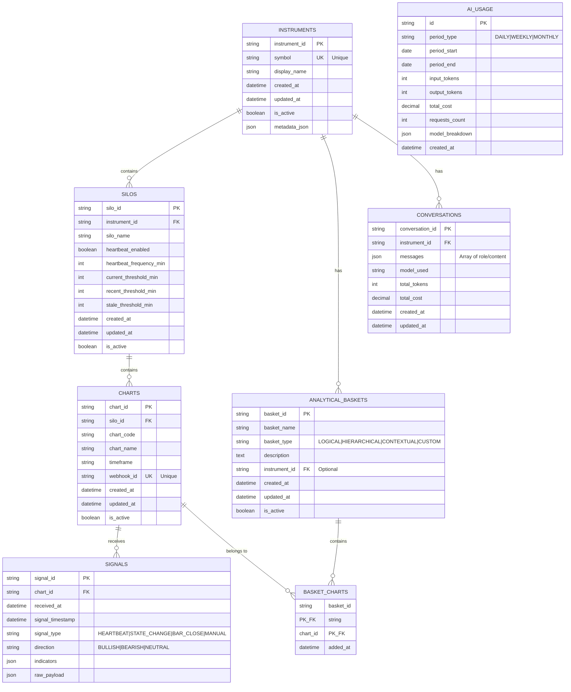
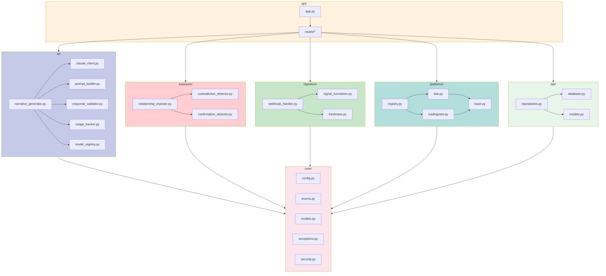
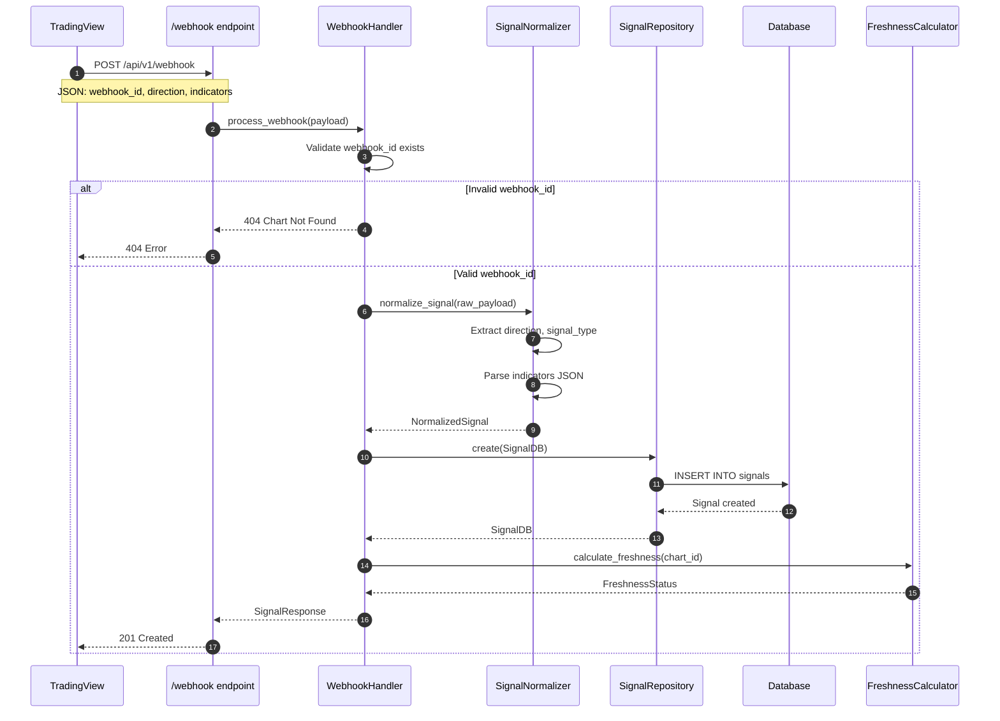
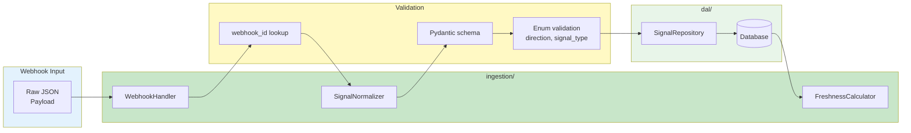
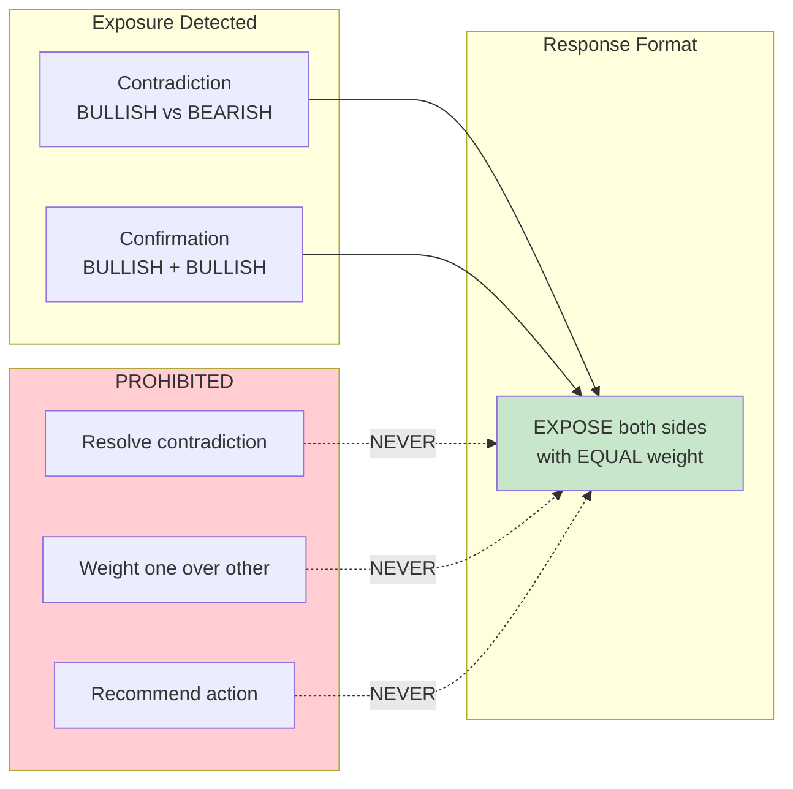
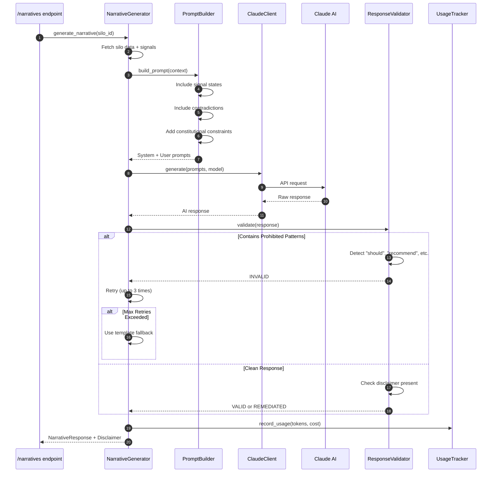
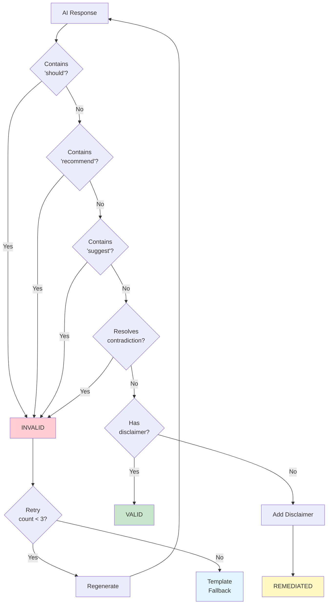
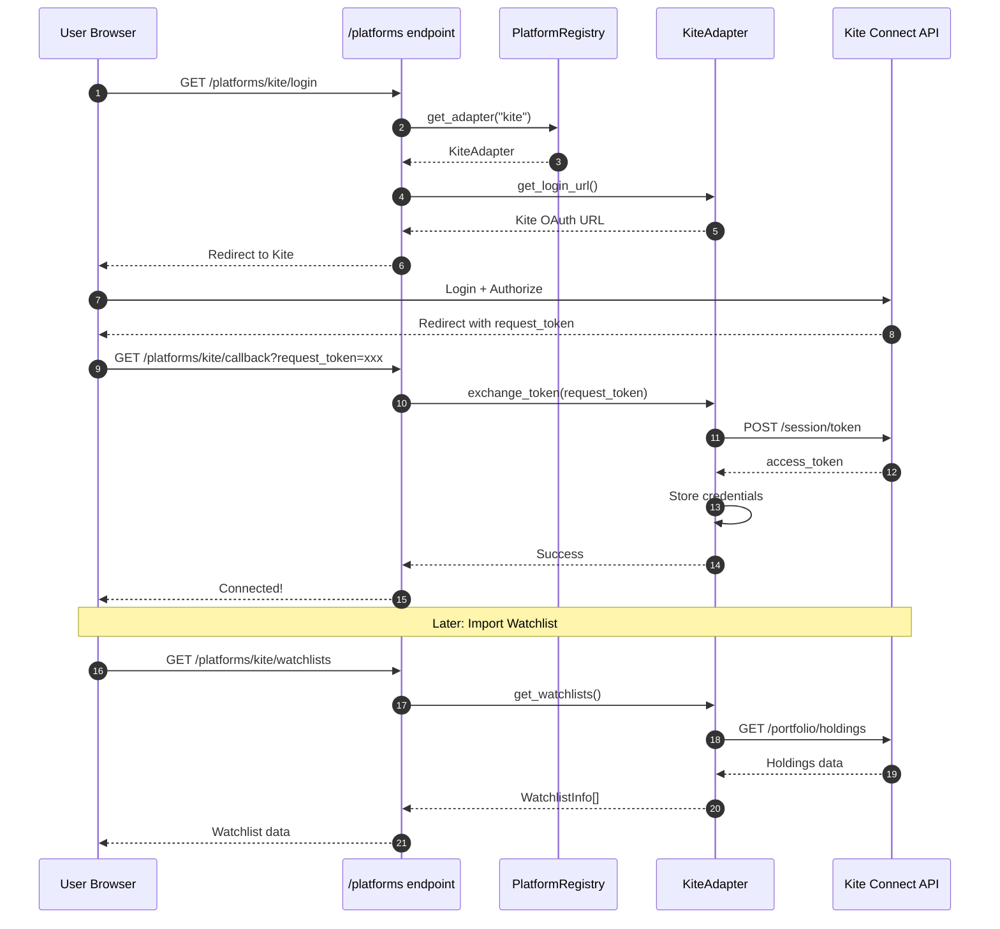

# CIA-SIE Backend Architecture - Accurate Enumeration

> **Generated:** 2026-01-04
> **Source:** Direct code audit of `/src/cia_sie/`
> **Status:** Verified against actual implementation

---

## Table of Contents

1. [Directory Structure](#1-directory-structure)
2. [Layered Architecture](#2-layered-architecture)
3. [Database Models (ER Diagram)](#3-database-models-er-diagram)
4. [API Endpoint Hierarchy](#4-api-endpoint-hierarchy)
5. [Module Dependency Graph](#5-module-dependency-graph)
6. [Signal Ingestion Flow](#6-signal-ingestion-flow)
7. [Exposure Detection Flow](#7-exposure-detection-flow)
8. [AI Narrative Pipeline](#8-ai-narrative-pipeline)
9. [Platform Integration Flow](#9-platform-integration-flow)
10. [Enumeration Tables](#10-enumeration-tables)

---

## 1. Directory Structure

```
src/cia_sie/
├── __init__.py                    # Package root
├── main.py                        # Application entry point
│
├── api/                           # API Layer
│   ├── __init__.py
│   ├── app.py                     # FastAPI application factory
│   └── routes/                    # 12 route modules
│       ├── __init__.py            # Router aggregation
│       ├── ai.py                  # /ai - AI management
│       ├── baskets.py             # /baskets - Analytical baskets
│       ├── charts.py              # /charts - Chart CRUD
│       ├── chat.py                # /chat - AI chat interface
│       ├── instruments.py         # /instruments - Instrument CRUD
│       ├── narratives.py          # /narratives - AI narratives
│       ├── platforms.py           # /platforms - Platform integration
│       ├── relationships.py       # /relationships - Exposure detection
│       ├── signals.py             # /signals - Signal queries
│       ├── silos.py               # /silos - Silo CRUD
│       ├── strategy.py            # /strategy - Strategy evaluation
│       └── webhooks.py            # /webhook - Signal ingestion
│
├── ai/                            # AI Integration Layer
│   ├── __init__.py
│   ├── claude_client.py           # Claude API client
│   ├── model_registry.py          # Model tier management
│   ├── narrative_generator.py     # Narrative generation
│   ├── prompt_builder.py          # Prompt construction
│   ├── response_validator.py      # Constitutional validation
│   └── usage_tracker.py           # Token/cost tracking
│
├── bridge/                        # Bridge Layer (Reserved)
│   └── __init__.py                # Placeholder for future use
│
├── core/                          # Core Layer
│   ├── __init__.py
│   ├── config.py                  # Application settings
│   ├── enums.py                   # All enumerations
│   ├── exceptions.py              # Custom exceptions
│   ├── models.py                  # Pydantic schemas (API models)
│   └── security.py                # Security utilities
│
├── dal/                           # Data Access Layer
│   ├── __init__.py
│   ├── database.py                # Database session management
│   ├── models.py                  # SQLAlchemy ORM models
│   └── repositories.py            # Repository pattern implementation
│
├── exposure/                      # Exposure Detection Layer
│   ├── __init__.py
│   ├── confirmation_detector.py   # Confirmation detection
│   ├── contradiction_detector.py  # Contradiction detection
│   └── relationship_exposer.py    # Relationship exposure
│
├── ingestion/                     # Signal Ingestion Layer
│   ├── __init__.py
│   ├── freshness.py               # Freshness calculation
│   ├── signal_normalizer.py       # Signal normalization
│   └── webhook_handler.py         # Webhook processing
│
└── platforms/                     # Platform Adapters Layer
    ├── __init__.py
    ├── base.py                    # Abstract adapter base
    ├── kite.py                    # Zerodha Kite adapter
    ├── registry.py                # Platform registry
    └── tradingview.py             # TradingView parser
```

---

## 2. Layered Architecture

```mermaid
flowchart TB
    subgraph External["External Systems"]
        TV[TradingView<br/>Webhooks]
        KITE[Zerodha Kite<br/>API]
        CLAUDE[Claude AI<br/>API]
    end

    subgraph API["API Layer (FastAPI)"]
        direction LR
        INST[/instruments]
        SILO[/silos]
        CHART[/charts]
        SIG[/signals]
        WH[/webhook]
        REL[/relationships]
        NARR[/narratives]
        BASK[/baskets]
        PLAT[/platforms]
        AI_RT[/ai]
        CHAT[/chat]
        STRAT[/strategy]
    end

    subgraph Business["Business Logic Layer"]
        subgraph Ingestion["ingestion/"]
            WH_HAND[WebhookHandler]
            SIG_NORM[SignalNormalizer]
            FRESH[FreshnessCalculator]
        end

        subgraph Exposure["exposure/"]
            CONTRA[ContradictionDetector]
            CONF[ConfirmationDetector]
            REL_EXP[RelationshipExposer]
        end

        subgraph AILayer["ai/"]
            CLAUDE_CL[ClaudeClient]
            NARR_GEN[NarrativeGenerator]
            PROMPT[PromptBuilder]
            VALID[ResponseValidator]
            USAGE[UsageTracker]
            MODEL_REG[ModelRegistry]
        end

        subgraph Platforms["platforms/"]
            PLAT_REG[PlatformRegistry]
            KITE_ADAPT[KiteAdapter]
            TV_PARSE[TradingViewParser]
        end
    end

    subgraph DAL["Data Access Layer (dal/)"]
        INST_REPO[InstrumentRepository]
        SILO_REPO[SiloRepository]
        CHART_REPO[ChartRepository]
        SIG_REPO[SignalRepository]
        BASK_REPO[BasketRepository]
    end

    subgraph Core["Core Layer (core/)"]
        CONFIG[config.py<br/>Settings]
        ENUMS[enums.py<br/>Enumerations]
        MODELS[models.py<br/>Pydantic Schemas]
        EXCEPT[exceptions.py<br/>Errors]
        SECURITY[security.py<br/>Auth]
    end

    subgraph Storage["Storage Layer"]
        DB[(SQLite<br/>Database)]
    end

    TV --> WH
    KITE --> PLAT

    WH --> WH_HAND
    WH_HAND --> SIG_NORM
    SIG_NORM --> SIG_REPO

    REL --> REL_EXP
    REL_EXP --> CONTRA
    REL_EXP --> CONF

    NARR --> NARR_GEN
    NARR_GEN --> PROMPT
    NARR_GEN --> CLAUDE_CL
    CLAUDE_CL --> CLAUDE
    NARR_GEN --> VALID

    PLAT --> PLAT_REG
    PLAT_REG --> KITE_ADAPT
    KITE_ADAPT --> KITE

    DAL --> DB
    Business --> Core

    style External fill:#e1f5fe
    style API fill:#fff3e0
    style Business fill:#f3e5f5
    style DAL fill:#e8f5e9
    style Core fill:#fce4ec
    style Storage fill:#fff9c4
```

---

## 3. Database Models (ER Diagram)



---

## 4. API Endpoint Hierarchy

```mermaid
flowchart TD
    ROOT["/api/v1"] --> INST["/instruments"]
    ROOT --> SILO["/silos"]
    ROOT --> CHART["/charts"]
    ROOT --> SIG["/signals"]
    ROOT --> WH["/webhook"]
    ROOT --> REL["/relationships"]
    ROOT --> NARR["/narratives"]
    ROOT --> BASK["/baskets"]
    ROOT --> PLAT["/platforms"]
    ROOT --> AI["/ai"]
    ROOT --> CHAT["/chat"]
    ROOT --> STRAT["/strategy"]

    %% Instruments
    INST --> INST_L["GET / - List all"]
    INST --> INST_C["POST / - Create"]
    INST --> INST_G["GET /{id} - Get by ID"]
    INST --> INST_S["GET /symbol/{symbol}"]
    INST --> INST_P["PATCH /{id} - Update"]
    INST --> INST_D["DELETE /{id}"]

    %% Silos
    SILO --> SILO_L["GET / - List all"]
    SILO --> SILO_C["POST / - Create"]
    SILO --> SILO_G["GET /{id} - Get by ID"]
    SILO --> SILO_D["DELETE /{id}"]

    %% Charts
    CHART --> CHART_L["GET / - List all"]
    CHART --> CHART_C["POST / - Create"]
    CHART --> CHART_G["GET /{id} - Get by ID"]
    CHART --> CHART_W["GET /webhook/{webhook_id}"]
    CHART --> CHART_D["DELETE /{id}"]

    %% Signals
    SIG --> SIG_CH["GET /chart/{chart_id}"]
    SIG --> SIG_LAT["GET /chart/{chart_id}/latest"]
    SIG --> SIG_G["GET /{id} - Get by ID"]

    %% Webhook
    WH --> WH_P["POST / - TradingView webhook"]
    WH --> WH_M["POST /manual - Manual signal"]
    WH --> WH_H["GET /health"]

    %% Relationships
    REL --> REL_S["GET /silo/{silo_id}"]
    REL --> REL_I["GET /instrument/{instrument_id}"]
    REL --> REL_C["GET /contradictions/silo/{silo_id}"]

    %% Narratives
    NARR --> NARR_S["GET /silo/{silo_id}"]
    NARR --> NARR_P["GET /silo/{silo_id}/plain"]

    %% Baskets
    BASK --> BASK_L["GET / - List all"]
    BASK --> BASK_C["POST / - Create"]
    BASK --> BASK_G["GET /{id}"]
    BASK --> BASK_AC["POST /{id}/charts/{chart_id}"]
    BASK --> BASK_RC["DELETE /{id}/charts/{chart_id}"]
    BASK --> BASK_D["DELETE /{id}"]

    %% Platforms
    PLAT --> PLAT_L["GET / - List platforms"]
    PLAT --> PLAT_G["GET /{name} - Get platform"]
    PLAT --> PLAT_CON["POST /connect"]
    PLAT --> PLAT_DIS["POST /{name}/disconnect"]
    PLAT --> PLAT_H["GET /{name}/health"]
    PLAT --> PLAT_WL["GET /{name}/watchlists"]
    PLAT --> PLAT_WLI["GET /{name}/watchlists/{id}/instruments"]
    PLAT --> PLAT_SET["GET /{name}/setup"]
    PLAT --> PLAT_KL["GET /kite/login"]
    PLAT --> PLAT_KC["GET /kite/callback"]
    PLAT --> PLAT_KS["GET /kite/status"]

    %% AI
    AI --> AI_M["GET /models"]
    AI --> AI_U["GET /usage"]
    AI --> AI_B["GET /budget"]
    AI --> AI_C["POST /configure"]
    AI --> AI_H["GET /health"]

    %% Chat
    CHAT --> CHAT_P["POST /{scrip_id}"]
    CHAT --> CHAT_H["GET /{scrip_id}/history"]

    %% Strategy
    STRAT --> STRAT_E["POST /evaluate"]

    style ROOT fill:#e3f2fd
    style INST fill:#fff9c4
    style SILO fill:#f3e5f5
    style CHART fill:#e8f5e9
    style SIG fill:#ffccbc
    style WH fill:#ffccbc
    style REL fill:#b2dfdb
    style NARR fill:#c5cae9
    style BASK fill:#d7ccc8
    style PLAT fill:#b2dfdb
    style AI fill:#c5cae9
    style CHAT fill:#c5cae9
    style STRAT fill:#c5cae9
```



---

## 5. Module Dependency Graph



---

## 6. Signal Ingestion Flow



### Signal Processing Pipeline



---

## 7. Exposure Detection Flow

```mermaid
flowchart TD
    START([GET /relationships/silo/{id}]) --> FETCH[RelationshipExposer<br/>fetch_silo_signals]

    FETCH --> GET_CHARTS[Get all charts<br/>in silo]
    GET_CHARTS --> GET_SIGNALS[Get latest signal<br/>per chart]

    GET_SIGNALS --> CONTRA_CHECK[ContradictionDetector<br/>detect]

    CONTRA_CHECK --> HAS_CONTRA{Opposite<br/>directions?}

    HAS_CONTRA -->|Yes| CONTRA_FOUND[Contradiction<br/>Detected]
    HAS_CONTRA -->|No| CONF_CHECK

    CONTRA_FOUND --> BUILD_RESP

    CONF_CHECK[ConfirmationDetector<br/>detect]
    CONF_CHECK --> HAS_CONF{Same<br/>directions?}

    HAS_CONF -->|Yes| CONF_FOUND[Confirmation<br/>Detected]
    HAS_CONF -->|No| ISOLATED[No Exposure]

    CONF_FOUND --> BUILD_RESP
    ISOLATED --> BUILD_RESP

    BUILD_RESP[Build RelationshipSummary]
    BUILD_RESP --> RETURN([Return to API])

    style CONTRA_FOUND fill:#ffcdd2,stroke:#c62828
    style CONF_FOUND fill:#c8e6c9,stroke:#2e7d32
    style ISOLATED fill:#e1f5fe,stroke:#0277bd
```

### Constitutional Constraint



---

## 8. AI Narrative Pipeline



### Constitutional Filtering



---

## 9. Platform Integration Flow



---

## 10. Enumeration Tables

### Signal Types

| Enum Value | Description |
|------------|-------------|
| `HEARTBEAT` | Periodic signal at configured interval |
| `STATE_CHANGE` | Signal triggered by condition change |
| `BAR_CLOSE` | Signal sent at bar close |
| `MANUAL` | User-triggered on-demand signal |

### Direction

| Enum Value | Description |
|------------|-------------|
| `BULLISH` | Positive/upward bias |
| `BEARISH` | Negative/downward bias |
| `NEUTRAL` | No directional bias |

### Freshness Status

| Enum Value | Description |
|------------|-------------|
| `CURRENT` | Data from current/most recent bar |
| `RECENT` | Data within expected update frequency |
| `STALE` | Data older than expected |
| `UNAVAILABLE` | Data could not be retrieved |

### Basket Types

| Enum Value | Description |
|------------|-------------|
| `LOGICAL` | Charts grouped by analytical function |
| `HIERARCHICAL` | Charts grouped by importance |
| `CONTEXTUAL` | Charts grouped by situation |
| `CUSTOM` | User-defined grouping |

### AI Model Tiers

| Enum Value | Use Case |
|------------|----------|
| `HAIKU` | Fast, simple queries |
| `SONNET` | Balanced, standard analysis |
| `OPUS` | Complex analysis |

### Validation Status

| Enum Value | Description |
|------------|-------------|
| `VALID` | Passed all constitutional checks |
| `INVALID` | Contains prohibited content |
| `REMEDIATED` | Modified to achieve compliance |

---

## Constitutional Constraints Summary

| Rule | Constraint | Enforcement |
|------|------------|-------------|
| **CR-001** | Decision-Support NOT Decision-Making | No "should", "recommend", "suggest" in AI responses |
| **CR-002** | Expose Contradictions, NEVER Resolve | Equal weight to all directions |
| **CR-003** | Descriptive AI, NOT Prescriptive | Mandatory disclaimer on all AI output |
| **No Weights** | `ChartDB` has NO weight column | All charts equal standing |
| **No Confidence** | `SignalDB` has NO confidence column | Raw data only |

---

## File Count Summary

| Layer | Files | Purpose |
|-------|-------|---------|
| `api/routes/` | 12 | API endpoints |
| `ai/` | 6 | AI integration |
| `core/` | 5 | Core definitions |
| `dal/` | 3 | Data access |
| `exposure/` | 3 | Relationship detection |
| `ingestion/` | 3 | Signal ingestion |
| `platforms/` | 4 | Platform adapters |
| **Total** | **36** | Backend modules |

---

*Generated from direct code audit - Verified accurate as of 2026-01-04*
