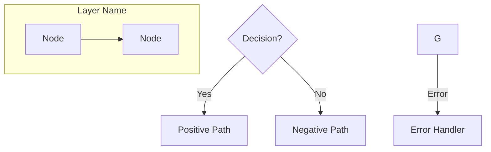
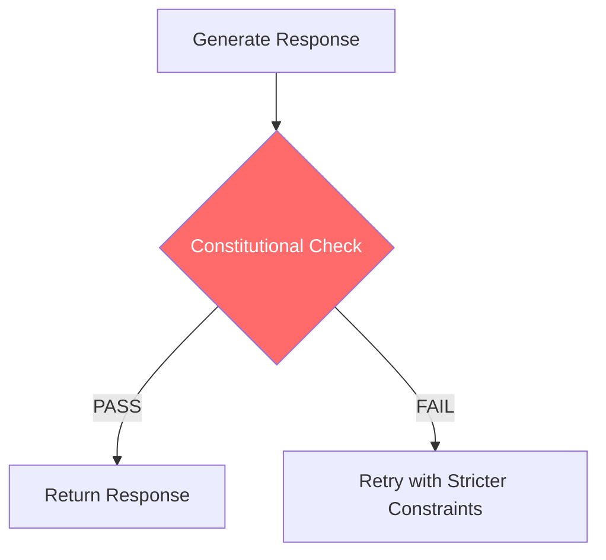
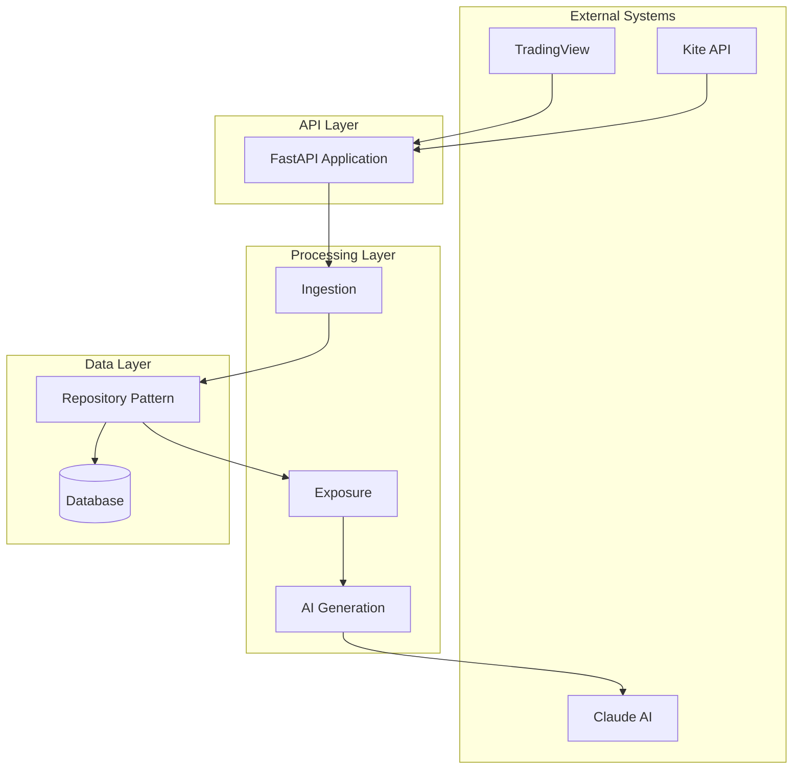

# FLOWCHART SYNTHESIS GUIDE

**Classification:** OPERATIONAL DIRECTIVE
**Phase:** 2 - Master Flowchart Creation
**Framework:** Gold Standard System v1.0

---

## OBJECTIVE

Synthesize a **MASTER_BACKEND_FLOWCHART** that represents the IDEAL state of the CIA-SIE-PURE backend system. This flowchart will serve as the authoritative reference for reconstruction.

---

## SECTION 1: INPUT FLOWCHART ANALYSIS

### 1.1 Primary Input: BACKEND_FLOWCHARTS.md

This document contains 6 major sections with Mermaid diagrams:

#### Section 1: Kite API Integration Layer
**Flowcharts present:**
- OAuth2 Authentication State Machine (stateDiagram-v2)
- OAuth Sequence Diagram (sequenceDiagram)
- Token Validation Flow (flowchart TD)
- API Request Flow (flowchart TD)
- Session Lifecycle (flowchart TD)
- Symbol Resolution Flow (flowchart TD)

**Analysis questions:**
- [ ] Are all OAuth states handled?
- [ ] Is token refresh addressed? (Note: Kite doesn't use refresh)
- [ ] Are all error paths explicit?
- [ ] Is reconnection flow complete?

#### Section 2: Data Ingestion Pipeline
**Flowcharts present:**
- Signal Ingestion Architecture Overview (flowchart TD)
- Complete Webhook Sequence (sequenceDiagram)
- Payload Validation Rules (flowchart TD)
- Normalization Process (flowchart TD)
- Freshness State Determination (flowchart TD)
- Signal Storage Flow (sequenceDiagram)

**Analysis questions:**
- [ ] Is every payload field validated?
- [ ] Are all normalization rules documented?
- [ ] Is freshness calculation complete?
- [ ] Are all error responses mapped?

#### Section 3: Claude API Two-Stage Orchestration
**Flowcharts present:**
- Architecture Overview (flowchart TD)
- Prompt Building Flow (flowchart TD)
- Validated Generation Flow (sequenceDiagram)
- Client Configuration (flowchart TD)
- Request/Response Flow (sequenceDiagram)
- Validation State Machine (stateDiagram-v2)
- Fallback Decision Tree (flowchart TD)

**Analysis questions:**
- [ ] Is prompt construction fully documented?
- [ ] Are all prohibited patterns checked?
- [ ] Is retry logic with temperature reduction shown?
- [ ] Is fallback narrative generation complete?

#### Section 4: State Management & Persistence
**Flowcharts present:**
- Application State Machine (stateDiagram-v2)
- Lifespan Management (sequenceDiagram)
- Entity Relationship Diagram (erDiagram)
- Repository Class Hierarchy (classDiagram)

**Analysis questions:**
- [ ] Are all entity relationships accurate?
- [ ] Is the repository pattern correctly shown?
- [ ] Are all database operations covered?
- [ ] Is connection pooling addressed?

#### Section 5: Error Propagation & Recovery
**Flowcharts present:**
- Error Taxonomy (classDiagram)
- Error Chain Propagation (flowchart TD)
- Circuit Breaker State Machine (stateDiagram-v2)
- AI Generation Retry (flowchart TD)

**Analysis questions:**
- [ ] Are all exception types shown?
- [ ] Is HTTP error mapping complete?
- [ ] Is recovery strategy for each component defined?
- [ ] Are degradation behaviors documented?

#### Section 6: Constitutional Compliance Enforcement
**Flowcharts present:**
- Validation Pipeline (flowchart TD)
- Signal Isolation Architecture (flowchart TD)
- Contradiction Exposure Flow (flowchart TD)

**Analysis questions:**
- [ ] Are all prohibited patterns listed?
- [ ] Is mandatory disclaimer enforcement shown?
- [ ] Is data structure isolation complete?
- [ ] Is audit logging architecture shown?

---

## SECTION 2: ADDITIONAL FLOWCHART SOURCES

### 2.1 FRONTEND_DATA_FLOW.md
Analyze for:
- [ ] Frontend-backend data contracts
- [ ] State synchronization patterns
- [ ] Real-time update mechanisms

### 2.2 SIGNAL_FLOW_MATRIX.md
Analyze for:
- [ ] End-to-end signal journey
- [ ] Transformation points
- [ ] Data integrity checkpoints

### 2.3 OPERATIONAL_GUIDE_SIGNAL_FLOW.html
Analyze for:
- [ ] Visual representation accuracy
- [ ] User journey mapping
- [ ] Operational scenarios

---

## SECTION 3: GAP IDENTIFICATION

### 3.1 Missing Flowcharts to Create

After analyzing existing flowcharts, identify what's missing:

| Gap Area | Current Status | Required Flowchart |
|----------|----------------|-------------------|
| End-to-End Request Journey | Fragmented | COMPLETE_REQUEST_LIFECYCLE |
| Cross-Component Data Flow | Implicit | DATA_TRANSFORMATION_CHAIN |
| Error Recovery Orchestration | Partial | RECOVERY_ORCHESTRATION |
| Constitutional Validation Points | Listed | CONSTITUTIONAL_CHECKPOINT_MAP |
| Test Verification Flow | Missing | TEST_VERIFICATION_PIPELINE |
| Deployment Pipeline | Missing | DEPLOYMENT_FLOWCHART |

### 3.2 Gap Documentation Template
```
FLOWCHART_GAP-[ID]:
├── Area: [system area]
├── Current State: [what exists]
├── Required State: [what's needed]
├── Integration Points: [connected flowcharts]
└── Priority: [HIGH/MEDIUM/LOW]
```

---

## SECTION 4: MASTER FLOWCHART SPECIFICATION

### 4.1 Structure Requirements

The MASTER_BACKEND_FLOWCHART must contain:

```
MASTER_BACKEND_FLOWCHART.md
│
├── LEVEL 0: SYSTEM OVERVIEW
│   └── Single high-level flowchart showing all major components
│
├── LEVEL 1: COMPONENT FLOWCHARTS
│   ├── 1.1 API Layer
│   ├── 1.2 Data Access Layer
│   ├── 1.3 AI Integration Layer
│   ├── 1.4 Signal Processing Layer
│   ├── 1.5 Platform Integration Layer
│   └── 1.6 Constitutional Enforcement Layer
│
├── LEVEL 2: OPERATION FLOWCHARTS
│   ├── 2.1 Webhook Receipt & Processing
│   ├── 2.2 Narrative Generation
│   ├── 2.3 Relationship Exposure
│   ├── 2.4 Platform Authentication
│   ├── 2.5 CRUD Operations
│   └── 2.6 Error Handling & Recovery
│
├── LEVEL 3: STATE MACHINES
│   ├── 3.1 Application Lifecycle
│   ├── 3.2 Platform Connection States
│   ├── 3.3 AI Generation States
│   └── 3.4 Signal Freshness States
│
└── CROSS-CUTTING: VERIFICATION CHECKPOINTS
    └── Where Gold Standard verification layers apply
```

### 4.2 Mermaid Syntax Standards

All flowcharts must use:


### 4.3 Constitutional Annotations

Every flowchart must mark constitutional checkpoints:


---

## SECTION 5: SYNTHESIS METHODOLOGY

### 5.1 Step-by-Step Process

**Step 1: Catalog Existing**
- List all flowcharts from all sources
- Identify diagram types (flowchart, sequence, state, ER, class)
- Note which components each covers

**Step 2: Map Connections**
- Identify where flowcharts connect
- Document handoff points between diagrams
- Find gaps in the connection chain

**Step 3: Identify Inconsistencies**
- Compare flowcharts for contradictions
- Flag where implementations differ from diagrams
- Document discrepancies for resolution

**Step 4: Create Unified View**
- Design LEVEL 0 system overview
- Ensure all existing flowcharts fit into hierarchy
- Create missing flowcharts for gaps

**Step 5: Validate Against Code**
- Compare each flowchart to actual implementation
- Mark where code diverges from flowchart
- Determine which is authoritative (code or flowchart)

**Step 6: Document IDEAL State**
- Where code is correct, flowchart matches
- Where flowchart is correct, mark code for fix
- Create definitive MASTER flowchart

### 5.2 Validation Criteria

The MASTER_BACKEND_FLOWCHART is complete when:

- [ ] Every API endpoint has a corresponding flow
- [ ] Every database operation is shown
- [ ] Every external integration has sequence diagram
- [ ] Every error path is explicit
- [ ] Every constitutional checkpoint is marked
- [ ] Every state transition is documented
- [ ] Every component has clear boundaries
- [ ] A developer unfamiliar with CIA-SIE could implement from flowcharts alone

---

## SECTION 6: DELIVERABLE TEMPLATE

### 6.1 MASTER_BACKEND_FLOWCHART.md Structure

```markdown
# MASTER BACKEND FLOWCHART
## CIA-SIE-PURE - Authoritative Architecture Reference

**Version:** 1.0
**Status:** AUTHORITATIVE
**Generated:** [date]

---

## LEVEL 0: SYSTEM OVERVIEW

[Single comprehensive flowchart showing all major components and their interactions]



---

## LEVEL 1: COMPONENT FLOWCHARTS

### 1.1 API Layer Architecture

[Detailed flowchart of API layer]

### 1.2 Data Access Layer Architecture

[Detailed flowchart of DAL]

... [continue for all components]

---

## LEVEL 2: OPERATION FLOWCHARTS

### 2.1 Webhook Receipt & Processing

[Complete flow from webhook receipt to signal storage]

### 2.2 Narrative Generation

[Complete flow from request to AI-generated response]

... [continue for all operations]

---

## LEVEL 3: STATE MACHINES

### 3.1 Application Lifecycle States

[State diagram for application startup/shutdown]

### 3.2 Platform Connection States

[State diagram for Kite connection]

... [continue for all state machines]

---

## VERIFICATION CHECKPOINT MAP

| Checkpoint | Location | Verification Layer | Enforcement |
|------------|----------|-------------------|-------------|
| Webhook Signature | `ingestion/webhook_handler.py` | Security | Runtime |
| Payload Validation | `ingestion/signal_normalizer.py` | Contract | Runtime |
| Constitutional Check | `ai/response_validator.py` | Functional | Runtime |
| ... | ... | ... | ... |

---

## CROSS-REFERENCE TO CODE

| Flowchart Section | Source Files | Lines |
|-------------------|--------------|-------|
| 1.1 API Layer | `api/app.py`, `api/routes/*.py` | ~1500 |
| 1.2 DAL | `dal/*.py` | ~800 |
| ... | ... | ... |

---

## CONSTITUTIONAL COMPLIANCE MARKERS

All flowcharts in this document mark constitutional checkpoints with:
- 🔴 Red fill for CRITICAL checks (Section 0B violations)
- 🟡 Yellow fill for WARNING checks
- 🟢 Green fill for COMPLIANT paths

---

*END OF MASTER FLOWCHART*
```

---

## SECTION 7: OUTPUT REQUIREMENTS

### 7.1 Files to Generate

1. **MASTER_BACKEND_FLOWCHART.md** - The authoritative reference
2. **FLOWCHART_GAP_REGISTRY.md** - All gaps discovered
3. **FLOWCHART_TO_CODE_MAP.md** - Traceability matrix
4. **CONSTITUTIONAL_CHECKPOINT_CATALOG.md** - All Section 0B enforcement points

### 7.2 Success Criteria

The synthesis is complete when:
- [ ] All existing flowcharts are incorporated
- [ ] All gaps are filled with new diagrams
- [ ] Every diagram is Mermaid-renderable
- [ ] Cross-references to code are accurate
- [ ] Constitutional checkpoints are highlighted
- [ ] A program analyst can verify completeness

---

**END OF GUIDE**

*Use this guide to create the definitive backend architecture reference.*
