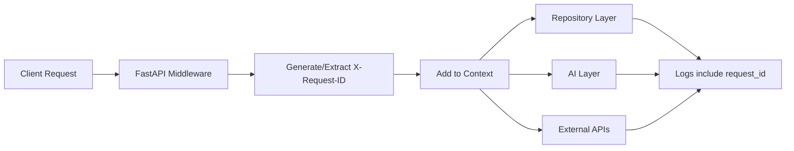
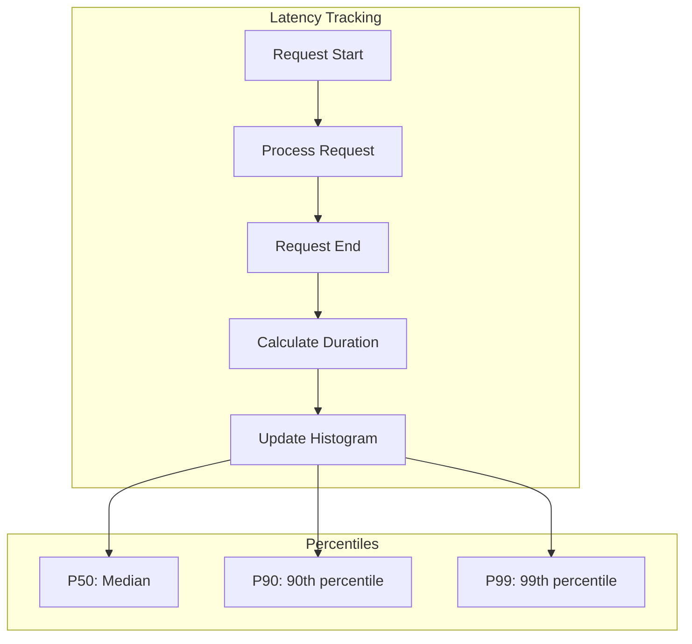
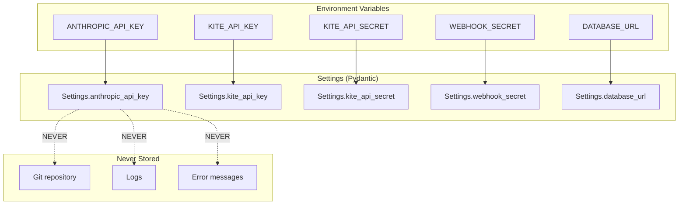
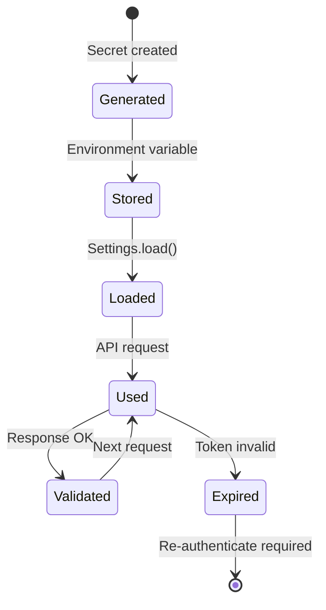
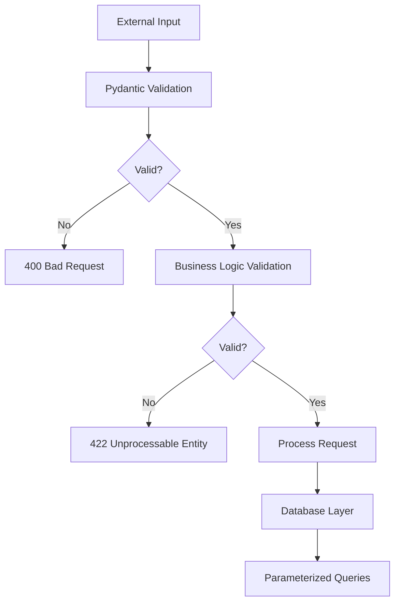
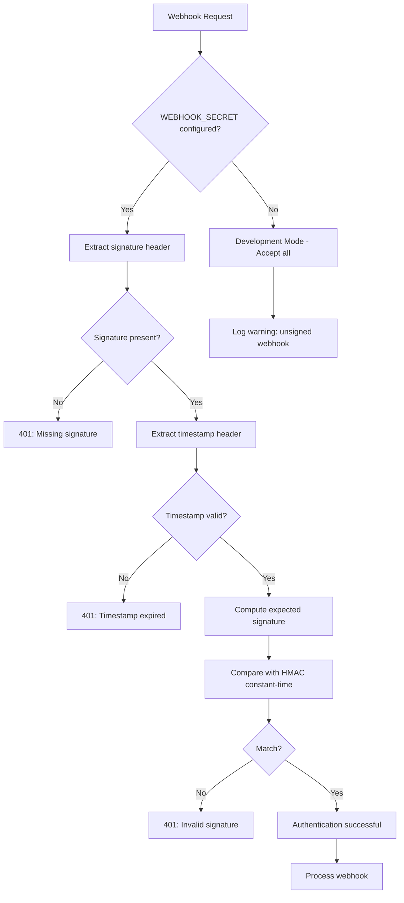
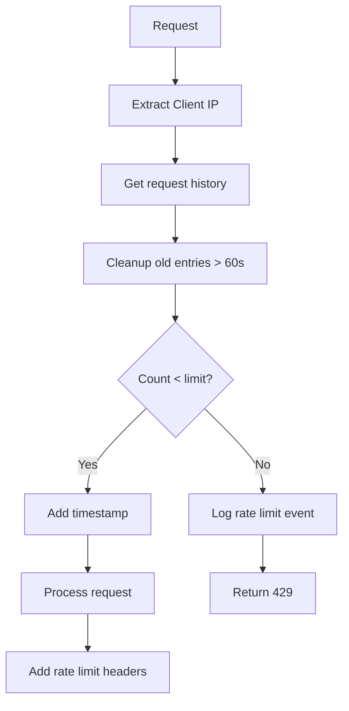
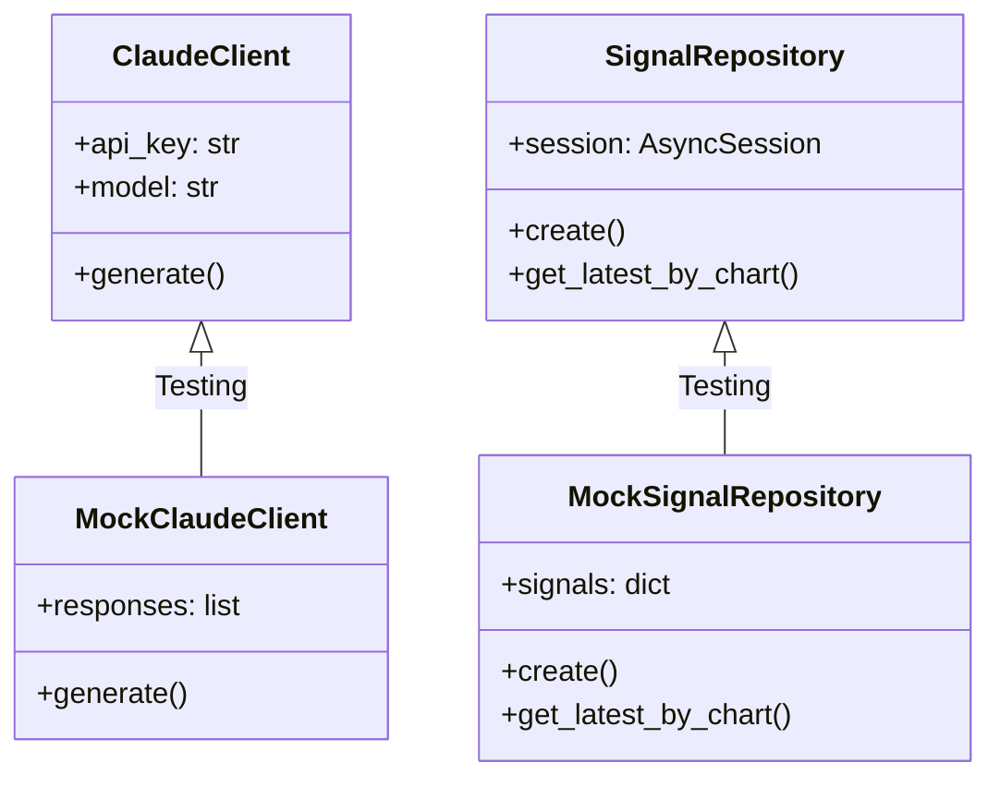
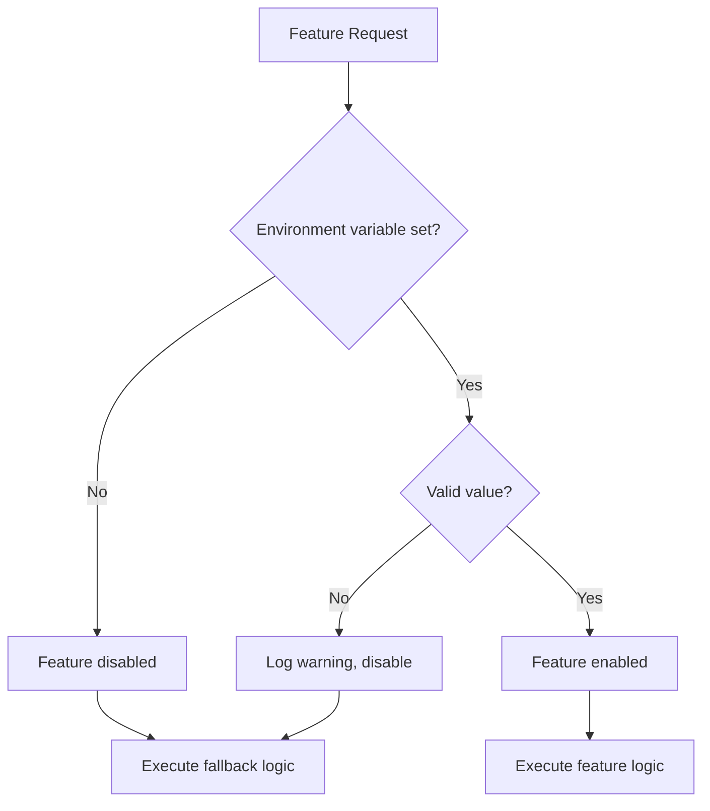

# CIA-SIE Cross-Cutting Concerns

**Phase 4 Deliverable - Architecture Generation**  
**Generated:** January 3, 2026  
**Version:** 1.0  
**Framework:** CURSOR_ARCHITECTURE_GENERATION_DIRECTIVE v1.0

---

## Executive Summary

This document captures cross-cutting architectural concerns that span multiple components of the CIA-SIE backend system. These concerns include logging & observability, security considerations, and testing hooks that apply uniformly across the entire system.

---

## Table of Contents

1. [Logging & Observability](#1-logging--observability)
2. [Security Considerations](#2-security-considerations)
3. [Testing Hooks](#3-testing-hooks)

---

## 1. Logging & Observability

### 1.1 Structured Logging Format

All log entries follow a consistent structured format for machine parsing and analysis.

#### 1.1.1 Log Entry Schema

```json
{
  "timestamp": "2026-01-03T10:15:30.123456Z",
  "level": "INFO",
  "logger": "cia_sie.ai.narrative_generator",
  "message": "Narrative generated successfully",
  "correlation_id": "req-abc123-def456",
  "context": {
    "silo_id": "uuid-here",
    "model_used": "claude-3-5-sonnet-20241022",
    "tokens_used": 1500,
    "validation_status": "VALID"
  }
}
```

#### 1.1.2 Log Levels Usage

| Level | Usage | Examples |
|-------|-------|----------|
| DEBUG | Detailed debugging information | SQL queries, request payloads |
| INFO | Normal operation confirmations | Request completed, signal stored |
| WARNING | Unexpected but handled situations | Rate limit approached, stale data |
| ERROR | Errors requiring attention | API failures, validation failures |
| CRITICAL | System-threatening issues | Database connection lost |

#### 1.1.3 Component Loggers

| Logger Name | Component | Purpose |
|-------------|-----------|---------|
| `cia_sie.api` | FastAPI routes | Request/response logging |
| `cia_sie.ai` | AI integration | Claude API calls, validation |
| `cia_sie.security` | Security module | Auth events, rate limits |
| `cia_sie.ingestion` | Webhook processing | Signal ingestion |
| `cia_sie.exposure` | Relationship detection | Contradiction/confirmation |
| `cia_sie.dal` | Data access layer | Database operations |
| `cia_sie.platforms` | Platform adapters | Kite/TradingView integration |

### 1.2 Distributed Tracing

#### 1.2.1 Request ID Propagation



#### 1.2.2 Correlation ID Headers

| Header | Direction | Purpose |
|--------|-----------|---------|
| `X-Request-ID` | Request | Client-provided or server-generated |
| `X-Correlation-ID` | Request/Response | Trace across services |

### 1.3 Metrics Collection

#### 1.3.1 Key Performance Metrics

| Metric | Type | Description |
|--------|------|-------------|
| `http_request_duration_seconds` | Histogram | Request latency (P50, P90, P99) |
| `http_requests_total` | Counter | Total requests by endpoint and status |
| `webhook_signals_received_total` | Counter | Total webhook signals processed |
| `ai_requests_total` | Counter | Claude API requests by model |
| `ai_tokens_used_total` | Counter | Token consumption by model |
| `ai_cost_usd_total` | Counter | AI cost tracking |
| `constitutional_violations_total` | Counter | Validation failures |
| `rate_limit_hits_total` | Counter | Rate limit events |

#### 1.3.2 Latency Percentiles



### 1.4 Health Check Endpoints

#### 1.4.1 Health Check Architecture

```mermaid
flowchart TD
    A[/health] --> B{Basic health}
    B -->|OK| C[Return 200]
    B -->|Fail| D[Return 503]
    
    E[/health/ready] --> F{Database connected?}
    F -->|Yes| G{AI configured?}
    G -->|Yes| H[Return 200: Ready]
    F -->|No| I[Return 503: Not ready]
    G -->|No| J[Return 200: Ready - AI optional]
```

#### 1.4.2 Health Endpoints Specification

| Endpoint | Purpose | Checks | Response |
|----------|---------|--------|----------|
| `GET /health` | Liveness | Process running | `{"status": "healthy"}` |
| `GET /health` (extended) | Readiness + info | App config, security status | Full status object |

#### 1.4.3 Health Response Schema

```json
{
  "status": "healthy",
  "app": "CIA-SIE",
  "version": "2.3.0",
  "environment": "development",
  "security": {
    "webhook_auth_enabled": true,
    "cors_restricted": false,
    "rate_limiting": "enabled",
    "security_headers": "enabled"
  }
}
```

### 1.5 Logging Configuration

#### 1.5.1 Configuration Settings

| Setting | Environment Variable | Default |
|---------|---------------------|---------|
| Log Level | `LOG_LEVEL` | `INFO` |
| Log File | `LOG_FILE` | `logs/cia_sie.log` |
| Log Format | (hardcoded) | Structured format |

#### 1.5.2 Security Logger

A dedicated security logger captures all security-related events:

```python
# cia_sie/core/security.py
security_logger = logging.getLogger("cia_sie.security")
```

Events logged:
- `AUTH_SUCCESS` - Successful webhook authentication
- `AUTH_FAILURE` - Failed authentication attempt
- `INVALID_SIGNATURE` - Signature verification failed
- `MISSING_SIGNATURE` - Required signature header missing
- `TIMESTAMP_EXPIRED` - Webhook timestamp too old
- `RATE_LIMIT_EXCEEDED` - Rate limit hit
- `WEBHOOK_RECEIVED` - Webhook received (info)
- `SUSPICIOUS_REQUEST` - Potentially malicious request

---

## 2. Security Considerations

### 2.1 API Key Storage

#### 2.1.1 Secret Management Architecture



#### 2.1.2 Environment Configuration

| Secret | Variable | Required | Purpose |
|--------|----------|----------|---------|
| Anthropic API Key | `ANTHROPIC_API_KEY` | For AI features | Claude API access |
| Kite API Key | `KITE_API_KEY` | For Kite features | Kite Connect auth |
| Kite API Secret | `KITE_API_SECRET` | For Kite features | Token exchange |
| Webhook Secret | `WEBHOOK_SECRET` | For production | Signature validation |
| Database URL | `DATABASE_URL` | Optional | Database connection |

#### 2.1.3 .env.example Template

```env
# CIA-SIE Configuration
# Copy this file to .env and fill in values

# AI Provider (Required for narrative generation)
ANTHROPIC_API_KEY=your_anthropic_api_key_here

# Kite Connect (Optional - for watchlist import)
KITE_API_KEY=your_kite_api_key_here
KITE_API_SECRET=your_kite_api_secret_here

# Security (Required for production)
WEBHOOK_SECRET=your_webhook_secret_here

# Database (Optional - defaults to SQLite)
DATABASE_URL=sqlite+aiosqlite:///./data/cia_sie.db

# Environment
ENVIRONMENT=development
DEBUG=false
```

### 2.2 Token Handling

#### 2.2.1 Token Lifecycle



#### 2.2.2 Token Security Measures

| Measure | Implementation | Purpose |
|---------|---------------|---------|
| Memory-only Kite tokens | `PlatformCredentials` (not persisted) | Prevent token leakage |
| HTTPS enforcement | HSTS header in production | Secure transmission |
| Token rotation | Not automatic (Kite tokens expire daily) | Limit exposure window |
| Token revocation | User disconnect clears token | Manual control |

### 2.3 Input Sanitization

#### 2.3.1 Validation Layers



#### 2.3.2 Validation Rules by Input Type

| Input Type | Validation | Example |
|------------|------------|---------|
| Webhook Payload | Pydantic schema + enum validation | `direction` must be BULLISH/BEARISH/NEUTRAL |
| Path Parameters | UUID format validation | `instrument_id` must be valid UUID |
| Query Parameters | Type coercion + bounds | `limit` must be positive integer |
| JSON Body | Pydantic BaseModel | All fields type-checked |

#### 2.3.3 SQL Injection Prevention

```python
# All database access uses SQLAlchemy ORM
# Parameterized queries automatically applied

# CORRECT (SQLAlchemy ORM)
stmt = select(InstrumentDB).where(InstrumentDB.symbol == symbol)

# NEVER (raw SQL with string interpolation)
# cursor.execute(f"SELECT * FROM instruments WHERE symbol = '{symbol}'")
```

#### 2.3.4 Log Injection Prevention

```python
# Inline sanitization for security logs
safe_ip = str(ip_address).replace("\n", "").replace("\r", "").replace("\t", "")[:45]
safe_details = {
    k: str(v).replace("\n", "").replace("\r", "").replace("\t", "")[:200]
    for k, v in details.items()
}
```

### 2.4 CORS Configuration

#### 2.4.1 CORS Policy by Environment

| Environment | Allowed Origins | Credentials | Methods |
|-------------|-----------------|-------------|---------|
| Development | localhost:3000, localhost:5173, 127.0.0.1:* | Yes | All |
| Production | Configured origins only | Yes | All |

#### 2.4.2 CORS Headers Configuration

```python
app.add_middleware(
    CORSMiddleware,
    allow_origins=cors_origins,  # Environment-specific
    allow_credentials=True,
    allow_methods=["GET", "POST", "PUT", "DELETE", "PATCH", "OPTIONS"],
    allow_headers=[
        "Authorization",
        "Content-Type",
        "X-Webhook-Signature",
        "X-Webhook-Timestamp",
        "X-TradingView-Signature",
        "X-TradingView-Timestamp",
    ],
    expose_headers=[
        "X-RateLimit-Limit",
        "X-RateLimit-Remaining",
        "Retry-After",
    ],
)
```

### 2.5 Security Headers

#### 2.5.1 Headers Applied to All Responses

| Header | Value | Purpose |
|--------|-------|---------|
| `X-Content-Type-Options` | `nosniff` | Prevent MIME type sniffing |
| `X-Frame-Options` | `DENY` | Prevent clickjacking |
| `X-XSS-Protection` | `1; mode=block` | XSS protection (legacy) |
| `Referrer-Policy` | `strict-origin-when-cross-origin` | Control referrer info |
| `Permissions-Policy` | `geolocation=(), microphone=(), camera=()` | Disable browser features |

#### 2.5.2 Production-Only Headers

| Header | Value | Purpose |
|--------|-------|---------|
| `Strict-Transport-Security` | `max-age=31536000; includeSubDomains` | Enforce HTTPS |

### 2.6 Webhook Signature Validation

#### 2.6.1 Signature Validation Flow



#### 2.6.2 Signature Computation

```python
# HMAC-SHA256 signature
message = timestamp.encode() + body
signature = hmac.new(
    secret.encode(), 
    message, 
    hashlib.sha256
).hexdigest()
return f"sha256={signature}"
```

#### 2.6.3 Timestamp Validation

| Parameter | Value | Purpose |
|-----------|-------|---------|
| Tolerance | 300 seconds (5 minutes) | Prevent replay attacks |
| Required | No (recommended) | Backward compatibility |

### 2.7 Rate Limiting

#### 2.7.1 Rate Limit Configuration

| Endpoint Type | Limit | Window | Identifier |
|---------------|-------|--------|------------|
| Webhook endpoints | 60 requests | 1 minute | Client IP |
| API endpoints | 100 requests | 1 minute | Client IP |

#### 2.7.2 Rate Limit Response

```http
HTTP/1.1 429 Too Many Requests
Retry-After: 60
X-RateLimit-Limit: 60
X-RateLimit-Remaining: 0
Content-Type: application/json

{"detail": "Rate limit exceeded. Please try again later."}
```

#### 2.7.3 Rate Limiter Architecture



---

## 3. Testing Hooks

### 3.1 Dependency Injection

#### 3.1.1 Injectable Components



#### 3.1.2 Dependency Override Pattern

```python
# In tests/conftest.py

@pytest.fixture
def mock_claude_client():
    """Provide mock Claude client for testing."""
    client = Mock(spec=ClaudeClient)
    client.generate = AsyncMock(return_value="Test narrative response")
    return client

@pytest.fixture
def app_with_mocks(mock_claude_client):
    """Override dependencies for testing."""
    app.dependency_overrides[get_claude_client] = lambda: mock_claude_client
    yield app
    app.dependency_overrides.clear()
```

#### 3.1.3 Swappable Components

| Component | Production | Test Mock |
|-----------|------------|-----------|
| Database Session | SQLAlchemy AsyncSession | In-memory SQLite |
| Claude Client | Anthropic API | Mock returning canned responses |
| Kite Adapter | Kite Connect API | Mock returning sample data |
| Rate Limiter | InMemoryRateLimiter | Disabled or permissive mock |

### 3.2 Feature Flags

#### 3.2.1 Configuration-Based Features

| Feature | Environment Variable | Default | Purpose |
|---------|---------------------|---------|---------|
| AI Narrative Generation | `ANTHROPIC_API_KEY` present | Disabled if missing | Graceful degradation |
| Webhook Authentication | `WEBHOOK_SECRET` present | Disabled if missing | Development mode |
| HSTS Header | `ENVIRONMENT=production` | Disabled | Only for HTTPS |
| API Documentation | `ENVIRONMENT!=production` | Enabled | Security (hide in prod) |

#### 3.2.2 Feature Flag Flow



### 3.3 Test Data Generation

#### 3.3.1 Factory Pattern for Test Data

```python
# tests/factories.py

class InstrumentFactory:
    @staticmethod
    def create(symbol: str = "TEST", display_name: str = "Test Instrument"):
        return InstrumentDB(
            instrument_id=str(uuid4()),
            symbol=symbol,
            display_name=display_name,
            is_active=True,
        )

class SignalFactory:
    @staticmethod
    def create(
        chart_id: str,
        direction: str = "BULLISH",
        signal_type: str = "STATE_CHANGE",
    ):
        return SignalDB(
            signal_id=str(uuid4()),
            chart_id=chart_id,
            direction=direction,
            signal_type=signal_type,
            signal_timestamp=datetime.utcnow(),
            received_at=datetime.utcnow(),
            indicators={"rsi": 45.5},
            raw_payload={"test": True},
        )
```

#### 3.3.2 Seed Data for Development

```python
# scripts/seed_data.py

async def seed_development_data(session: AsyncSession):
    """Seed database with sample data for development."""
    
    # Create sample instrument
    instrument = InstrumentDB(
        instrument_id=str(uuid4()),
        symbol="SAMPLE",
        display_name="Sample Instrument",
    )
    session.add(instrument)
    
    # Create sample silo
    silo = SiloDB(
        silo_id=str(uuid4()),
        instrument_id=instrument.instrument_id,
        silo_name="Primary",
    )
    session.add(silo)
    
    # Create 12 sample charts (per specification)
    for i in range(1, 13):
        chart = ChartDB(
            chart_id=str(uuid4()),
            silo_id=silo.silo_id,
            chart_code=f"{i:02d}{'ABCDEFGHIJKL'[i-1]}",
            chart_name=f"Chart {i}",
            timeframe="1h",
            webhook_id=f"SAMPLE_PRIMARY_{i:02d}",
        )
        session.add(chart)
    
    await session.commit()
```

#### 3.3.3 Test Fixture Organization

```
tests/
├── conftest.py              # Shared fixtures
├── fixtures/
│   ├── instruments.py       # Instrument test data
│   ├── signals.py           # Signal test data
│   └── webhooks.py          # Webhook payload samples
├── unit/
│   └── ... (unit tests)
└── integration/
    └── ... (integration tests)
```

### 3.4 Test Categories

#### 3.4.1 Unit Tests

| Component | Test File | Coverage Focus |
|-----------|-----------|----------------|
| ClaudeClient | `test_claude_client.py` | API calls, error handling |
| ResponseValidator | `test_response_validator.py` | Pattern matching, remediation |
| ContradictionDetector | `test_contradiction_detector.py` | Detection logic |
| FreshnessCalculator | `test_freshness.py` | Time-based calculations |
| WebhookHandler | `test_webhook_handler.py` | Payload processing |
| Constitutional | `test_constitutional_compliance.py` | All constitutional rules |

#### 3.4.2 Integration Tests

| Test File | Coverage Focus |
|-----------|----------------|
| `test_api.py` | Full API endpoint testing |
| `test_full_api.py` | End-to-end flows |

#### 3.4.3 Constitutional Compliance Tests

```python
# tests/unit/test_constitutional_compliance.py

class TestRule1DecisionSupportOnly:
    """Tests for Constitutional Rule 1: Decision-Support ONLY."""
    
    def test_no_trading_commands_in_api(self):
        """Verify no API returns trading commands."""
        pass
    
    def test_ai_response_descriptive_only(self):
        """Verify AI responses are descriptive."""
        pass

class TestRule2NeverResolveContradictions:
    """Tests for Constitutional Rule 2: Never Resolve Contradictions."""
    
    def test_no_weight_columns_in_schema(self):
        """Verify no weight columns exist."""
        pass
    
    def test_no_aggregation_functions(self):
        """Verify no aggregation functions exist."""
        pass

class TestRule3DescriptiveNotPrescriptive:
    """Tests for Constitutional Rule 3: Descriptive NOT Prescriptive."""
    
    def test_mandatory_disclaimer_present(self):
        """Verify all narratives include disclaimer."""
        pass
    
    def test_prohibited_phrases_rejected(self):
        """Verify prohibited phrases cause validation failure."""
        pass
```

### 3.5 Mock Server Configuration

#### 3.5.1 Test Database Configuration

```python
# tests/conftest.py

@pytest.fixture
async def test_db():
    """Create in-memory SQLite database for testing."""
    engine = create_async_engine(
        "sqlite+aiosqlite:///:memory:",
        echo=False,
    )
    async with engine.begin() as conn:
        await conn.run_sync(Base.metadata.create_all)
    
    async_session = sessionmaker(
        engine, class_=AsyncSession, expire_on_commit=False
    )
    
    async with async_session() as session:
        yield session
    
    await engine.dispose()
```

#### 3.5.2 Test Client Configuration

```python
@pytest.fixture
def client(test_db):
    """Create test client with overridden dependencies."""
    from cia_sie.api.app import create_app
    
    app = create_app()
    app.dependency_overrides[get_db] = lambda: test_db
    
    with TestClient(app) as client:
        yield client
```

---

## Cross-Validation Summary

### Alignment with Requirements

| Concern Area | Requirements Covered |
|--------------|---------------------|
| Logging & Observability | REQ-024 (Health Check) |
| Security | REQ-022 (Security) |
| Testing | All requirements (comprehensive test coverage) |

### Constitutional Compliance

All cross-cutting concerns respect constitutional principles:
- Security logging does NOT include recommendations
- Rate limiting does NOT prioritize any signals
- Test data does NOT include weight/score columns

---

## Appendix: Configuration Reference

### Environment Variables Summary

| Variable | Required | Default | Purpose |
|----------|----------|---------|---------|
| `ANTHROPIC_API_KEY` | For AI | None | Claude API access |
| `ANTHROPIC_MODEL` | No | claude-3-5-sonnet-20241022 | Model selection |
| `AI_BUDGET_LIMIT` | No | 50.0 | Monthly budget (USD) |
| `AI_BUDGET_ALERT_THRESHOLD` | No | 80 | Alert percentage |
| `KITE_API_KEY` | For Kite | None | Kite Connect |
| `KITE_API_SECRET` | For Kite | None | Kite Connect |
| `WEBHOOK_SECRET` | For prod | None | Signature validation |
| `DATABASE_URL` | No | sqlite:///data/cia_sie.db | Database |
| `ENVIRONMENT` | No | development | Environment mode |
| `DEBUG` | No | false | Debug logging |
| `LOG_LEVEL` | No | INFO | Log verbosity |
| `LOG_FILE` | No | logs/cia_sie.log | Log file path |
| `CORS_ORIGINS` | No | localhost origins | CORS allowed origins |
| `API_HOST` | No | 0.0.0.0 | Server bind host |
| `API_PORT` | No | 8000 | Server bind port |

---

**END OF CROSS-CUTTING CONCERNS DOCUMENT**

*Generated as Phase 4 deliverable per CURSOR_ARCHITECTURE_GENERATION_DIRECTIVE.md*

