# Universal Frontend-Backend Integration Architecture

**Version:** 1.0.0  
**Date:** January 4, 2026  
**Classification:** Reference Template  
**Governance:** Gold Standard Unified Framework v3.0  
**Constitutional Compliance:** CR-001, CR-002, CR-003

---

## Executive Overview

This document provides the **complete architectural blueprint** for frontend-backend integration in the CIA-SIE system. It serves as the universal reference template that ensures:

1. **Full Constitutional Compliance** across all layers
2. **Type-Safe Communication** between frontend and backend
3. **Proper State Management** with clear data flow patterns
4. **Defense-in-Depth** error handling and security
5. **Observable and Traceable** request flows

---

## Table of Contents

1. [System Overview](#1-system-overview)
2. [Constitutional Compliance Architecture](#2-constitutional-compliance-architecture)
3. [Frontend Architecture](#3-frontend-architecture)
4. [Backend Architecture](#4-backend-architecture)
5. [API Contract Layer](#5-api-contract-layer)
6. [Data Flow Patterns](#6-data-flow-patterns)
7. [State Management](#7-state-management)
8. [Authentication & Security](#8-authentication--security)
9. [AI Integration Flow](#9-ai-integration-flow)
10. [Error Handling Architecture](#10-error-handling-architecture)
11. [Real-Time Data Flow](#11-real-time-data-flow)
12. [Component-to-API Mapping](#12-component-to-api-mapping)

---

## 1. System Overview

### 1.1 Master Architecture Flowchart

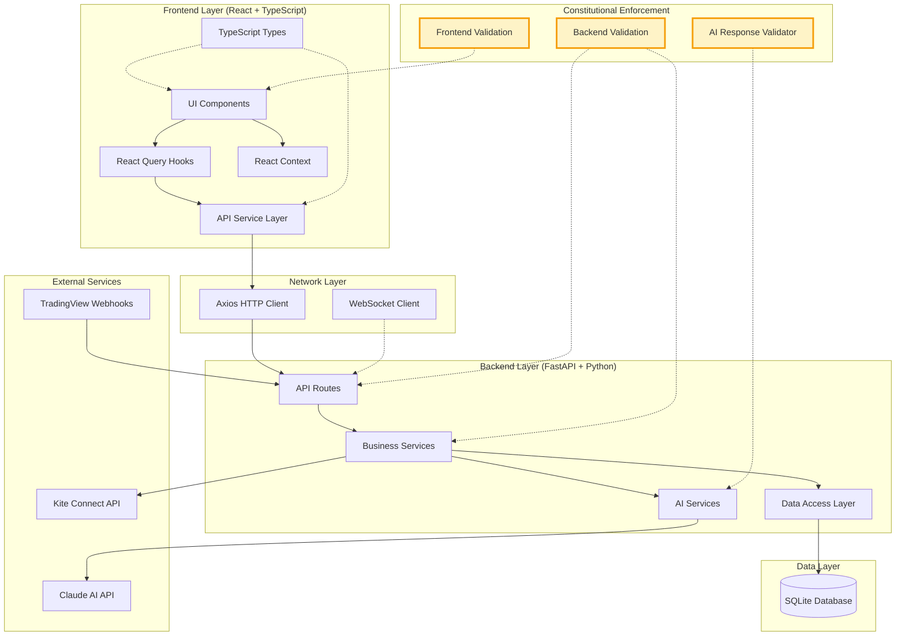
```mermaid
flowchart TB
    subgraph CLIENT["Frontend Layer (React + TypeScript)"]
        direction TB
        UI[UI Components]
        HOOKS[React Query Hooks]
        API_SVC[API Service Layer]
        TYPES[TypeScript Types]
        CONTEXT[React Context]
    end

    subgraph NETWORK["Network Layer"]
        AXIOS[Axios HTTP Client]
        WS[WebSocket Client]
    end

    subgraph SERVER["Backend Layer (FastAPI + Python)"]
        direction TB
        ROUTES[API Routes]
        SERVICES[Business Services]
        DAL[Data Access Layer]
        AI_SVC[AI Services]
    end

    subgraph EXTERNAL["External Services"]
        CLAUDE[Claude AI API]
        KITE[Kite Connect API]
        TV[TradingView Webhooks]
    end

    subgraph STORAGE["Data Layer"]
        DB[(SQLite Database)]
    end

    subgraph CONSTITUTIONAL["Constitutional Enforcement"]
        FE_CONST[Frontend Validation]
        BE_CONST[Backend Validation]
        AI_CONST[AI Response Validator]
    end

    UI --> HOOKS
    HOOKS --> API_SVC
    API_SVC --> AXIOS
    UI --> CONTEXT
    TYPES -.-> UI
    TYPES -.-> API_SVC

    AXIOS --> ROUTES
    WS -.-> ROUTES

    ROUTES --> SERVICES
    SERVICES --> DAL
    SERVICES --> AI_SVC
    DAL --> DB

    AI_SVC --> CLAUDE
    SERVICES --> KITE
    TV --> ROUTES

    FE_CONST -.-> UI
    BE_CONST -.-> ROUTES
    BE_CONST -.-> SERVICES
    AI_CONST -.-> AI_SVC

    classDef constitutional fill:#fef3c7,stroke:#f59e0b,stroke-width:3px
    class FE_CONST,BE_CONST,AI_CONST constitutional
```

### 1.2 Technology Stack Reference

| Layer | Technology | Purpose |
|-------|------------|---------|
| **Frontend Framework** | React 18+ | Component-based UI |
| **Frontend Language** | TypeScript 5+ | Type safety |
| **Build Tool** | Vite | Fast HMR, optimized builds |
| **Styling** | TailwindCSS | Utility-first CSS |
| **Server State** | React Query (TanStack Query) | Caching, background updates |
| **Client State** | React Context | UI state management |
| **HTTP Client** | Axios | Request/response handling |
| **Routing** | React Router v6 | Client-side routing |
| **Backend Framework** | FastAPI | Async Python API |
| **ORM** | SQLAlchemy 2.0 | Database abstraction |
| **Validation** | Pydantic v2 | Request/response validation |
| **AI Client** | Anthropic SDK | Claude API integration |
| **Database** | SQLite | Persistent storage |

---

## 2. Constitutional Compliance Architecture

### 2.1 Three Constitutional Rules

```
┌─────────────────────────────────────────────────────────────────────────────â”
│                    CONSTITUTIONAL RULES (INVIOLABLE)                         │
├─────────────────────────────────────────────────────────────────────────────┤
│                                                                              │
│  CR-001: DECISION-SUPPORT ONLY                                              │
│  â•â•â•â•â•â•â•â•â•â•â•â•â•â•â•â•â•â•â•â•â•â•â•â•â•â•â•â•â•â•â•                                            │
│  • System provides INFORMATION, never recommendations                        │
│  • NO "should", "recommend", "suggest", "consider"                          │
│  • NO buy/sell/enter/exit buttons or actions                                │
│                                                                              │
│  CR-002: NEVER RESOLVE CONTRADICTIONS                                       │
│  â•â•â•â•â•â•â•â•â•â•â•â•â•â•â•â•â•â•â•â•â•â•â•â•â•â•â•â•â•â•â•â•â•â•â•â•â•â•â•                                    │
│  • When charts disagree, show BOTH with EQUAL prominence                    │
│  • NO aggregation, weighting, or scoring                                    │
│  • NO "overall", "consensus", "net" language                                │
│                                                                              │
│  CR-003: DESCRIPTIVE NOT PRESCRIPTIVE                                       │
│  â•â•â•â•â•â•â•â•â•â•â•â•â•â•â•â•â•â•â•â•â•â•â•â•â•â•â•â•â•â•â•â•â•â•â•â•â•â•â•                                    │
│  • AI describes what data shows, never what to do                           │
│  • MANDATORY disclaimer on all AI content                                   │
│  • NO predictions, probabilities, or forecasts                              │
│                                                                              │
└─────────────────────────────────────────────────────────────────────────────┘
```

### 2.2 Five-Layer Defense-in-Depth

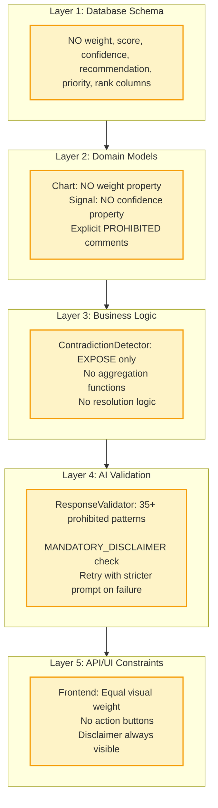
```mermaid
flowchart TB
    subgraph LAYER1["Layer 1: Database Schema"]
        DB_CONST["NO weight, score, confidence, 
        recommendation, priority, rank columns"]
    end

    subgraph LAYER2["Layer 2: Domain Models"]
        MODEL_CONST["Chart: NO weight property
        Signal: NO confidence property
        Explicit PROHIBITED comments"]
    end

    subgraph LAYER3["Layer 3: Business Logic"]
        BL_CONST["ContradictionDetector: EXPOSE only
        No aggregation functions
        No resolution logic"]
    end

    subgraph LAYER4["Layer 4: AI Validation"]
        AI_CONST["ResponseValidator: 35+ prohibited patterns
        MANDATORY_DISCLAIMER check
        Retry with stricter prompt on failure"]
    end

    subgraph LAYER5["Layer 5: API/UI Constraints"]
        UI_CONST["Frontend: Equal visual weight
        No action buttons
        Disclaimer always visible"]
    end

    LAYER1 --> LAYER2
    LAYER2 --> LAYER3
    LAYER3 --> LAYER4
    LAYER4 --> LAYER5

    classDef defense fill:#fef3c7,stroke:#f59e0b,stroke-width:2px
    class DB_CONST,MODEL_CONST,BL_CONST,AI_CONST,UI_CONST defense
```

### 2.3 Constitutional Enforcement Sequence

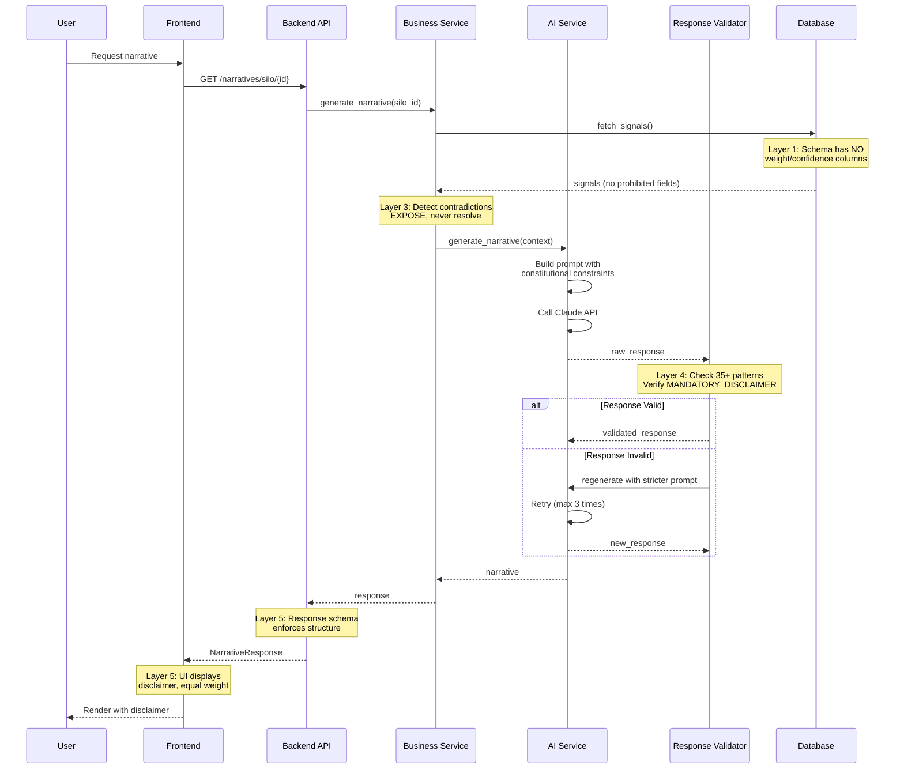
```mermaid
sequenceDiagram
    participant U as User
    participant FE as Frontend
    participant API as Backend API
    participant SVC as Business Service
    participant AI as AI Service
    participant VAL as Response Validator
    participant DB as Database

    U->>FE: Request narrative
    FE->>API: GET /narratives/silo/{id}
    
    API->>SVC: generate_narrative(silo_id)
    SVC->>DB: fetch_signals()
    
    Note over DB: Layer 1: Schema has NO<br/>weight/confidence columns
    
    DB-->>SVC: signals (no prohibited fields)
    
    Note over SVC: Layer 3: Detect contradictions<br/>EXPOSE, never resolve
    
    SVC->>AI: generate_narrative(context)
    AI->>AI: Build prompt with<br/>constitutional constraints
    AI->>AI: Call Claude API
    AI-->>VAL: raw_response
    
    Note over VAL: Layer 4: Check 35+ patterns<br/>Verify MANDATORY_DISCLAIMER
    
    alt Response Valid
        VAL-->>AI: validated_response
    else Response Invalid
        VAL->>AI: regenerate with stricter prompt
        AI->>AI: Retry (max 3 times)
        AI-->>VAL: new_response
    end
    
    AI-->>SVC: narrative
    SVC-->>API: response
    
    Note over API: Layer 5: Response schema<br/>enforces structure
    
    API-->>FE: NarrativeResponse
    
    Note over FE: Layer 5: UI displays<br/>disclaimer, equal weight
    
    FE-->>U: Render with disclaimer
```

---

## 3. Frontend Architecture

### 3.1 Component Hierarchy

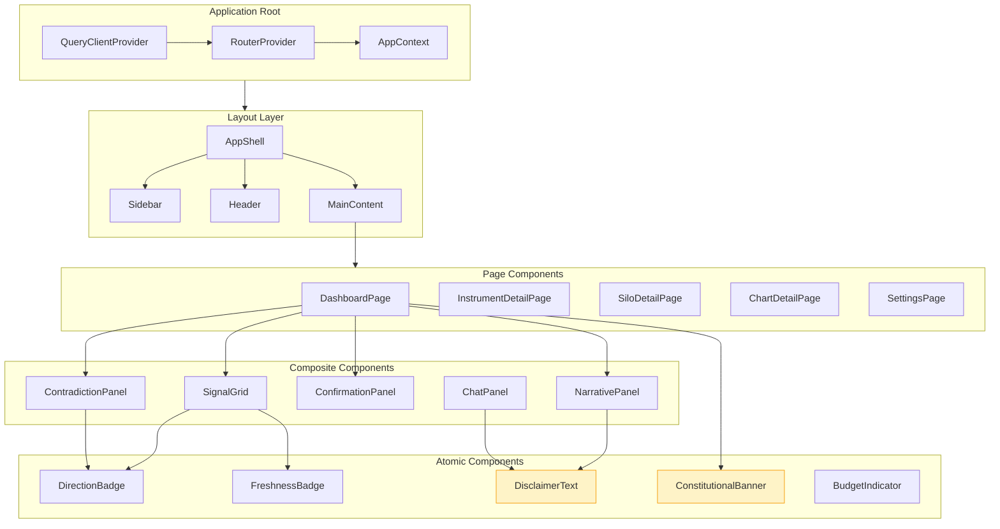
```mermaid
flowchart TB
    subgraph APP["Application Root"]
        QC[QueryClientProvider]
        RC[RouterProvider]
        CTX[AppContext]
    end

    subgraph LAYOUT["Layout Layer"]
        SHELL[AppShell]
        SIDEBAR[Sidebar]
        HEADER[Header]
        MAIN[MainContent]
    end

    subgraph PAGES["Page Components"]
        DASH[DashboardPage]
        INST[InstrumentDetailPage]
        SILO[SiloDetailPage]
        CHART[ChartDetailPage]
        SET[SettingsPage]
    end

    subgraph COMPOSITE["Composite Components"]
        SIG_GRID[SignalGrid]
        CONT_PANEL[ContradictionPanel]
        CONF_PANEL[ConfirmationPanel]
        NARR_PANEL[NarrativePanel]
        CHAT_PANEL[ChatPanel]
    end

    subgraph ATOMS["Atomic Components"]
        DIR_BADGE[DirectionBadge]
        FRESH_BADGE[FreshnessBadge]
        DISC[DisclaimerText]
        CONST_BAN[ConstitutionalBanner]
        BUDGET[BudgetIndicator]
    end

    APP --> LAYOUT
    QC --> RC
    RC --> CTX

    SHELL --> SIDEBAR
    SHELL --> HEADER
    SHELL --> MAIN

    MAIN --> PAGES

    DASH --> CONST_BAN
    DASH --> SIG_GRID
    DASH --> CONT_PANEL
    DASH --> CONF_PANEL
    DASH --> NARR_PANEL

    SIG_GRID --> DIR_BADGE
    SIG_GRID --> FRESH_BADGE
    NARR_PANEL --> DISC
    CONT_PANEL --> DIR_BADGE
    CHAT_PANEL --> DISC

    classDef constitutional fill:#fef3c7,stroke:#f59e0b
    class CONST_BAN,DISC constitutional
```

### 3.2 React Query Integration Pattern

```mermaid
flowchart LR
    subgraph COMPONENT["React Component"]
        RENDER[Render Logic]
    end

    subgraph HOOK["Custom Hook"]
        UQ[useQuery / useMutation]
    end

    subgraph API_LAYER["API Service"]
        API_FN[API Function]
    end

    subgraph HTTP["HTTP Client"]
        AXIOS_INST[Axios Instance]
    end

    subgraph CACHE["React Query Cache"]
        CACHE_DATA[Cached Data]
    end

    COMPONENT -->|1. Call hook| HOOK
    HOOK -->|2. Check cache| CACHE
    
    alt Cache Hit
        CACHE -->|3a. Return cached| HOOK
    else Cache Miss
        HOOK -->|3b. Call API| API_LAYER
        API_LAYER -->|4. HTTP request| HTTP
        HTTP -->|5. Response| API_LAYER
        API_LAYER -->|6. Return data| HOOK
        HOOK -->|7. Update cache| CACHE
    end
    
    HOOK -->|8. Return to component| COMPONENT
    COMPONENT -->|9. Render UI| RENDER
```

### 3.3 State Management Architecture

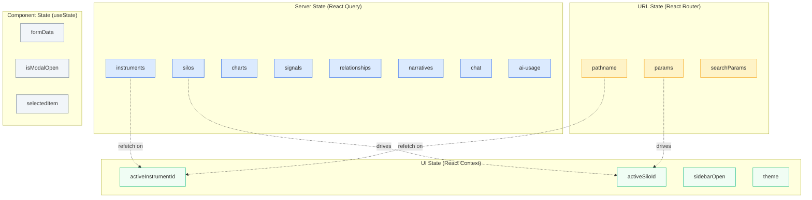
```mermaid
flowchart TB
    subgraph SERVER_STATE["Server State (React Query)"]
        direction LR
        INST_Q[instruments]
        SILO_Q[silos]
        CHART_Q[charts]
        SIG_Q[signals]
        REL_Q[relationships]
        NARR_Q[narratives]
        CHAT_Q[chat]
        AI_Q[ai-usage]
    end

    subgraph UI_STATE["UI State (React Context)"]
        direction LR
        ACTIVE_INST[activeInstrumentId]
        ACTIVE_SILO[activeSiloId]
        SIDEBAR[sidebarOpen]
        THEME[theme]
    end

    subgraph URL_STATE["URL State (React Router)"]
        direction LR
        PATH[pathname]
        PARAMS[params]
        SEARCH[searchParams]
    end

    subgraph LOCAL_STATE["Component State (useState)"]
        direction LR
        FORM[formData]
        MODAL[isModalOpen]
        SELECT[selectedItem]
    end

    INST_Q -.->|refetch on| ACTIVE_INST
    SILO_Q -.->|refetch on| ACTIVE_SILO
    
    PATH -.->|drives| ACTIVE_INST
    PARAMS -.->|drives| ACTIVE_SILO

    classDef server fill:#dbeafe,stroke:#2563eb
    classDef ui fill:#f0fdf4,stroke:#10b981
    classDef url fill:#fef3c7,stroke:#f59e0b
    classDef local fill:#f1f5f9,stroke:#64748b

    class INST_Q,SILO_Q,CHART_Q,SIG_Q,REL_Q,NARR_Q,CHAT_Q,AI_Q server
    class ACTIVE_INST,ACTIVE_SILO,SIDEBAR,THEME ui
    class PATH,PARAMS,SEARCH url
    class FORM,MODAL,SELECT local
```

---

## 4. Backend Architecture

### 4.1 Layered Architecture

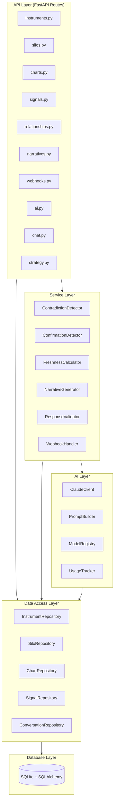
```mermaid
flowchart TB
    subgraph API_LAYER["API Layer (FastAPI Routes)"]
        direction LR
        R_INST[instruments.py]
        R_SILO[silos.py]
        R_CHART[charts.py]
        R_SIG[signals.py]
        R_REL[relationships.py]
        R_NARR[narratives.py]
        R_WH[webhooks.py]
        R_AI[ai.py]
        R_CHAT[chat.py]
        R_STRAT[strategy.py]
    end

    subgraph SERVICE_LAYER["Service Layer"]
        direction LR
        S_CONT[ContradictionDetector]
        S_CONF[ConfirmationDetector]
        S_FRESH[FreshnessCalculator]
        S_NARR[NarrativeGenerator]
        S_VALID[ResponseValidator]
        S_WH[WebhookHandler]
    end

    subgraph AI_LAYER["AI Layer"]
        direction LR
        AI_CLIENT[ClaudeClient]
        AI_PROMPT[PromptBuilder]
        AI_MODEL[ModelRegistry]
        AI_USAGE[UsageTracker]
    end

    subgraph DAL_LAYER["Data Access Layer"]
        direction LR
        REPO_INST[InstrumentRepository]
        REPO_SILO[SiloRepository]
        REPO_CHART[ChartRepository]
        REPO_SIG[SignalRepository]
        REPO_CONV[ConversationRepository]
    end

    subgraph DB_LAYER["Database Layer"]
        DB[(SQLite + SQLAlchemy)]
    end

    API_LAYER --> SERVICE_LAYER
    API_LAYER --> DAL_LAYER
    SERVICE_LAYER --> AI_LAYER
    SERVICE_LAYER --> DAL_LAYER
    AI_LAYER --> DAL_LAYER
    DAL_LAYER --> DB_LAYER
```

### 4.2 Request Processing Pipeline

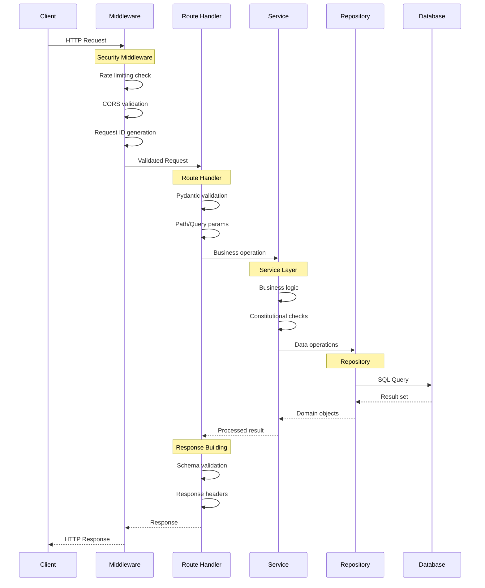
```mermaid
sequenceDiagram
    participant C as Client
    participant M as Middleware
    participant R as Route Handler
    participant S as Service
    participant D as Repository
    participant DB as Database

    C->>M: HTTP Request
    
    Note over M: Security Middleware
    M->>M: Rate limiting check
    M->>M: CORS validation
    M->>M: Request ID generation
    
    M->>R: Validated Request
    
    Note over R: Route Handler
    R->>R: Pydantic validation
    R->>R: Path/Query params
    
    R->>S: Business operation
    
    Note over S: Service Layer
    S->>S: Business logic
    S->>S: Constitutional checks
    
    S->>D: Data operations
    
    Note over D: Repository
    D->>DB: SQL Query
    DB-->>D: Result set
    D-->>S: Domain objects
    
    S-->>R: Processed result
    
    Note over R: Response Building
    R->>R: Schema validation
    R->>R: Response headers
    
    R-->>M: Response
    M-->>C: HTTP Response
```

### 4.3 Dependency Injection Pattern

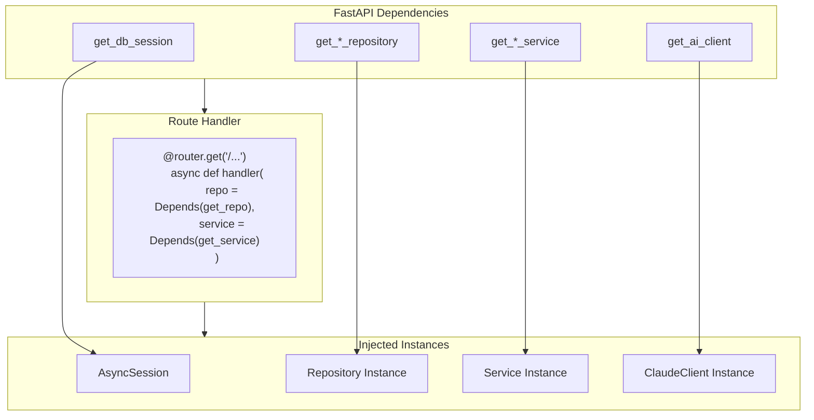
```mermaid
flowchart TB
    subgraph DEPS["FastAPI Dependencies"]
        GET_DB[get_db_session]
        GET_REPO[get_*_repository]
        GET_SVC[get_*_service]
        GET_AI[get_ai_client]
    end

    subgraph ROUTE["Route Handler"]
        HANDLER["@router.get('/...')
        async def handler(
            repo = Depends(get_repo),
            service = Depends(get_service)
        )"]
    end

    subgraph INSTANCES["Injected Instances"]
        DB_SESS[AsyncSession]
        REPO_INST[Repository Instance]
        SVC_INST[Service Instance]
        AI_INST[ClaudeClient Instance]
    end

    GET_DB --> DB_SESS
    GET_REPO --> REPO_INST
    GET_SVC --> SVC_INST
    GET_AI --> AI_INST

    DEPS --> ROUTE
    ROUTE --> INSTANCES
```

---

## 5. API Contract Layer

### 5.1 API Endpoint Map


```mermaid
flowchart LR
    subgraph CRUD["CRUD Endpoints"]
        direction TB
        I["/instruments/*"]
        S["/silos/*"]
        C["/charts/*"]
        SG["/signals/*"]
        B["/baskets/*"]
    end

    subgraph ANALYTICS["Analytics Endpoints"]
        direction TB
        R["/relationships/*"]
        N["/narratives/*"]
    end

    subgraph AI_EP["AI Endpoints"]
        direction TB
        A["/ai/*"]
        CH["/chat/*"]
        ST["/strategy/*"]
    end

    subgraph INTEGRATION["Integration Endpoints"]
        direction TB
        W["/webhook/*"]
        P["/platforms/*"]
    end

    subgraph SYSTEM["System Endpoints"]
        direction TB
        H["/health"]
        HC["/health/components"]
    end

    CRUD --> ANALYTICS
    ANALYTICS --> AI_EP
    AI_EP --> INTEGRATION
    INTEGRATION --> SYSTEM
```

### 5.2 Request/Response Type Flow

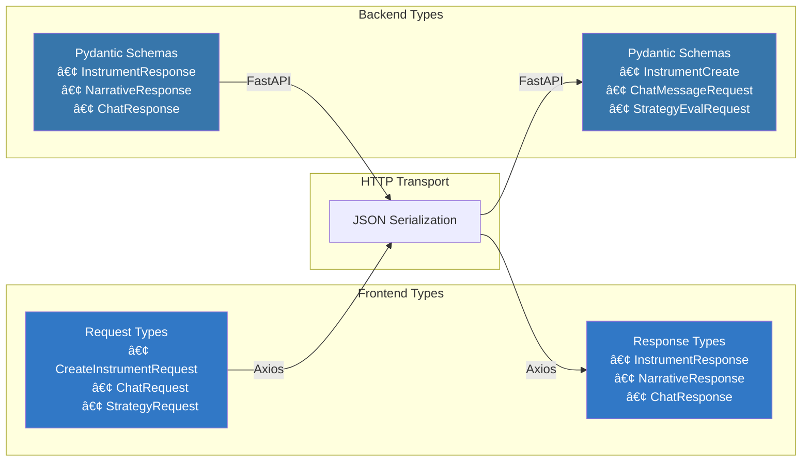
```mermaid
flowchart LR
    subgraph FE_TYPES["Frontend Types"]
        direction TB
        FE_REQ["Request Types
        • CreateInstrumentRequest
        • ChatRequest
        • StrategyRequest"]
        FE_RES["Response Types
        • InstrumentResponse
        • NarrativeResponse
        • ChatResponse"]
    end

    subgraph TRANSPORT["HTTP Transport"]
        JSON[JSON Serialization]
    end

    subgraph BE_TYPES["Backend Types"]
        direction TB
        BE_REQ["Pydantic Schemas
        • InstrumentCreate
        • ChatMessageRequest
        • StrategyEvalRequest"]
        BE_RES["Pydantic Schemas
        • InstrumentResponse
        • NarrativeResponse
        • ChatResponse"]
    end

    FE_REQ -->|Axios| JSON
    JSON -->|FastAPI| BE_REQ
    BE_RES -->|FastAPI| JSON
    JSON -->|Axios| FE_RES

    classDef ts fill:#3178c6,color:white
    classDef py fill:#3776ab,color:white
    class FE_REQ,FE_RES ts
    class BE_REQ,BE_RES py
```

### 5.3 Core API Contracts

```
┌─────────────────────────────────────────────────────────────────────────────â”
│                           API CONTRACT REFERENCE                             │
├─────────────────────────────────────────────────────────────────────────────┤
│                                                                              │
│  INSTRUMENTS                                                                 │
│  ───────────                                                                │
│  GET    /api/v1/instruments/              → InstrumentListResponse          │
│  GET    /api/v1/instruments/{id}          → InstrumentResponse              │
│  POST   /api/v1/instruments/              → InstrumentResponse              │
│  DELETE /api/v1/instruments/{id}          → SuccessResponse                 │
│                                                                              │
│  RELATIONSHIPS (Constitutional: NO aggregation)                             │
│  ─────────────                                                               │
│  GET    /api/v1/relationships/silo/{id}   → RelationshipSummaryResponse     │
│         ↳ Contains: contradictions[], confirmations[]                       │
│         ↳ NO: overall_direction, consensus, net_sentiment                   │
│                                                                              │
│  NARRATIVES (Constitutional: MANDATORY disclaimer)                          │
│  ──────────                                                                  │
│  GET    /api/v1/narratives/silo/{id}      → NarrativeResponse               │
│         ↳ Contains: sections[], closing_statement (MANDATORY)               │
│         ↳ closing_statement is ALWAYS the constitutional disclaimer         │
│                                                                              │
│  CHAT (Constitutional: Descriptive ONLY)                                    │
│  ────                                                                        │
│  POST   /api/v1/chat/{scrip_id}           → ChatResponse                    │
│         ↳ AI response validated for prohibited patterns                     │
│         ↳ Always includes disclaimer                                        │
│                                                                              │
│  STRATEGY (Constitutional: NO recommendations)                              │
│  ────────                                                                    │
│  POST   /api/v1/strategy/evaluate         → StrategyEvaluationResponse      │
│         ↳ Describes alignment, NEVER recommends action                      │
│         ↳ Includes: "THIS IS NOT A RECOMMENDATION"                          │
│                                                                              │
└─────────────────────────────────────────────────────────────────────────────┘
```

---

## 6. Data Flow Patterns

### 6.1 Signal Ingestion Flow

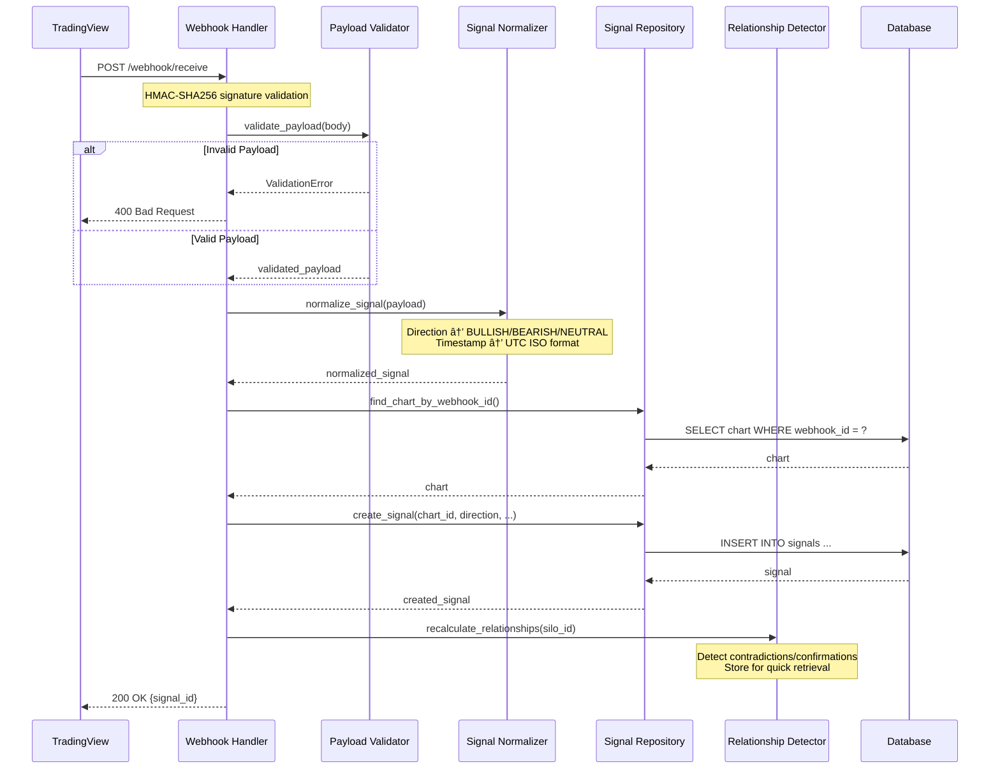
```mermaid
sequenceDiagram
    participant TV as TradingView
    participant WH as Webhook Handler
    participant VAL as Payload Validator
    participant NORM as Signal Normalizer
    participant REPO as Signal Repository
    participant DET as Relationship Detector
    participant DB as Database

    TV->>WH: POST /webhook/receive
    Note over WH: HMAC-SHA256 signature validation
    
    WH->>VAL: validate_payload(body)
    
    alt Invalid Payload
        VAL-->>WH: ValidationError
        WH-->>TV: 400 Bad Request
    else Valid Payload
        VAL-->>WH: validated_payload
    end

    WH->>NORM: normalize_signal(payload)
    Note over NORM: Direction → BULLISH/BEARISH/NEUTRAL<br/>Timestamp → UTC ISO format
    NORM-->>WH: normalized_signal

    WH->>REPO: find_chart_by_webhook_id()
    REPO->>DB: SELECT chart WHERE webhook_id = ?
    DB-->>REPO: chart
    REPO-->>WH: chart

    WH->>REPO: create_signal(chart_id, direction, ...)
    REPO->>DB: INSERT INTO signals ...
    DB-->>REPO: signal
    REPO-->>WH: created_signal

    WH->>DET: recalculate_relationships(silo_id)
    Note over DET: Detect contradictions/confirmations<br/>Store for quick retrieval
    
    WH-->>TV: 200 OK {signal_id}
```

### 6.2 Narrative Generation Flow

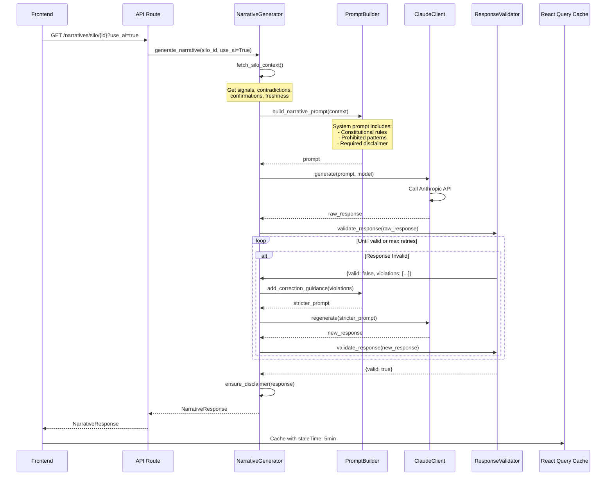
```mermaid
sequenceDiagram
    participant FE as Frontend
    participant API as API Route
    participant GEN as NarrativeGenerator
    participant PROMPT as PromptBuilder
    participant AI as ClaudeClient
    participant VAL as ResponseValidator
    participant CACHE as React Query Cache

    FE->>API: GET /narratives/silo/{id}?use_ai=true
    API->>GEN: generate_narrative(silo_id, use_ai=True)
    
    GEN->>GEN: fetch_silo_context()
    Note over GEN: Get signals, contradictions,<br/>confirmations, freshness
    
    GEN->>PROMPT: build_narrative_prompt(context)
    Note over PROMPT: System prompt includes:<br/>- Constitutional rules<br/>- Prohibited patterns<br/>- Required disclaimer
    
    PROMPT-->>GEN: prompt

    GEN->>AI: generate(prompt, model)
    AI->>AI: Call Anthropic API
    AI-->>GEN: raw_response

    GEN->>VAL: validate_response(raw_response)
    
    loop Until valid or max retries
        alt Response Invalid
            VAL->>GEN: {valid: false, violations: [...]}
            GEN->>PROMPT: add_correction_guidance(violations)
            PROMPT-->>GEN: stricter_prompt
            GEN->>AI: regenerate(stricter_prompt)
            AI-->>GEN: new_response
            GEN->>VAL: validate_response(new_response)
        end
    end

    VAL-->>GEN: {valid: true}
    GEN->>GEN: ensure_disclaimer(response)
    GEN-->>API: NarrativeResponse
    API-->>FE: NarrativeResponse
    FE->>CACHE: Cache with staleTime: 5min
```

### 6.3 Dashboard Data Assembly

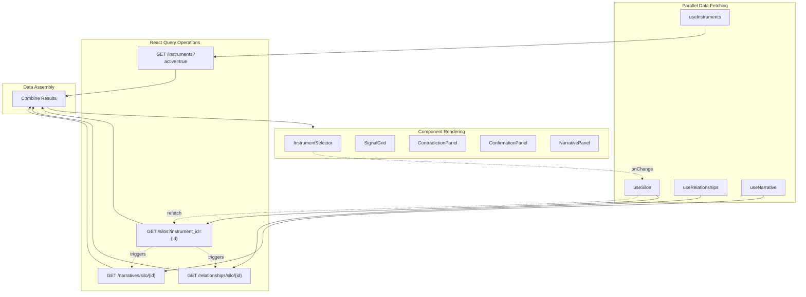
```mermaid
flowchart TB
    subgraph PARALLEL["Parallel Data Fetching"]
        direction LR
        F1[useInstruments]
        F2[useSilos]
        F3[useRelationships]
        F4[useNarrative]
    end

    subgraph QUERIES["React Query Operations"]
        Q1["GET /instruments?active=true"]
        Q2["GET /silos?instrument_id={id}"]
        Q3["GET /relationships/silo/{id}"]
        Q4["GET /narratives/silo/{id}"]
    end

    subgraph ASSEMBLY["Data Assembly"]
        COMBINE[Combine Results]
    end

    subgraph RENDER["Component Rendering"]
        INST_SEL[InstrumentSelector]
        SIG_GRID[SignalGrid]
        CONT_PAN[ContradictionPanel]
        CONF_PAN[ConfirmationPanel]
        NARR_PAN[NarrativePanel]
    end

    F1 --> Q1
    F2 --> Q2
    F3 --> Q3
    F4 --> Q4

    Q1 --> COMBINE
    Q2 --> COMBINE
    Q3 --> COMBINE
    Q4 --> COMBINE

    COMBINE --> RENDER

    INST_SEL -.->|onChange| F2
    F2 -.->|refetch| Q2
    Q2 -.->|triggers| Q3
    Q2 -.->|triggers| Q4
```

---

## 7. State Management

### 7.1 React Query Configuration

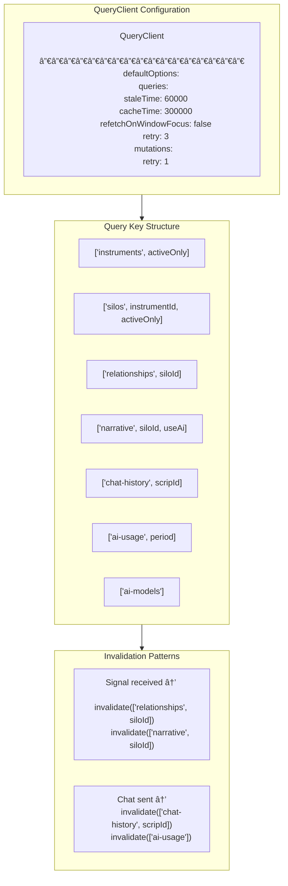
```mermaid
flowchart TB
    subgraph CONFIG["QueryClient Configuration"]
        QC["QueryClient
        ─────────────────
        defaultOptions:
          queries:
            staleTime: 60000
            cacheTime: 300000
            refetchOnWindowFocus: false
            retry: 3
          mutations:
            retry: 1"]
    end

    subgraph QUERY_KEYS["Query Key Structure"]
        K1["['instruments', activeOnly]"]
        K2["['silos', instrumentId, activeOnly]"]
        K3["['relationships', siloId]"]
        K4["['narrative', siloId, useAi]"]
        K5["['chat-history', scripId]"]
        K6["['ai-usage', period]"]
        K7["['ai-models']"]
    end

    subgraph INVALIDATION["Invalidation Patterns"]
        I1["Signal received → 
        invalidate(['relationships', siloId])
        invalidate(['narrative', siloId])"]
        
        I2["Chat sent →
        invalidate(['chat-history', scripId])
        invalidate(['ai-usage'])"]
    end

    CONFIG --> QUERY_KEYS
    QUERY_KEYS --> INVALIDATION
```

### 7.2 Context Architecture

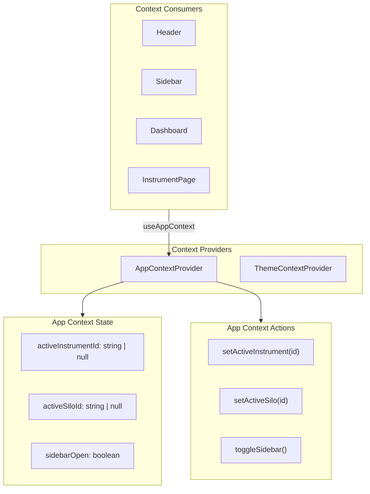
```mermaid
flowchart TB
    subgraph PROVIDERS["Context Providers"]
        APP_CTX[AppContextProvider]
        THEME_CTX[ThemeContextProvider]
    end

    subgraph APP_STATE["App Context State"]
        direction LR
        AI["activeInstrumentId: string | null"]
        AS["activeSiloId: string | null"]
        SO["sidebarOpen: boolean"]
    end

    subgraph ACTIONS["App Context Actions"]
        direction LR
        SAI["setActiveInstrument(id)"]
        SAS["setActiveSilo(id)"]
        TSB["toggleSidebar()"]
    end

    subgraph CONSUMERS["Context Consumers"]
        direction LR
        HEADER[Header]
        SIDEBAR[Sidebar]
        DASH[Dashboard]
        INST_PAGE[InstrumentPage]
    end

    APP_CTX --> APP_STATE
    APP_CTX --> ACTIONS

    CONSUMERS -->|useAppContext| APP_CTX
```

### 7.3 Optimistic Updates Pattern

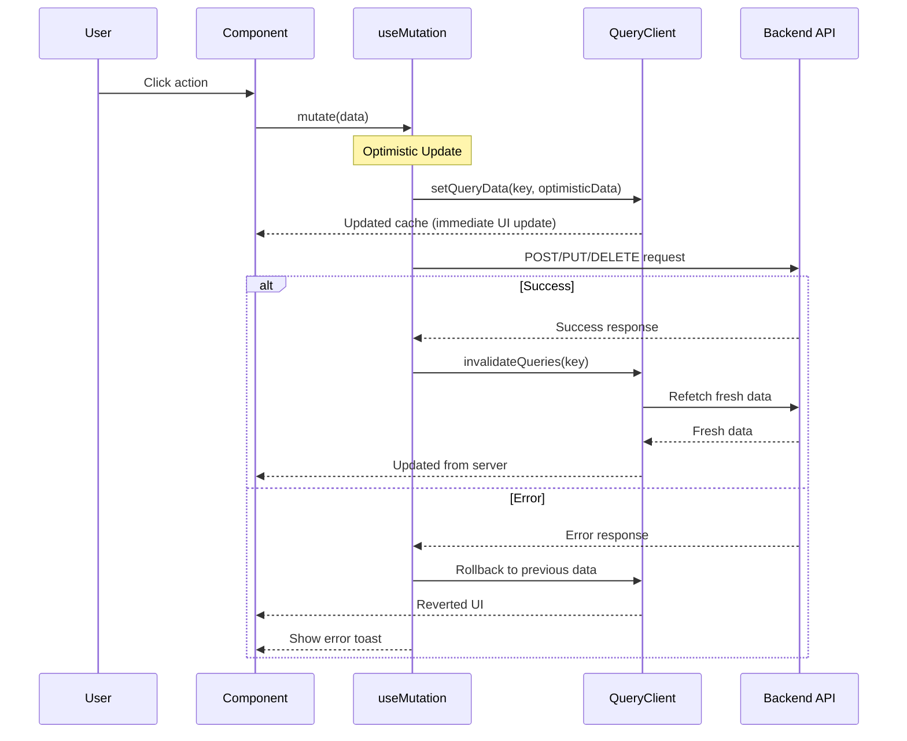
```mermaid
sequenceDiagram
    participant U as User
    participant C as Component
    participant M as useMutation
    participant Q as QueryClient
    participant API as Backend API

    U->>C: Click action
    C->>M: mutate(data)
    
    Note over M: Optimistic Update
    M->>Q: setQueryData(key, optimisticData)
    Q-->>C: Updated cache (immediate UI update)
    
    M->>API: POST/PUT/DELETE request
    
    alt Success
        API-->>M: Success response
        M->>Q: invalidateQueries(key)
        Q->>API: Refetch fresh data
        API-->>Q: Fresh data
        Q-->>C: Updated from server
    else Error
        API-->>M: Error response
        M->>Q: Rollback to previous data
        Q-->>C: Reverted UI
        M-->>C: Show error toast
    end
```

---

## 8. Authentication & Security

### 8.1 Security Architecture Overview

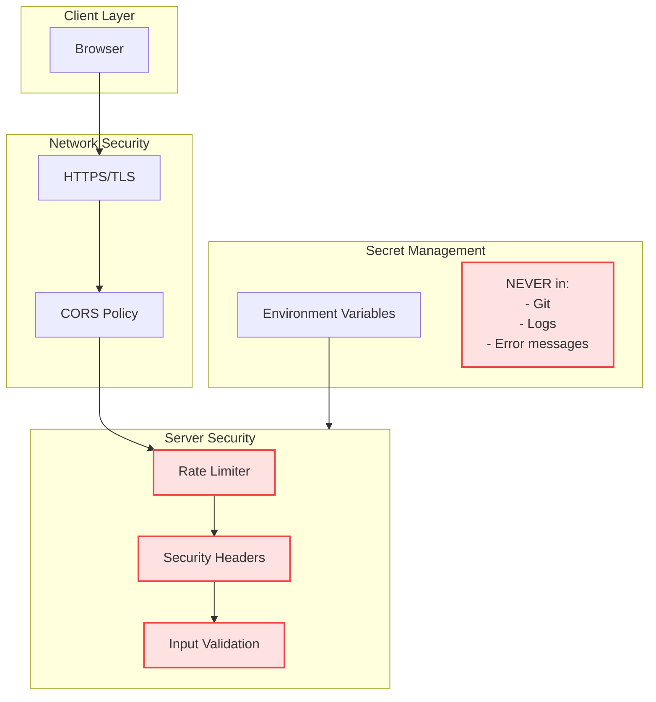
```mermaid
flowchart TB
    subgraph CLIENT["Client Layer"]
        BROWSER[Browser]
    end

    subgraph NETWORK["Network Security"]
        HTTPS[HTTPS/TLS]
        CORS[CORS Policy]
    end

    subgraph SERVER["Server Security"]
        RATE[Rate Limiter]
        HEADERS[Security Headers]
        VALID[Input Validation]
    end

    subgraph SECRETS["Secret Management"]
        ENV[Environment Variables]
        NEVER["NEVER in:
        - Git
        - Logs
        - Error messages"]
    end

    BROWSER --> HTTPS
    HTTPS --> CORS
    CORS --> RATE
    RATE --> HEADERS
    HEADERS --> VALID
    ENV --> SERVER

    classDef security fill:#fee2e2,stroke:#ef4444,stroke-width:2px
    class RATE,HEADERS,VALID,NEVER security
```

### 8.2 Kite OAuth Flow

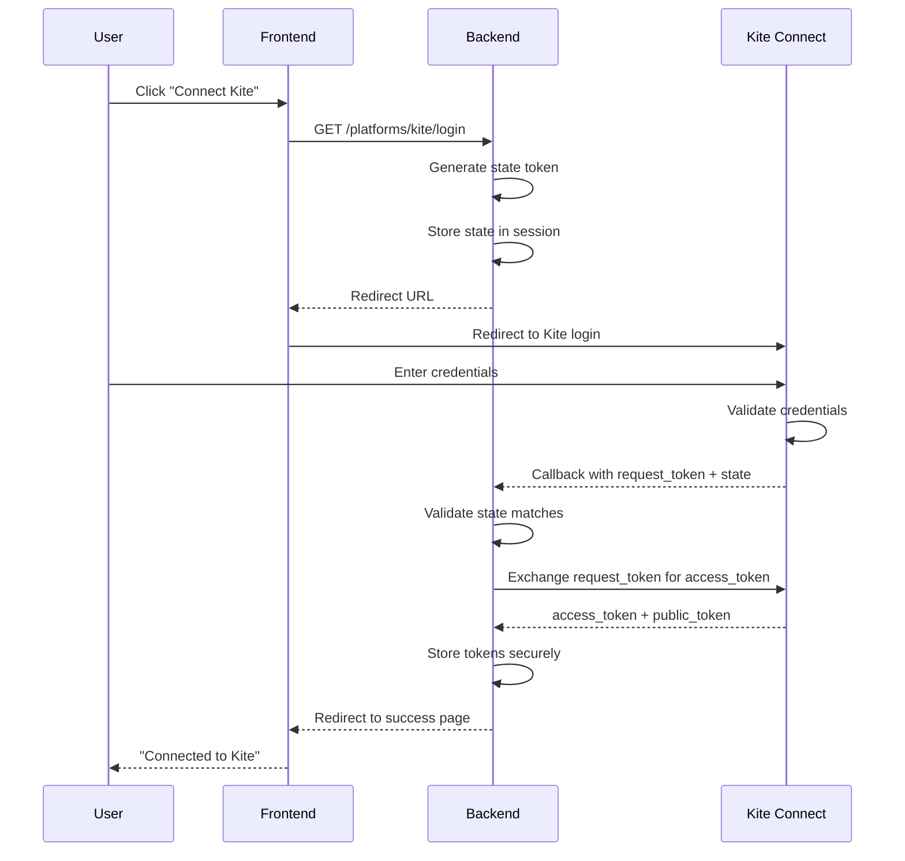
```mermaid
sequenceDiagram
    participant U as User
    participant FE as Frontend
    participant BE as Backend
    participant KITE as Kite Connect

    U->>FE: Click "Connect Kite"
    FE->>BE: GET /platforms/kite/login
    BE->>BE: Generate state token
    BE->>BE: Store state in session
    BE-->>FE: Redirect URL
    FE->>KITE: Redirect to Kite login

    U->>KITE: Enter credentials
    KITE->>KITE: Validate credentials
    KITE-->>BE: Callback with request_token + state

    BE->>BE: Validate state matches
    BE->>KITE: Exchange request_token for access_token
    KITE-->>BE: access_token + public_token

    BE->>BE: Store tokens securely
    BE-->>FE: Redirect to success page
    FE-->>U: "Connected to Kite"
```

### 8.3 Webhook Signature Validation

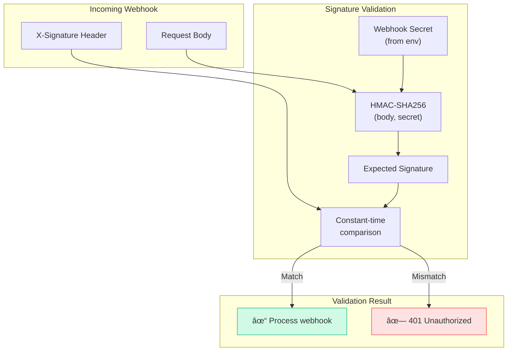
```mermaid
flowchart TB
    subgraph INPUT["Incoming Webhook"]
        BODY[Request Body]
        SIG[X-Signature Header]
    end

    subgraph VALIDATION["Signature Validation"]
        SECRET["Webhook Secret
        (from env)"]
        HMAC["HMAC-SHA256
        (body, secret)"]
        EXPECTED[Expected Signature]
        COMPARE["Constant-time
        comparison"]
    end

    subgraph RESULT["Validation Result"]
        PASS[✓ Process webhook]
        FAIL[✗ 401 Unauthorized]
    end

    BODY --> HMAC
    SECRET --> HMAC
    HMAC --> EXPECTED
    SIG --> COMPARE
    EXPECTED --> COMPARE

    COMPARE -->|Match| PASS
    COMPARE -->|Mismatch| FAIL

    classDef secure fill:#d1fae5,stroke:#10b981
    classDef danger fill:#fee2e2,stroke:#ef4444
    class PASS secure
    class FAIL danger
```

### 8.4 Rate Limiting Architecture

```mermaid
flowchart TB
    subgraph LIMITS["Rate Limit Configuration"]
        L1["General API: 100/minute"]
        L2["Webhook: 60/minute"]
        L3["AI Endpoints: 20/minute"]
        L4["Auth: 5/minute"]
    end

    subgraph TRACKER["Request Tracker"]
        WINDOW["Sliding window
        per IP/endpoint"]
    end

    subgraph RESPONSE["Rate Limit Response"]
        ALLOW["Allow request"]
        BLOCK["429 Too Many Requests
        Retry-After header"]
    end

    LIMITS --> TRACKER
    TRACKER -->|Under limit| ALLOW
    TRACKER -->|Over limit| BLOCK
```

---

## 9. AI Integration Flow

### 9.1 AI Service Architecture

```mermaid
flowchart TB
    subgraph AI_ROUTES["AI API Routes"]
        R_MODELS["/ai/models"]
        R_USAGE["/ai/usage"]
        R_BUDGET["/ai/budget"]
        R_CHAT["/chat/{scrip_id}"]
        R_NARR["/narratives/silo/{id}"]
        R_STRAT["/strategy/evaluate"]
    end

    subgraph AI_SERVICES["AI Services"]
        MODEL_REG[ModelRegistry]
        USAGE_TRACK[UsageTracker]
        CLAUDE[ClaudeClient]
        PROMPT_BUILD[PromptBuilder]
        RESP_VALID[ResponseValidator]
        NARR_GEN[NarrativeGenerator]
    end

    subgraph EXTERNAL["External"]
        ANTHROPIC[Anthropic API]
    end

    R_MODELS --> MODEL_REG
    R_USAGE --> USAGE_TRACK
    R_BUDGET --> USAGE_TRACK
    R_CHAT --> CLAUDE
    R_CHAT --> RESP_VALID
    R_NARR --> NARR_GEN
    R_STRAT --> CLAUDE
    R_STRAT --> RESP_VALID

    CLAUDE --> ANTHROPIC
    NARR_GEN --> PROMPT_BUILD
    NARR_GEN --> CLAUDE
    NARR_GEN --> RESP_VALID
```

### 9.2 Model Selection Flow

```mermaid
flowchart TB
    subgraph INPUT["Selection Inputs"]
        USER_PREF["User preference
        (optional)"]
        TOKEN_EST["Token estimate"]
        COMPLEXITY["Context complexity"]
    end

    subgraph LOGIC["Selection Logic"]
        CHECK_USER{"User specified?"}
        CHECK_TOKENS{"Tokens < 500?"}
        CHECK_COMPLEX{"Complex context?"}
        CHECK_BUDGET{"Budget available?"}
    end

    subgraph MODELS["Model Options"]
        HAIKU["claude-3-haiku
        Fast, cheap"]
        SONNET["claude-3.5-sonnet
        Balanced (default)"]
        OPUS["claude-opus-4
        Most capable"]
    end

    INPUT --> CHECK_USER
    CHECK_USER -->|Yes| USER_PREF
    USER_PREF --> CHECK_BUDGET

    CHECK_USER -->|No| CHECK_TOKENS
    CHECK_TOKENS -->|Yes| HAIKU
    CHECK_TOKENS -->|No| CHECK_COMPLEX
    CHECK_COMPLEX -->|Yes| OPUS
    CHECK_COMPLEX -->|No| SONNET

    CHECK_BUDGET -->|Sufficient| MODELS
    CHECK_BUDGET -->|Insufficient| HAIKU
```

### 9.3 Response Validation Pipeline

```mermaid
flowchart TB
    subgraph INPUT["AI Response"]
        RAW[Raw Claude Response]
    end

    subgraph CHECKS["Validation Checks"]
        direction TB
        C1["Check prohibited patterns
        (35+ regex patterns)"]
        C2["Check for disclaimer
        (MANDATORY)"]
        C3["Check language tone
        (descriptive only)"]
    end

    subgraph PATTERNS["Prohibited Pattern Categories"]
        P1["Recommendations:
        should, recommend, suggest"]
        P2["Predictions:
        will, likely, probably"]
        P3["Actions:
        buy, sell, enter, exit"]
        P4["Scores:
        confidence %, rating, score"]
        P5["Aggregation:
        overall, consensus, net"]
    end

    subgraph RESULT["Validation Result"]
        PASS["✓ Valid
        Return to caller"]
        FAIL["✗ Invalid
        Retry with corrections"]
        FALLBACK["Maximum retries
        Use template response"]
    end

    RAW --> C1
    C1 --> C2
    C2 --> C3

    PATTERNS -.-> C1

    C3 -->|All pass| PASS
    C3 -->|Failure| FAIL
    FAIL -->|Retry < 3| CHECKS
    FAIL -->|Retry >= 3| FALLBACK

    classDef valid fill:#d1fae5,stroke:#10b981
    classDef invalid fill:#fee2e2,stroke:#ef4444
    class PASS valid
    class FAIL,FALLBACK invalid
```

### 9.4 Budget Management Flow

```mermaid
flowchart TB
    subgraph CHECK["Pre-Request Check"]
        ESTIMATE["Estimate request cost"]
        CURRENT["Get current usage"]
        BUDGET["Get budget limit"]
    end

    subgraph CALCULATION["Budget Calculation"]
        PERCENT["percentage = 
        (current + estimate) / limit × 100"]
    end

    subgraph STATUS["Budget Status"]
        OK["OK (< 80%)
        Proceed normally"]
        WARN["WARNING (80-90%)
        Show dismissible alert"]
        CRIT["CRITICAL (90-100%)
        Require confirmation"]
        BLOCKED["BLOCKED (100%+)
        Deny request"]
    end

    subgraph UI["Frontend Display"]
        BANNER_WARN["âš ï¸ Budget Warning Banner"]
        BANNER_CRIT["🔴 Budget Critical Banner"]
        MODAL_BLOCK["🚫 Budget Exhausted Modal"]
    end

    CHECK --> CALCULATION
    CALCULATION --> STATUS

    OK --> PROCEED[Process Request]
    WARN --> BANNER_WARN
    BANNER_WARN --> PROCEED
    CRIT --> BANNER_CRIT
    BANNER_CRIT -->|User confirms| PROCEED
    BLOCKED --> MODAL_BLOCK
    MODAL_BLOCK -->|Request increase| DENY[Deny Request]

    classDef ok fill:#d1fae5,stroke:#10b981
    classDef warn fill:#fef3c7,stroke:#f59e0b
    classDef crit fill:#fee2e2,stroke:#ef4444
    class OK ok
    class WARN warn
    class CRIT,BLOCKED crit
```

---

## 10. Error Handling Architecture

### 10.1 Error Hierarchy

```mermaid
classDiagram
    class CIASIEError {
        <<abstract>>
        +message: str
        +code: str
        +status_code: int
    }

    class ValidationError {
        +field: str
        +constraint: str
        +status_code: 400
    }

    class NotFoundError {
        +entity: str
        +identifier: str
        +status_code: 404
    }

    class ConstitutionalViolationError {
        +rule: str
        +violation: str
        +status_code: 422
    }

    class AggregationAttemptError {
        +attempted_operation: str
        +status_code: 422
    }

    class RecommendationAttemptError {
        +attempted_text: str
        +status_code: 422
    }

    class ContradictionResolutionAttemptError {
        +contradiction_id: str
        +status_code: 422
    }

    class ExternalServiceError {
        +service: str
        +original_error: str
        +status_code: 502
    }

    class RateLimitError {
        +retry_after: int
        +status_code: 429
    }

    CIASIEError <|-- ValidationError
    CIASIEError <|-- NotFoundError
    CIASIEError <|-- ConstitutionalViolationError
    CIASIEError <|-- ExternalServiceError
    CIASIEError <|-- RateLimitError

    ConstitutionalViolationError <|-- AggregationAttemptError
    ConstitutionalViolationError <|-- RecommendationAttemptError
    ConstitutionalViolationError <|-- ContradictionResolutionAttemptError
```

### 10.2 Error Flow Through Layers

```mermaid
sequenceDiagram
    participant FE as Frontend
    participant API as API Route
    participant SVC as Service
    participant DB as Database
    participant EH as Error Handler

    FE->>API: Request
    API->>SVC: Business operation
    
    alt Database Error
        SVC->>DB: Query
        DB-->>SVC: DatabaseError
        SVC->>EH: Wrap as CIASIEError
        EH-->>API: Structured error
    else Validation Error
        SVC->>SVC: Validate data
        SVC->>EH: ValidationError
        EH-->>API: Structured error
    else Constitutional Violation
        SVC->>SVC: Check constitutional rules
        SVC->>EH: ConstitutionalViolationError
        EH-->>API: Structured error
    end

    API->>API: Format error response
    API-->>FE: {"error": {...}, "status": 4xx}
    
    FE->>FE: Error boundary catch
    FE->>FE: Show user-friendly message
```

### 10.3 Frontend Error Handling

```mermaid
flowchart TB
    subgraph REACT["React Component Tree"]
        ROOT[App Root]
        EB[ErrorBoundary]
        PAGE[Page Component]
        COMP[Child Components]
    end

    subgraph QUERY["React Query"]
        QH["Query Hook
        {error, isError}"]
        MH["Mutation Hook
        {error, isError}"]
    end

    subgraph HANDLING["Error Handling"]
        UI_ERR["ErrorMessage component"]
        TOAST["Toast notification"]
        FALLBACK["Error fallback UI"]
        RETRY["Retry button"]
    end

    ROOT --> EB
    EB --> PAGE
    PAGE --> COMP

    COMP --> QH
    COMP --> MH

    QH -->|isError| UI_ERR
    MH -->|onError| TOAST

    EB -->|Catch render error| FALLBACK
    UI_ERR --> RETRY
    RETRY -->|onClick| QH
```

### 10.4 Circuit Breaker Pattern (Conceptual)

```mermaid
stateDiagram-v2
    [*] --> Closed: Initial state

    Closed --> Open: Failure threshold reached
    Closed --> Closed: Success / Failure under threshold

    Open --> HalfOpen: Timeout elapsed
    Open --> Open: All requests fail fast

    HalfOpen --> Closed: Probe request succeeds
    HalfOpen --> Open: Probe request fails

    note right of Closed: Normal operation
    note right of Open: Fail fast, protect backend
    note right of HalfOpen: Test if service recovered
```

---

## 11. Real-Time Data Flow

### 11.1 Signal Update Propagation

```mermaid
sequenceDiagram
    participant TV as TradingView
    participant WH as Webhook Handler
    participant DB as Database
    participant CACHE as Query Cache
    participant UI as Frontend UI

    TV->>WH: New signal webhook
    WH->>DB: Store signal
    DB-->>WH: Stored
    WH-->>TV: 200 OK

    Note over CACHE: Option A: Polling
    loop Every 30 seconds
        UI->>CACHE: Check staleTime
        alt Data stale
            CACHE->>DB: Refetch
            DB-->>CACHE: Fresh data
            CACHE-->>UI: Updated signals
            UI->>UI: Re-render
        end
    end

    Note over CACHE: Option B: Server-Sent Events (Future)
    WH-->>UI: SSE: signal_updated
    UI->>CACHE: Invalidate queries
    CACHE->>DB: Refetch
    DB-->>CACHE: Fresh data
    CACHE-->>UI: Updated signals
```

### 11.2 Freshness Calculation Flow

```mermaid
flowchart TB
    subgraph INPUT["Signal Data"]
        TS["signal_timestamp"]
        NOW["current_time (UTC)"]
    end

    subgraph CALC["Calculation"]
        AGE["age_minutes = 
        (now - timestamp) / 60"]
    end

    subgraph THRESHOLDS["Threshold Comparison"]
        T1{"age ≤ 2 min?"}
        T2{"age ≤ 10 min?"}
        T3{"age ≤ 30 min?"}
        T4{"signal exists?"}
    end

    subgraph STATUS["Freshness Status"]
        CURRENT["🟢 CURRENT"]
        RECENT["🟡 RECENT"]
        STALE["🔴 STALE"]
        UNAVAILABLE["âš« UNAVAILABLE"]
    end

    INPUT --> CALC
    CALC --> T4

    T4 -->|No| UNAVAILABLE
    T4 -->|Yes| T1
    T1 -->|Yes| CURRENT
    T1 -->|No| T2
    T2 -->|Yes| RECENT
    T2 -->|No| T3
    T3 -->|Yes or No| STALE

    classDef current fill:#d1fae5,stroke:#10b981
    classDef recent fill:#fef3c7,stroke:#f59e0b
    classDef stale fill:#fee2e2,stroke:#ef4444
    classDef unavailable fill:#f1f5f9,stroke:#64748b

    class CURRENT current
    class RECENT recent
    class STALE stale
    class UNAVAILABLE unavailable
```

---

## 12. Component-to-API Mapping

### 12.1 Dashboard Page Dependencies

```mermaid
flowchart LR
    subgraph PAGE["Dashboard Page"]
        P[DashboardPage]
    end

    subgraph COMPONENTS["Components"]
        CB[ConstitutionalBanner]
        IS[InstrumentSelector]
        SG[SignalGrid]
        CP[ContradictionPanel]
        CFP[ConfirmationPanel]
        NP[NarrativePanel]
    end

    subgraph HOOKS["React Query Hooks"]
        H1[useInstruments]
        H2[useSilos]
        H3[useRelationships]
        H4[useNarrative]
    end

    subgraph API["API Endpoints"]
        A1[GET /instruments]
        A2[GET /silos]
        A3[GET /relationships/silo]
        A4[GET /narratives/silo]
    end

    P --> CB
    P --> IS
    P --> SG
    P --> CP
    P --> CFP
    P --> NP

    IS --> H1
    IS --> H2
    SG --> H3
    CP --> H3
    CFP --> H3
    NP --> H4

    H1 --> A1
    H2 --> A2
    H3 --> A3
    H4 --> A4
```

### 12.2 Chat Page Dependencies

```mermaid
flowchart LR
    subgraph PAGE["Chat Interface"]
        CP[ChatPanel]
    end

    subgraph COMPONENTS["Sub-Components"]
        MS[ModelSelector]
        MSG[MessageList]
        INPUT[ChatInput]
        COST[CostDisplay]
        DISC[DisclaimerText]
    end

    subgraph HOOKS["React Query Hooks"]
        H1[useAIModels]
        H2[useChatHistory]
        H3[useSendMessage]
        H4[useAIUsage]
    end

    subgraph API["API Endpoints"]
        A1[GET /ai/models]
        A2[GET /chat/{id}/history]
        A3[POST /chat/{id}]
        A4[GET /ai/usage]
    end

    CP --> MS
    CP --> MSG
    CP --> INPUT
    CP --> COST
    CP --> DISC

    MS --> H1
    MSG --> H2
    INPUT --> H3
    COST --> H4

    H1 --> A1
    H2 --> A2
    H3 --> A3
    H4 --> A4
```

### 12.3 Full Component-API Matrix

```
┌─────────────────────────────────────────────────────────────────────────────â”
│                    COMPONENT → API ENDPOINT MATRIX                           │
├─────────────────────────────────────────────────────────────────────────────┤
│                                                                              │
│  COMPONENT              │ HOOK                  │ API ENDPOINT               │
│  ──────────────────────────────────────────────────────────────────────────  │
│  InstrumentSelector     │ useInstruments        │ GET /instruments           │
│  SiloSelector           │ useSilos              │ GET /silos                 │
│  SignalGrid             │ useRelationships      │ GET /relationships/silo    │
│  ChartSignalCard        │ (via SignalGrid)      │ (via relationships)        │
│  DirectionBadge         │ (props only)          │ N/A                        │
│  FreshnessBadge         │ (props only)          │ N/A                        │
│  ContradictionPanel     │ useRelationships      │ GET /relationships/silo    │
│  ContradictionAlert     │ (props only)          │ N/A                        │
│  ConfirmationPanel      │ useRelationships      │ GET /relationships/silo    │
│  NarrativePanel         │ useNarrative          │ GET /narratives/silo       │
│  DisclaimerText         │ (static content)      │ N/A                        │
│  ConstitutionalBanner   │ (static content)      │ N/A                        │
│  ModelSelector          │ useAIModels           │ GET /ai/models             │
│  BudgetIndicator        │ useAIBudget           │ GET /ai/budget             │
│  TokenDisplay           │ (props only)          │ N/A                        │
│  CostDisplay            │ useAIUsage            │ GET /ai/usage              │
│  BudgetAlert            │ useAIBudget           │ GET /ai/budget             │
│  AIUsagePanel           │ useAIUsage            │ GET /ai/usage              │
│  ChatPanel              │ useChat               │ POST /chat, GET /history   │
│  ChatInput              │ useSendMessage        │ POST /chat/{scrip_id}      │
│  MessageList            │ useChatHistory        │ GET /chat/{id}/history     │
│  SettingsForm           │ useAIConfigure        │ POST /ai/configure         │
│  Header                 │ useAIBudget           │ GET /ai/budget             │
│                                                                              │
└─────────────────────────────────────────────────────────────────────────────┘
```

---

## Appendix A: TypeScript Types Reference

### A.1 Domain Types (Frontend)

```typescript
// Direction - NO WEIGHTING
type Direction = 'BULLISH' | 'BEARISH' | 'NEUTRAL'

// Freshness Status
type FreshnessStatus = 'CURRENT' | 'RECENT' | 'STALE' | 'UNAVAILABLE'

// Signal Type
type SignalType = 'STATE_CHANGE' | 'HEARTBEAT'

// Core Domain Models
interface Instrument {
  instrument_id: string
  symbol: string
  display_name: string
  is_active: boolean
  created_at: string
}

interface Silo {
  silo_id: string
  instrument_id: string
  silo_name: string
  is_active: boolean
}

interface Chart {
  chart_id: string
  silo_id: string
  chart_code: string
  chart_name: string
  timeframe: string
  webhook_id: string
  is_active: boolean
  // ⌠NO weight property
  // ⌠NO priority property
}

interface Signal {
  signal_id: string
  chart_id: string
  signal_type: SignalType
  direction: Direction
  signal_timestamp: string
  // ⌠NO confidence property
  // ⌠NO strength property
  // ⌠NO score property
}

interface Contradiction {
  chart_a_id: string
  chart_a_code: string
  chart_a_name: string
  chart_a_direction: Direction
  chart_b_id: string
  chart_b_code: string
  chart_b_name: string
  chart_b_direction: Direction
  detected_at: string
  // ⌠NO resolution property
  // ⌠NO preferred property
}

interface Confirmation {
  chart_ids: string[]
  chart_codes: string[]
  chart_names: string[]
  aligned_direction: Direction
  detected_at: string
  // ⌠NO strength property
  // ⌠NO confidence property
}

interface RelationshipSummary {
  silo_id: string
  contradictions: Contradiction[]
  confirmations: Confirmation[]
  chart_statuses: ChartSignalStatus[]
  // ⌠NO overall_direction
  // ⌠NO consensus
  // ⌠NO net_sentiment
}

interface Narrative {
  silo_id: string
  sections: NarrativeSection[]
  closing_statement: string  // MANDATORY DISCLAIMER
  generated_at: string
  model_used: string
}

interface NarrativeSection {
  section_type: 'SIGNAL_SUMMARY' | 'CONTRADICTION' | 'CONFIRMATION' | 'FRESHNESS'
  content: string
  referenced_chart_ids: string[]
}
```

### A.2 AI Types (Frontend)

```typescript
type AIModelTier = 'HAIKU' | 'SONNET' | 'OPUS'
type UsagePeriod = 'DAILY' | 'WEEKLY' | 'MONTHLY'
type MessageRole = 'USER' | 'ASSISTANT' | 'SYSTEM'
type BudgetStatus = 'OK' | 'WARNING' | 'CRITICAL' | 'BLOCKED'

interface AIModel {
  model_id: string
  display_name: string
  tier: AIModelTier
  input_cost_per_1k: number
  output_cost_per_1k: number
  max_tokens: number
  is_default: boolean
}

interface ChatMessage {
  role: MessageRole
  content: string
  timestamp: string
  tokens_used?: number
  cost?: number
}

interface ChatResponse {
  conversation_id: string
  response: string
  model_used: string
  tokens_used: number
  cost: number
  disclaimer: string  // ALWAYS PRESENT
}

interface UsageResponse {
  period: UsagePeriod
  total_requests: number
  total_tokens: number
  total_cost: number
  model_breakdown: ModelBreakdown[]
}

interface BudgetResponse {
  status: BudgetStatus
  used: number
  limit: number
  percentage: number
  remaining: number
  period: UsagePeriod
}
```

---

## Appendix B: Pydantic Schemas Reference

### B.1 Core Domain Schemas (Backend)

```python
from pydantic import BaseModel
from datetime import datetime
from typing import Optional, List
from decimal import Decimal

class InstrumentResponse(BaseModel):
    instrument_id: str
    symbol: str
    display_name: str
    is_active: bool
    created_at: datetime
    
    class Config:
        from_attributes = True

class ChartResponse(BaseModel):
    chart_id: str
    silo_id: str
    chart_code: str
    chart_name: str
    timeframe: str
    webhook_id: str
    is_active: bool
    # PROHIBITED: weight, priority, importance
    
    class Config:
        from_attributes = True

class SignalResponse(BaseModel):
    signal_id: str
    chart_id: str
    signal_type: str  # STATE_CHANGE | HEARTBEAT
    direction: str    # BULLISH | BEARISH | NEUTRAL
    signal_timestamp: datetime
    # PROHIBITED: confidence, strength, score, quality
    
    class Config:
        from_attributes = True

class ContradictionResponse(BaseModel):
    chart_a_id: str
    chart_a_code: str
    chart_a_name: str
    chart_a_direction: str
    chart_b_id: str
    chart_b_code: str
    chart_b_name: str
    chart_b_direction: str
    detected_at: datetime
    # PROHIBITED: resolution, preferred_chart, recommendation

class RelationshipSummaryResponse(BaseModel):
    silo_id: str
    contradictions: List[ContradictionResponse]
    confirmations: List[ConfirmationResponse]
    chart_statuses: List[ChartSignalStatusResponse]
    # PROHIBITED: overall_direction, consensus, net_sentiment, summary_score

class NarrativeResponse(BaseModel):
    silo_id: str
    sections: List[NarrativeSectionResponse]
    closing_statement: str  # MANDATORY - always the disclaimer
    generated_at: datetime
    model_used: str
    tokens_used: int
    cost: Decimal
```

---

## Appendix C: Verification Checklist

### C.1 Pre-Deployment Verification

```
┌─────────────────────────────────────────────────────────────────────────────â”
│                    INTEGRATION VERIFICATION CHECKLIST                        │
├─────────────────────────────────────────────────────────────────────────────┤
│                                                                              │
│  CONSTITUTIONAL COMPLIANCE                                                  │
│  ☠No "should/recommend/suggest" in any user-facing text                    │
│  ☠No signal scores or confidence values displayed                          │
│  ☠No chart weights or priorities in UI                                     │
│  ☠No aggregation (counts, percentages, consensus)                          │
│  ☠Contradictions shown with equal visual weight                            │
│  ☠All AI narratives end with mandatory disclaimer                          │
│  ☠No action buttons (buy/sell/enter/exit)                                  │
│  ☠No predictions or forecasts                                              │
│  ☠Freshness indicators on all signals                                      │
│  ☠Constitutional banner visible on dashboard                               │
│                                                                              │
│  FRONTEND-BACKEND INTEGRATION                                               │
│  ☠All TypeScript types match Pydantic schemas                              │
│  ☠API base URL correctly configured                                        │
│  ☠Error responses properly handled                                         │
│  ☠Loading states displayed during fetches                                  │
│  ☠React Query cache keys consistent                                        │
│  ☠Invalidation patterns working correctly                                  │
│                                                                              │
│  SECURITY                                                                    │
│  ☠No API keys in frontend code                                             │
│  ☠CORS configured correctly                                                │
│  ☠Rate limiting functional                                                 │
│  ☠Webhook signature validation active                                      │
│  ☠Input validation on all endpoints                                        │
│                                                                              │
│  AI INTEGRATION                                                              │
│  ☠Response validator catching prohibited patterns                          │
│  ☠Disclaimer always appended to AI responses                               │
│  ☠Budget tracking functional                                               │
│  ☠Model selection working                                                  │
│  ☠Retry logic with stricter prompts functional                             │
│                                                                              │
│  DATA FLOW                                                                   │
│  ☠Webhooks processing signals correctly                                    │
│  ☠Freshness calculated accurately                                          │
│  ☠Contradictions detected properly                                         │
│  ☠Confirmations detected properly                                          │
│  ☠Narratives generating with all sections                                  │
│                                                                              │
└─────────────────────────────────────────────────────────────────────────────┘
```

---

## Document Control

| Version | Date | Author | Changes |
|---------|------|--------|---------|
| 1.0.0 | 2026-01-04 | Claude Opus 4.5 | Initial comprehensive architecture |

---

**END OF DOCUMENT**

*This document serves as the Universal Frontend-Backend Integration Architecture reference template for the CIA-SIE system. All implementation must conform to the patterns and flows documented herein.*

