# CIA-SIE Backend Architectural Flowchart

**Phase 4 Deliverable - Architecture Generation**  
**Generated:** January 3, 2026  
**Version:** 1.0  
**Framework:** CURSOR_ARCHITECTURE_GENERATION_DIRECTIVE v1.0

---

## Executive Summary

This document provides exhaustive architectural flowcharts for the CIA-SIE backend system. Every component, state transition, and data flow is documented to enable:

1. Complete implementation by a developer unfamiliar with CIA-SIE
2. Verification of complete coverage with zero gaps by a program analyst
3. Explicit state transitions with no unhandled operations
4. Architecturally enforced constitutional compliance

---

## Table of Contents

1. [Section 1: Kite API Integration Layer](#section-1-kite-api-integration-layer)
2. [Section 2: Data Ingestion & Processing Pipeline](#section-2-data-ingestion--processing-pipeline)
3. [Section 3: Claude API Two-Stage Orchestration](#section-3-claude-api-two-stage-orchestration)
4. [Section 4: State Management & Persistence](#section-4-state-management--persistence)
5. [Section 5: Error Propagation & Recovery Architecture](#section-5-error-propagation--recovery-architecture)
6. [Section 6: Constitutional Compliance Enforcement](#section-6-constitutional-compliance-enforcement)

---

## Section 1: Kite API Integration Layer

### 1.1 OAuth2 Authentication Flow

The Kite Connect integration uses OAuth 2.0 for authentication. The complete authentication lifecycle is documented below.

#### 1.1.1 Authentication State Machine

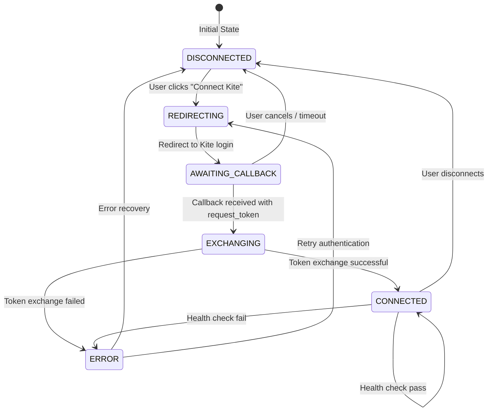
```mermaid
stateDiagram-v2
    [*] --> DISCONNECTED: Initial State
    
    DISCONNECTED --> REDIRECTING: User clicks "Connect Kite"
    REDIRECTING --> AWAITING_CALLBACK: Redirect to Kite login
    AWAITING_CALLBACK --> EXCHANGING: Callback received with request_token
    AWAITING_CALLBACK --> DISCONNECTED: User cancels / timeout
    EXCHANGING --> CONNECTED: Token exchange successful
    EXCHANGING --> ERROR: Token exchange failed
    CONNECTED --> CONNECTED: Health check pass
    CONNECTED --> ERROR: Health check fail
    CONNECTED --> DISCONNECTED: User disconnects
    ERROR --> DISCONNECTED: Error recovery
    ERROR --> REDIRECTING: Retry authentication
```

#### 1.1.2 OAuth Sequence Diagram

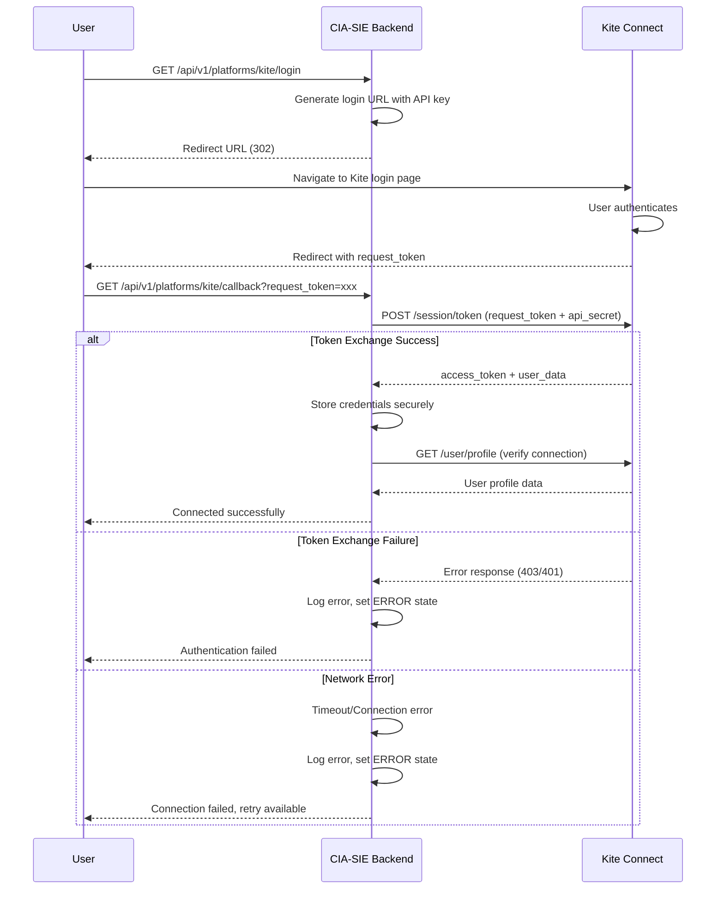
```mermaid
sequenceDiagram
    participant User
    participant CIASIE as CIA-SIE Backend
    participant Kite as Kite Connect
    
    User->>CIASIE: GET /api/v1/platforms/kite/login
    CIASIE->>CIASIE: Generate login URL with API key
    CIASIE-->>User: Redirect URL (302)
    User->>Kite: Navigate to Kite login page
    Kite->>Kite: User authenticates
    Kite-->>User: Redirect with request_token
    User->>CIASIE: GET /api/v1/platforms/kite/callback?request_token=xxx
    CIASIE->>Kite: POST /session/token (request_token + api_secret)
    
    alt Token Exchange Success
        Kite-->>CIASIE: access_token + user_data
        CIASIE->>CIASIE: Store credentials securely
        CIASIE->>Kite: GET /user/profile (verify connection)
        Kite-->>CIASIE: User profile data
        CIASIE-->>User: Connected successfully
    else Token Exchange Failure
        Kite-->>CIASIE: Error response (403/401)
        CIASIE->>CIASIE: Log error, set ERROR state
        CIASIE-->>User: Authentication failed
    else Network Error
        CIASIE->>CIASIE: Timeout/Connection error
        CIASIE->>CIASIE: Log error, set ERROR state
        CIASIE-->>User: Connection failed, retry available
    end
```

#### 1.1.3 Token Storage Specification

| Element | Implementation | Security |
|---------|---------------|----------|
| Access Token | `PlatformCredentials.access_token` | Memory-only (not persisted to disk) |
| API Key | `Settings.kite_api_key` | Environment variable |
| API Secret | `Settings.kite_api_secret` | Environment variable |
| Token Expiry | `PlatformCredentials.expires_at` | Checked per-request |
| Refresh Token | Not used (Kite tokens expire daily) | N/A |

#### 1.1.4 Token Validation Flow

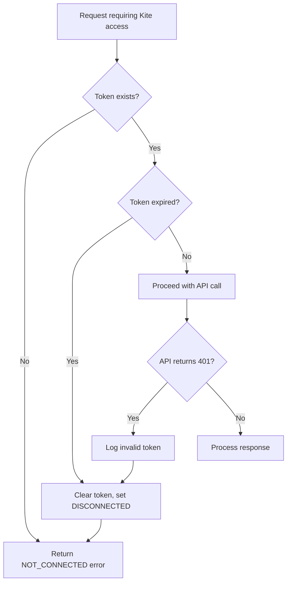
```mermaid
flowchart TD
    A[Request requiring Kite access] --> B{Token exists?}
    B -->|No| C[Return NOT_CONNECTED error]
    B -->|Yes| D{Token expired?}
    D -->|Yes| E[Clear token, set DISCONNECTED]
    E --> C
    D -->|No| F[Proceed with API call]
    F --> G{API returns 401?}
    G -->|Yes| H[Log invalid token]
    H --> E
    G -->|No| I[Process response]
```

### 1.2 Session Management

#### 1.2.1 Session State Elements

| Element | Description | Implementation |
|---------|-------------|----------------|
| Heartbeat Interval | Not used (Kite has no persistent session) | N/A |
| Session Expiry | Daily at 3:30 AM IST (Kite policy) | `PlatformCredentials.expires_at` |
| Auto-reconnection | Not automatic (user must re-authenticate) | Manual flow |
| Manual Reconnection | User clicks "Connect Kite" again | `GET /api/v1/platforms/kite/login` |
| Session Persistence | Tokens not persisted across server restart | Memory-only design |

#### 1.2.2 Session Lifecycle

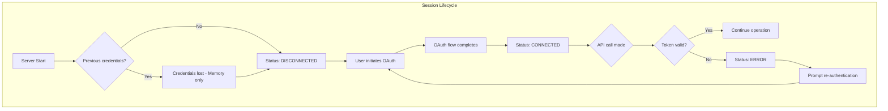
```mermaid
flowchart TD
    subgraph "Session Lifecycle"
        A[Server Start] --> B{Previous credentials?}
        B -->|No| C[Status: DISCONNECTED]
        B -->|Yes| D[Credentials lost - Memory only]
        D --> C
        C --> E[User initiates OAuth]
        E --> F[OAuth flow completes]
        F --> G[Status: CONNECTED]
        G --> H{API call made}
        H --> I{Token valid?}
        I -->|Yes| J[Continue operation]
        I -->|No| K[Status: ERROR]
        K --> L[Prompt re-authentication]
        L --> E
    end
```

### 1.3 REST API Endpoints Used

| Endpoint | Method | Purpose | Rate Limit | Retry Strategy | Implementation |
|----------|--------|---------|------------|----------------|----------------|
| `/user/profile` | GET | Verify connection, get user info | 1/sec | N/A (health check) | `KiteAdapter.health_check()` |
| `/marketwatch` | GET | Retrieve user's watchlists | 1/sec | None (user-initiated) | `KiteAdapter.get_watchlists()` |
| `/instruments` | GET | Fetch instrument master list | 1/day | Cache for 24 hours | Not currently used |

#### 1.3.1 API Request Flow

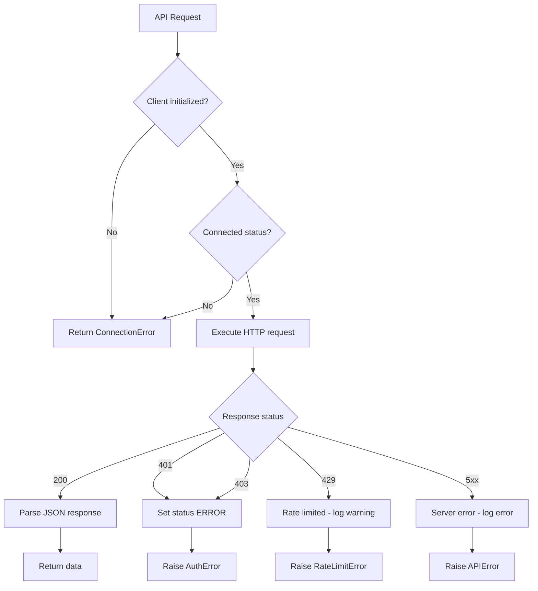
```mermaid
flowchart TD
    A[API Request] --> B{Client initialized?}
    B -->|No| C[Return ConnectionError]
    B -->|Yes| D{Connected status?}
    D -->|No| C
    D -->|Yes| E[Execute HTTP request]
    E --> F{Response status}
    F -->|200| G[Parse JSON response]
    F -->|401| H[Set status ERROR]
    F -->|403| H
    F -->|429| I[Rate limited - log warning]
    F -->|5xx| J[Server error - log error]
    G --> K[Return data]
    H --> L[Raise AuthError]
    I --> M[Raise RateLimitError]
    J --> N[Raise APIError]
```

### 1.4 WebSocket Streaming

**Note:** WebSocket streaming is NOT currently implemented for Kite in CIA-SIE.

Kite provides WebSocket streaming for real-time market data, but CIA-SIE does not use it because:
- CIA-SIE receives signals from TradingView webhooks (which include computed indicators)
- Kite's WebSocket provides raw price data only (no computed indicators like RSI, MACD)
- TradingView handles indicator computation and alert triggering

If WebSocket streaming were to be added in the future, it would follow this architecture:

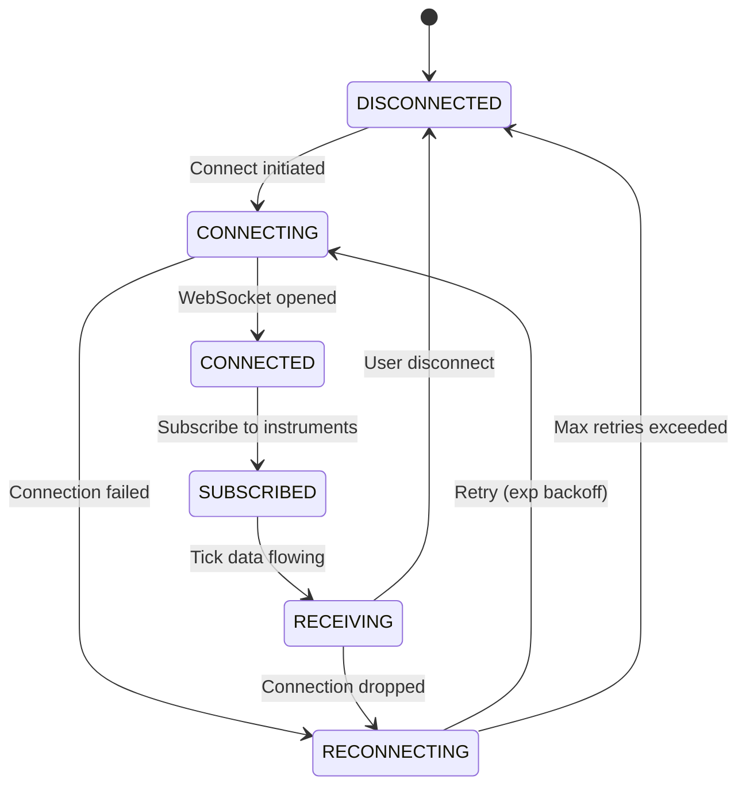
```mermaid
stateDiagram-v2
    [*] --> DISCONNECTED
    DISCONNECTED --> CONNECTING: Connect initiated
    CONNECTING --> CONNECTED: WebSocket opened
    CONNECTING --> RECONNECTING: Connection failed
    CONNECTED --> SUBSCRIBED: Subscribe to instruments
    SUBSCRIBED --> RECEIVING: Tick data flowing
    RECEIVING --> RECONNECTING: Connection dropped
    RECEIVING --> DISCONNECTED: User disconnect
    RECONNECTING --> CONNECTING: Retry (exp backoff)
    RECONNECTING --> DISCONNECTED: Max retries exceeded
```

### 1.5 Rate Limiting Compliance

#### 1.5.1 Kite API Rate Limits

| Limit Type | Limit | CIA-SIE Handling |
|------------|-------|------------------|
| API calls | 3 requests/second | Not actively throttled (low usage pattern) |
| Login attempts | 2 per second | Manual user-initiated only |
| WebSocket subscriptions | 3000 instruments | Not used |

#### 1.5.2 Rate Limit Handling

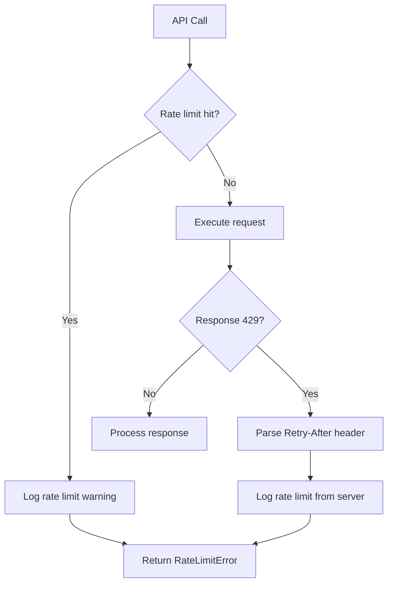
```mermaid
flowchart TD
    A[API Call] --> B{Rate limit hit?}
    B -->|No| C[Execute request]
    B -->|Yes| D[Log rate limit warning]
    D --> E[Return RateLimitError]
    C --> F{Response 429?}
    F -->|Yes| G[Parse Retry-After header]
    G --> H[Log rate limit from server]
    H --> E
    F -->|No| I[Process response]
```

### 1.6 Instrument Token Mapping

#### 1.6.1 Symbol Resolution Flow

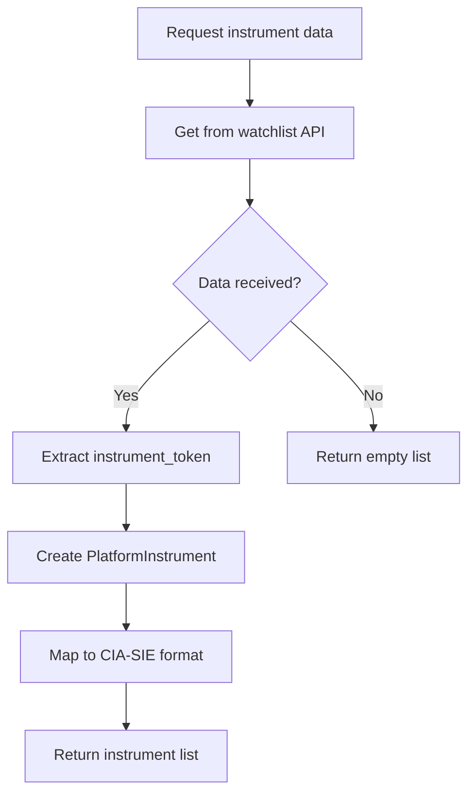
```mermaid
flowchart TD
    A[Request instrument data] --> B[Get from watchlist API]
    B --> C{Data received?}
    C -->|Yes| D[Extract instrument_token]
    C -->|No| E[Return empty list]
    D --> F[Create PlatformInstrument]
    F --> G[Map to CIA-SIE format]
    G --> H[Return instrument list]
```

#### 1.6.2 Instrument Mapping Table

| Kite Field | CIA-SIE Field | Transformation |
|------------|---------------|----------------|
| `tradingsymbol` | `symbol` | Direct mapping |
| `tradingsymbol` | `display_name` | Direct mapping |
| `exchange` | `metadata.exchange` | Direct mapping |
| `instrument_token` | `platform_symbol` | String conversion |
| `instrument_type` | `instrument_type` | EQ→EQUITY, FUT→FUTURE, CE/PE→OPTION |

---

## Section 2: Data Ingestion & Processing Pipeline

### 2.1 Signal Ingestion Architecture Overview

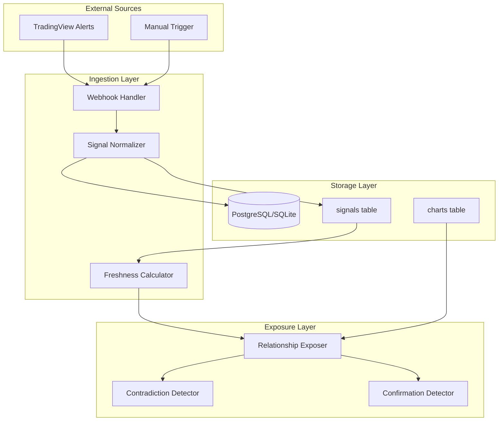
```mermaid
flowchart TD
    subgraph "External Sources"
        TV[TradingView Alerts]
        MTIC[Manual Trigger]
    end
    
    subgraph "Ingestion Layer"
        WH[Webhook Handler]
        SN[Signal Normalizer]
        FV[Freshness Calculator]
    end
    
    subgraph "Storage Layer"
        DB[(PostgreSQL/SQLite)]
        SIG[signals table]
        CHT[charts table]
    end
    
    subgraph "Exposure Layer"
        CD[Contradiction Detector]
        CF[Confirmation Detector]
        RE[Relationship Exposer]
    end
    
    TV --> WH
    MTIC --> WH
    WH --> SN
    SN --> DB
    SN --> SIG
    SIG --> FV
    FV --> RE
    CHT --> RE
    RE --> CD
    RE --> CF
```

### 2.2 Webhook Processing Flow

#### 2.2.1 Complete Webhook Sequence

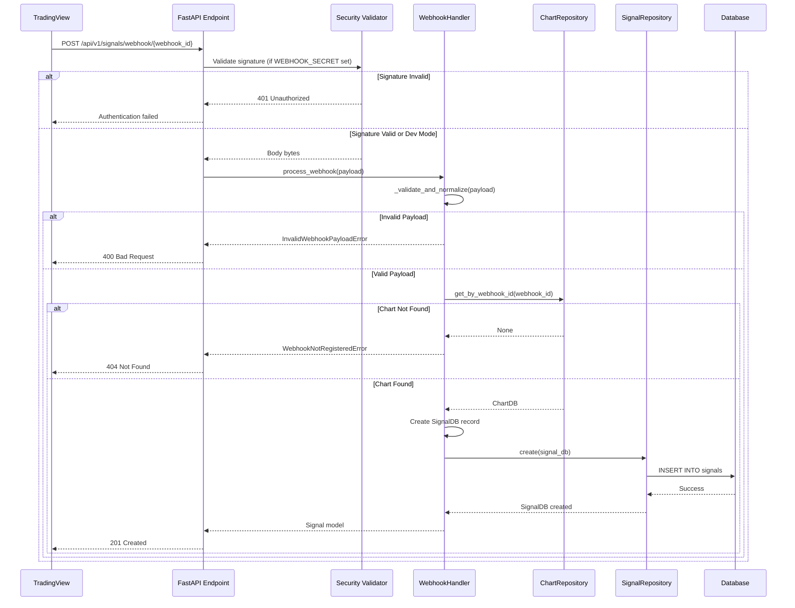
```mermaid
sequenceDiagram
    participant TV as TradingView
    participant API as FastAPI Endpoint
    participant SEC as Security Validator
    participant WH as WebhookHandler
    participant CR as ChartRepository
    participant SR as SignalRepository
    participant DB as Database
    
    TV->>API: POST /api/v1/signals/webhook/{webhook_id}
    API->>SEC: Validate signature (if WEBHOOK_SECRET set)
    
    alt Signature Invalid
        SEC-->>API: 401 Unauthorized
        API-->>TV: Authentication failed
    else Signature Valid or Dev Mode
        SEC-->>API: Body bytes
        API->>WH: process_webhook(payload)
        WH->>WH: _validate_and_normalize(payload)
        
        alt Invalid Payload
            WH-->>API: InvalidWebhookPayloadError
            API-->>TV: 400 Bad Request
        else Valid Payload
            WH->>CR: get_by_webhook_id(webhook_id)
            
            alt Chart Not Found
                CR-->>WH: None
                WH-->>API: WebhookNotRegisteredError
                API-->>TV: 404 Not Found
            else Chart Found
                CR-->>WH: ChartDB
                WH->>WH: Create SignalDB record
                WH->>SR: create(signal_db)
                SR->>DB: INSERT INTO signals
                DB-->>SR: Success
                SR-->>WH: SignalDB created
                WH-->>API: Signal model
                API-->>TV: 201 Created
            end
        end
    end
```

#### 2.2.2 Payload Validation Rules

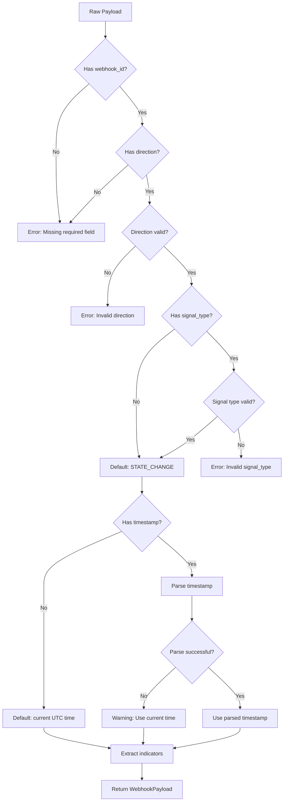
```mermaid
flowchart TD
    A[Raw Payload] --> B{Has webhook_id?}
    B -->|No| C[Error: Missing required field]
    B -->|Yes| D{Has direction?}
    D -->|No| C
    D -->|Yes| E{Direction valid?}
    E -->|No| F[Error: Invalid direction]
    E -->|Yes| G{Has signal_type?}
    G -->|No| H[Default: STATE_CHANGE]
    G -->|Yes| I{Signal type valid?}
    I -->|No| J[Error: Invalid signal_type]
    I -->|Yes| H
    H --> K{Has timestamp?}
    K -->|No| L[Default: current UTC time]
    K -->|Yes| M[Parse timestamp]
    M --> N{Parse successful?}
    N -->|No| O[Warning: Use current time]
    N -->|Yes| P[Use parsed timestamp]
    L --> Q[Extract indicators]
    O --> Q
    P --> Q
    Q --> R[Return WebhookPayload]
```

### 2.3 Tick Data Normalization

#### 2.3.1 Normalization Process

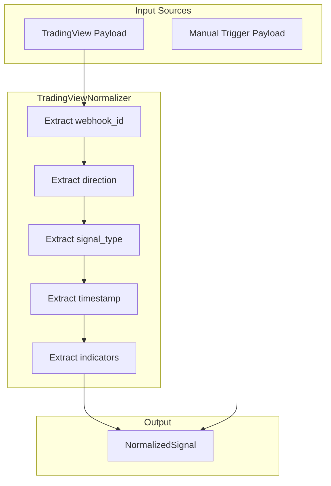
```mermaid
flowchart TD
    subgraph "Input Sources"
        TV[TradingView Payload]
        MT[Manual Trigger Payload]
    end
    
    subgraph "TradingViewNormalizer"
        A1[Extract webhook_id]
        A2[Extract direction]
        A3[Extract signal_type]
        A4[Extract timestamp]
        A5[Extract indicators]
    end
    
    subgraph "Output"
        NS[NormalizedSignal]
    end
    
    TV --> A1
    A1 --> A2
    A2 --> A3
    A3 --> A4
    A4 --> A5
    A5 --> NS
    
    MT --> NS
```

#### 2.3.2 Direction Mapping

| Input Value | Normalized Direction |
|-------------|---------------------|
| BULLISH, BUY, LONG, UP, POSITIVE | `Direction.BULLISH` |
| BEARISH, SELL, SHORT, DOWN, NEGATIVE | `Direction.BEARISH` |
| NEUTRAL, FLAT, NONE, SIDEWAYS | `Direction.NEUTRAL` |

#### 2.3.3 Field Mapping (TradingView)

| TradingView Field | Standard Field |
|-------------------|----------------|
| `chart_id`, `chartId`, `id` | `webhook_id` |
| `bias`, `signal`, `trend` | `direction` |
| `type`, `alertType` | `signal_type` |
| `time`, `alertTime` | `timestamp` |
| (all other fields) | `indicators` |

### 2.4 Data Validation Layer

#### 2.4.1 Validation Rules

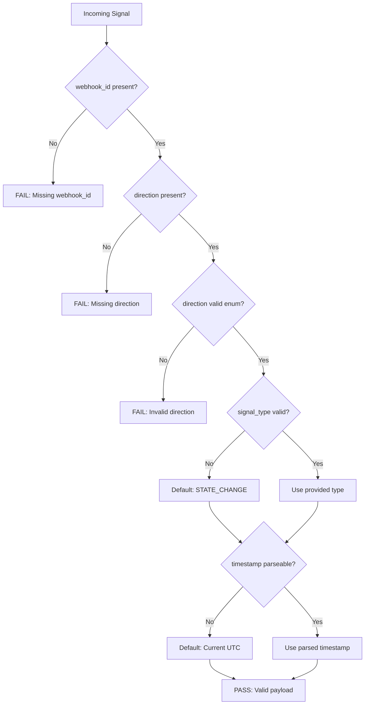
```mermaid
flowchart TD
    A[Incoming Signal] --> B{webhook_id present?}
    B -->|No| FAIL1[FAIL: Missing webhook_id]
    B -->|Yes| C{direction present?}
    C -->|No| FAIL2[FAIL: Missing direction]
    C -->|Yes| D{direction valid enum?}
    D -->|No| FAIL3[FAIL: Invalid direction]
    D -->|Yes| E{signal_type valid?}
    E -->|No| F[Default: STATE_CHANGE]
    E -->|Yes| G[Use provided type]
    F --> H{timestamp parseable?}
    G --> H
    H -->|No| I[Default: Current UTC]
    H -->|Yes| J[Use parsed timestamp]
    I --> K[PASS: Valid payload]
    J --> K
```

#### 2.4.2 Validation Responses

| Validation Failure | HTTP Code | Error Type |
|--------------------|-----------|------------|
| Missing webhook_id | 400 | InvalidWebhookPayloadError |
| Missing direction | 400 | InvalidWebhookPayloadError |
| Invalid direction value | 400 | InvalidWebhookPayloadError |
| Invalid signal_type | 400 | InvalidWebhookPayloadError |
| Unparseable timestamp | (warn, use current) | Warning logged |

### 2.5 Freshness Calculation

#### 2.5.1 Freshness State Determination

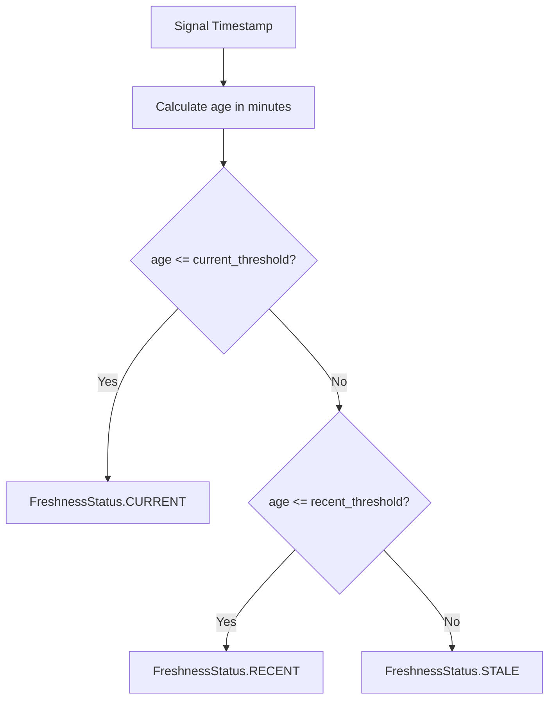
```mermaid
flowchart TD
    A[Signal Timestamp] --> B[Calculate age in minutes]
    B --> C{age <= current_threshold?}
    C -->|Yes| D[FreshnessStatus.CURRENT]
    C -->|No| E{age <= recent_threshold?}
    E -->|Yes| F[FreshnessStatus.RECENT]
    E -->|No| G[FreshnessStatus.STALE]
```

#### 2.5.2 Default Freshness Thresholds

| Status | Default Threshold | Description |
|--------|-------------------|-------------|
| CURRENT | ≤ 2 minutes | Data from current/most recent bar |
| RECENT | ≤ 10 minutes | Data within expected update frequency |
| STALE | > 30 minutes | Data older than expected |
| UNAVAILABLE | N/A | No signal data exists |

**CRITICAL:** Freshness is purely DESCRIPTIVE. Stale data is NOT hidden or invalidated. All data is displayed regardless of freshness.

### 2.6 Signal Storage Flow

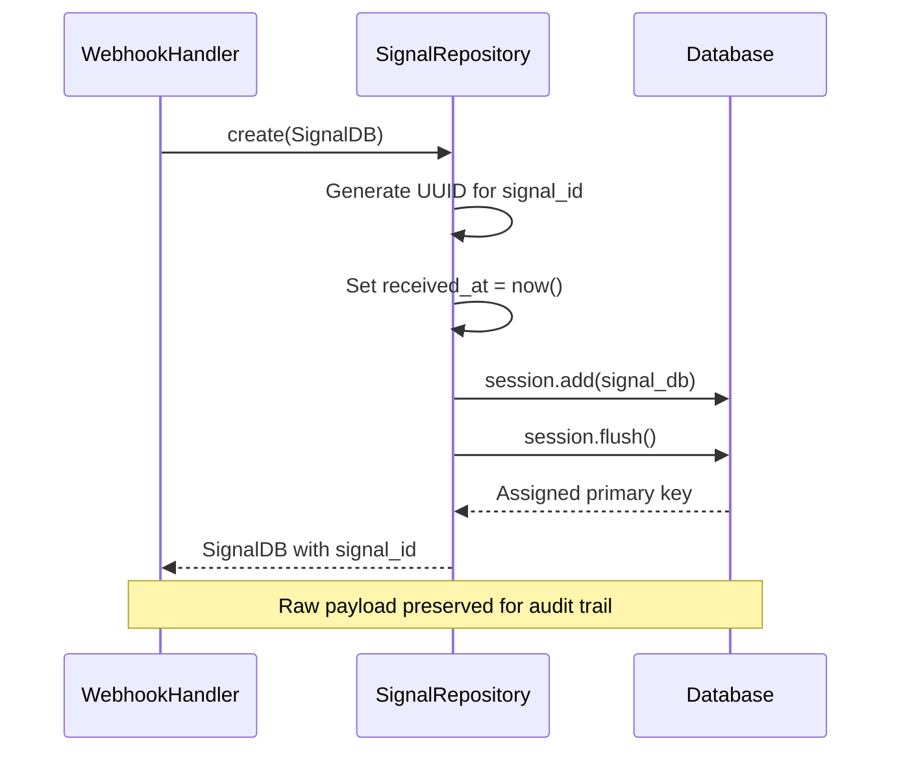
```mermaid
sequenceDiagram
    participant WH as WebhookHandler
    participant SR as SignalRepository
    participant DB as Database
    
    WH->>SR: create(SignalDB)
    SR->>SR: Generate UUID for signal_id
    SR->>SR: Set received_at = now()
    SR->>DB: session.add(signal_db)
    SR->>DB: session.flush()
    DB-->>SR: Assigned primary key
    SR-->>WH: SignalDB with signal_id
    
    Note over WH,DB: Raw payload preserved for audit trail
```

---

## Section 3: Claude API Two-Stage Orchestration

### 3.1 Architecture Overview

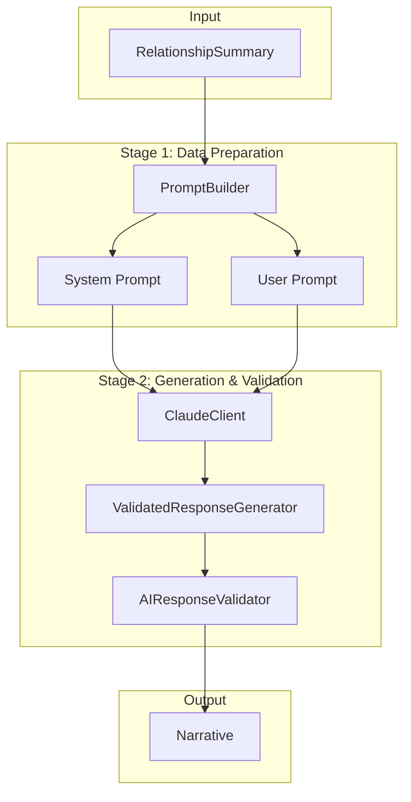
```mermaid
flowchart TD
    subgraph "Input"
        RS[RelationshipSummary]
    end
    
    subgraph "Stage 1: Data Preparation"
        PB[PromptBuilder]
        SP[System Prompt]
        UP[User Prompt]
    end
    
    subgraph "Stage 2: Generation & Validation"
        CC[ClaudeClient]
        VRG[ValidatedResponseGenerator]
        AIV[AIResponseValidator]
    end
    
    subgraph "Output"
        NAR[Narrative]
    end
    
    RS --> PB
    PB --> SP
    PB --> UP
    SP --> CC
    UP --> CC
    CC --> VRG
    VRG --> AIV
    AIV --> NAR
```

### 3.2 Stage 1: Prompt Construction

#### 3.2.1 System Prompt Structure

The system prompt establishes Claude's role as a DESCRIPTIVE assistant:

```
CRITICAL CONSTRAINTS (enforced):
1. DESCRIBE signals, do not PRESCRIBE actions
2. EXPOSE contradictions, do not RESOLVE them  
3. Use plain English, avoid unexplained jargon
4. Every response must end with user authority reminder
5. NEVER use prohibited phrases
6. NEVER compute aggregate scores/rankings
7. ALWAYS present ALL signals with equal weight
```

#### 3.2.2 Prompt Building Flow

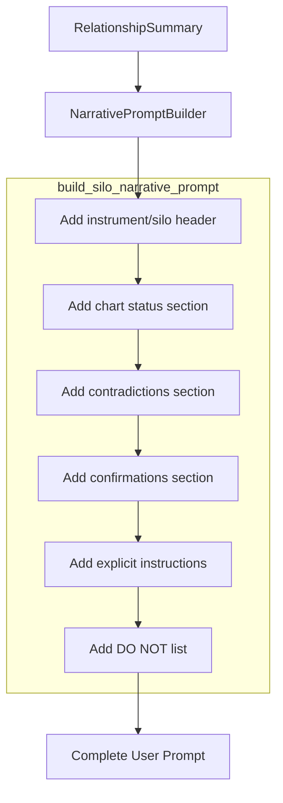
```mermaid
flowchart TD
    A[RelationshipSummary] --> B[NarrativePromptBuilder]
    
    subgraph "build_silo_narrative_prompt"
        C1[Add instrument/silo header]
        C2[Add chart status section]
        C3[Add contradictions section]
        C4[Add confirmations section]
        C5[Add explicit instructions]
        C6[Add DO NOT list]
    end
    
    B --> C1
    C1 --> C2
    C2 --> C3
    C3 --> C4
    C4 --> C5
    C5 --> C6
    C6 --> D[Complete User Prompt]
```

#### 3.2.3 Token Budget Management

| Parameter | Value | Purpose |
|-----------|-------|---------|
| Max Input Tokens | Model-dependent | Stay within context window |
| Max Output Tokens | 2000 (narrative), 500 (chart) | Control response length |
| Temperature | 0.3 | Focused, consistent output |

### 3.3 Stage 2: Synthesis with Validation

#### 3.3.1 Validated Generation Flow

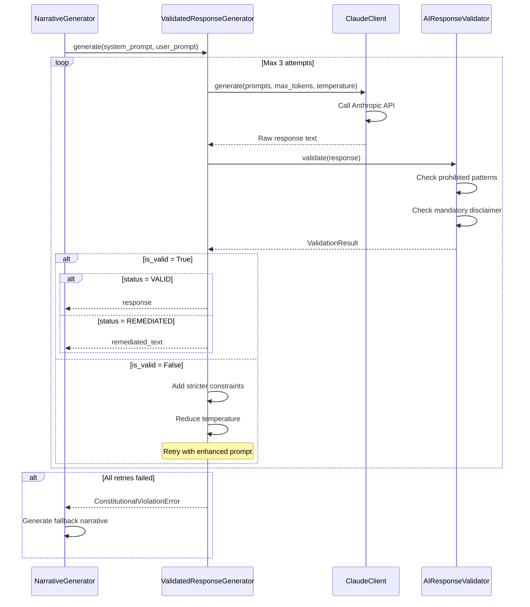
```mermaid
sequenceDiagram
    participant NG as NarrativeGenerator
    participant VRG as ValidatedResponseGenerator
    participant CC as ClaudeClient
    participant AIV as AIResponseValidator
    
    NG->>VRG: generate(system_prompt, user_prompt)
    
    loop Max 3 attempts
        VRG->>CC: generate(prompts, max_tokens, temperature)
        CC->>CC: Call Anthropic API
        CC-->>VRG: Raw response text
        
        VRG->>AIV: validate(response)
        AIV->>AIV: Check prohibited patterns
        AIV->>AIV: Check mandatory disclaimer
        AIV-->>VRG: ValidationResult
        
        alt is_valid = True
            alt status = VALID
                VRG-->>NG: response
            else status = REMEDIATED
                VRG-->>NG: remediated_text
            end
        else is_valid = False
            VRG->>VRG: Add stricter constraints
            VRG->>VRG: Reduce temperature
            Note over VRG: Retry with enhanced prompt
        end
    end
    
    alt All retries failed
        VRG-->>NG: ConstitutionalViolationError
        NG->>NG: Generate fallback narrative
    end
```

#### 3.3.2 Signal Grading Logic

**CRITICAL:** CIA-SIE does NOT compute aggregate scores or rankings.

| Input | Output | Processing |
|-------|--------|------------|
| Chart A: BULLISH | Describe: "Chart A shows BULLISH" | No aggregation |
| Chart B: BEARISH | Describe: "Chart B shows BEARISH" | No aggregation |
| Contradiction | Describe: "Charts A and B show opposing directions" | Expose, don't resolve |
| Confirmation | Describe: "Charts align on BULLISH" | No "stronger signal" language |

### 3.4 API Integration Details

#### 3.4.1 Claude Client Configuration

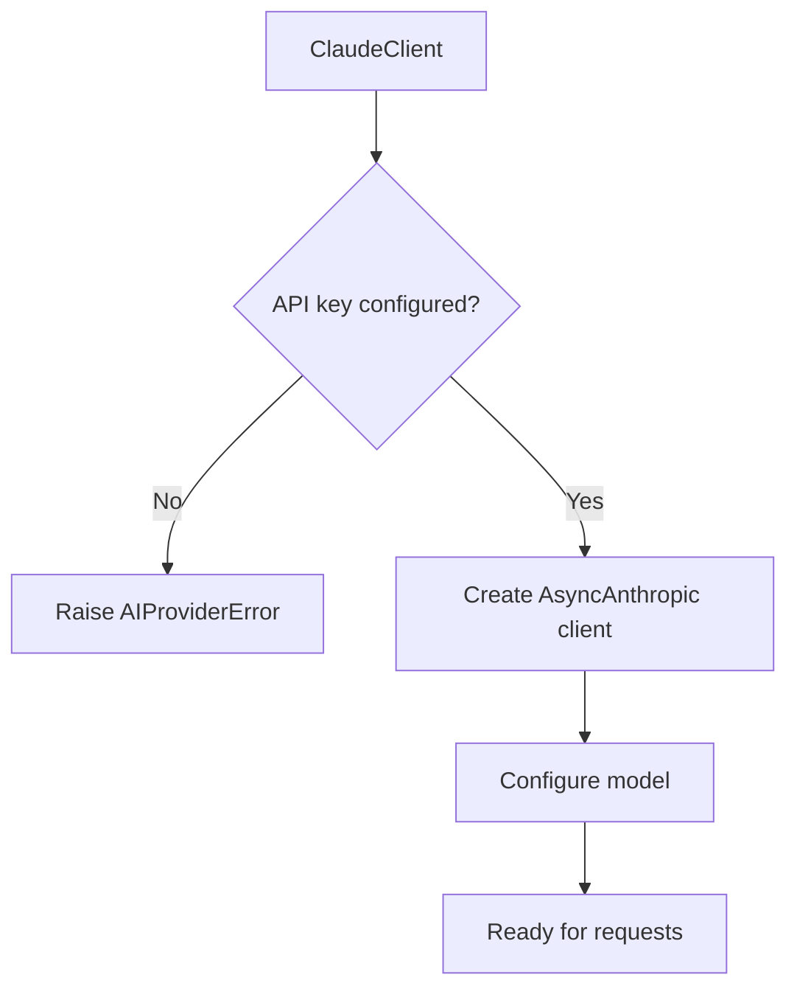
```mermaid
flowchart TD
    A[ClaudeClient] --> B{API key configured?}
    B -->|No| C[Raise AIProviderError]
    B -->|Yes| D[Create AsyncAnthropic client]
    D --> E[Configure model]
    E --> F[Ready for requests]
```

| Configuration | Source | Default |
|---------------|--------|---------|
| API Key | `ANTHROPIC_API_KEY` env var | None (required) |
| Model | `ANTHROPIC_MODEL` env var | `claude-3-5-sonnet-20241022` |
| Fallback Model | `AI_FALLBACK_MODEL` env var | `claude-3-haiku-20240307` |

#### 3.4.2 Request/Response Flow

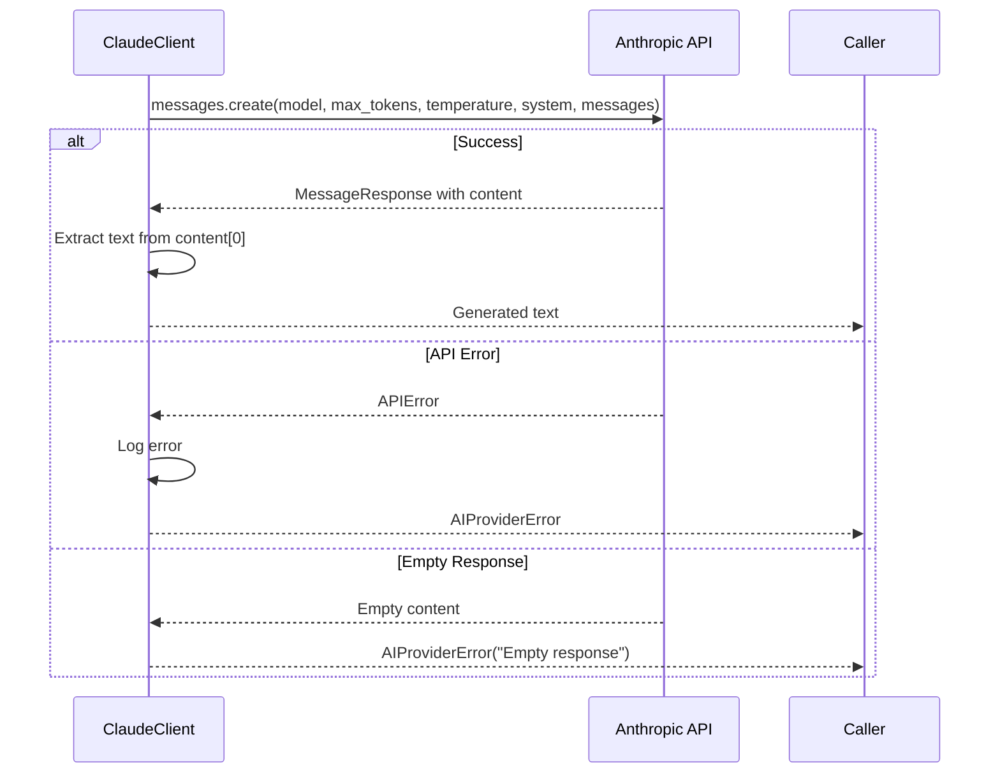
```mermaid
sequenceDiagram
    participant CC as ClaudeClient
    participant AN as Anthropic API
    
    CC->>AN: messages.create(model, max_tokens, temperature, system, messages)
    
    alt Success
        AN-->>CC: MessageResponse with content
        CC->>CC: Extract text from content[0]
        CC-->>Caller: Generated text
    else API Error
        AN-->>CC: APIError
        CC->>CC: Log error
        CC-->>Caller: AIProviderError
    else Empty Response
        AN-->>CC: Empty content
        CC-->>Caller: AIProviderError("Empty response")
    end
```

### 3.5 Response Parsing & Validation

#### 3.5.1 Prohibited Patterns (Constitutional Violations)

| Pattern Category | Examples | Severity |
|------------------|----------|----------|
| Recommendation | "you should", "I recommend", "consider buying" | CRITICAL |
| Trading Action | "buy now", "enter long position", "take profit" | CRITICAL |
| Aggregation | "overall direction is", "net signal", "consensus" | CRITICAL |
| Confidence | "confidence: 80%", "probability of", "likely to rise" | CRITICAL |
| Ranking | "more reliable than", "stronger signal", "signal strength" | CRITICAL |

#### 3.5.2 Validation State Machine

```mermaid
stateDiagram-v2
    [*] --> VALIDATING: Response received
    VALIDATING --> VALID: No violations, disclaimer present
    VALIDATING --> REMEDIATED: Warning violations only, fixed
    VALIDATING --> INVALID: Critical violations detected
    VALID --> [*]: Return response
    REMEDIATED --> [*]: Return remediated text
    INVALID --> RETRY: Attempts remaining
    INVALID --> [*]: All retries failed
    RETRY --> VALIDATING: Generate with stricter prompt
```

#### 3.5.3 Mandatory Disclaimer

**Required closing statement:**
```
"This is a description of what your charts are showing. 
The interpretation and any decision is entirely yours."
```

### 3.6 Token Economics & Usage Tracking

#### 3.6.1 Cost Tracking Flow

```mermaid
flowchart TD
    A[AI Request] --> B[Record model_id]
    B --> C[Execute request]
    C --> D[Extract token counts]
    D --> E[Calculate cost]
    E --> F[UsageTracker.record_usage]
    F --> G[Update monthly totals]
    G --> H[Check budget status]
```

#### 3.6.2 Budget Management

| Threshold | Action |
|-----------|--------|
| 80% used | Warning alert |
| 90% used | Critical alert |
| 100% used | Block AI features |

#### 3.6.3 Cost Calculation

```python
cost = (input_tokens * input_price_per_1M / 1_000_000) + 
       (output_tokens * output_price_per_1M / 1_000_000)
```

| Model | Input $/1M | Output $/1M |
|-------|-----------|-------------|
| claude-3-5-sonnet | $3.00 | $15.00 |
| claude-3-haiku | $0.25 | $1.25 |
| claude-3-opus | $15.00 | $75.00 |

### 3.7 Fallback Handling

#### 3.7.1 Fallback Decision Tree

```mermaid
flowchart TD
    A[Narrative Request] --> B{Claude available?}
    B -->|No| C[Generate fallback narrative]
    B -->|Yes| D[Call validated generator]
    D --> E{Validation passed?}
    E -->|Yes| F[Return AI narrative]
    E -->|No| G{Retries remaining?}
    G -->|Yes| H[Retry with stricter prompt]
    H --> D
    G -->|No| C
    C --> I[Return basic description]
```

#### 3.7.2 Fallback Narrative Content

Fallback narratives include:
- Chart name and timeframe
- Direction (if signal exists)
- Freshness status
- Raw indicator values
- Contradictions/confirmations (simple list format)
- Mandatory disclaimer

---

## Section 4: State Management & Persistence

### 4.1 Application State Machine

```mermaid
stateDiagram-v2
    [*] --> INITIALIZING: Application start
    
    INITIALIZING --> CONFIGURING: Load settings
    CONFIGURING --> DB_CONNECTING: Settings loaded
    DB_CONNECTING --> DB_READY: Database initialized
    DB_CONNECTING --> ERROR: Database connection failed
    DB_READY --> REGISTERING_ROUTES: Tables created/verified
    REGISTERING_ROUTES --> READY: All routes registered
    READY --> READY: Serving requests
    READY --> SHUTDOWN: Graceful shutdown initiated
    SHUTDOWN --> [*]: Cleanup complete
    ERROR --> SHUTDOWN: Fatal error recovery
```

#### 4.1.1 Lifespan Management

```mermaid
sequenceDiagram
    participant UV as Uvicorn
    participant APP as FastAPI App
    participant LS as Lifespan Manager
    participant DB as Database
    
    UV->>APP: Start application
    APP->>LS: Enter lifespan context
    LS->>LS: Log startup
    LS->>DB: init_db()
    DB->>DB: Create engine
    DB->>DB: Create tables if not exist
    DB-->>LS: Database ready
    LS->>LS: Log security config
    LS-->>APP: Yield (app running)
    
    Note over APP: Application serving requests
    
    UV->>APP: Shutdown signal
    APP->>LS: Exit lifespan context
    LS->>LS: Log shutdown
    LS-->>APP: Cleanup complete
```

### 4.2 Database Schema

#### 4.2.1 Entity Relationship Diagram

```mermaid
erDiagram
    INSTRUMENTS ||--o{ SILOS : contains
    SILOS ||--o{ CHARTS : contains
    CHARTS ||--o{ SIGNALS : emits
    CHARTS }o--o{ BASKET_CHARTS : member_of
    BASKET_CHARTS }o--|| ANALYTICAL_BASKETS : belongs_to
    INSTRUMENTS ||--o{ ANALYTICAL_BASKETS : optional_for
    INSTRUMENTS ||--o{ CONVERSATIONS : has
    
    INSTRUMENTS {
        string instrument_id PK
        string symbol UK
        string display_name
        datetime created_at
        datetime updated_at
        boolean is_active
        json metadata_json
    }
    
    SILOS {
        string silo_id PK
        string instrument_id FK
        string silo_name
        boolean heartbeat_enabled
        int heartbeat_frequency_min
        int current_threshold_min
        int recent_threshold_min
        int stale_threshold_min
        datetime created_at
        datetime updated_at
        boolean is_active
    }
    
    CHARTS {
        string chart_id PK
        string silo_id FK
        string chart_code
        string chart_name
        string timeframe
        string webhook_id UK
        datetime created_at
        datetime updated_at
        boolean is_active
    }
    
    SIGNALS {
        string signal_id PK
        string chart_id FK
        datetime received_at
        datetime signal_timestamp
        string signal_type
        string direction
        json indicators
        json raw_payload
    }
    
    ANALYTICAL_BASKETS {
        string basket_id PK
        string basket_name
        string basket_type
        string description
        string instrument_id FK
        datetime created_at
        datetime updated_at
        boolean is_active
    }
    
    BASKET_CHARTS {
        string basket_id PK_FK
        string chart_id PK_FK
        datetime added_at
    }
    
    CONVERSATIONS {
        string conversation_id PK
        string instrument_id FK
        json messages
        string model_used
        int total_tokens
        decimal total_cost
        datetime created_at
        datetime updated_at
    }
    
    AI_USAGE {
        string id PK
        string period_type
        date period_start
        date period_end
        int input_tokens
        int output_tokens
        decimal total_cost
        int requests_count
        json model_breakdown
        datetime created_at
    }
```

#### 4.2.2 PROHIBITED COLUMNS (Constitutional)

The following columns are **PROHIBITED** per Section 0B:

| Prohibited Column | Reason | Would Enable |
|-------------------|--------|--------------|
| `weight` (on charts) | Enables weighted aggregation | Signal prioritization |
| `score` (on signals) | Implies system judgment | Ranking |
| `confidence` (on signals) | Implies certainty calculation | Automated decisions |
| `recommendation` (anywhere) | Direct advice | Prescriptive output |
| `priority` (on signals) | Enables ranking | Signal ordering |
| `rank` (on signals) | Explicit ordering | Aggregation |

### 4.3 Repository Pattern

#### 4.3.1 Repository Hierarchy

```mermaid
classDiagram
    class BaseRepository~T~ {
        +session: AsyncSession
        +get_by_id(id: str) T
        +create(entity: T) T
        +update(entity: T) T
        +delete(id: str) bool
        +list_all() List~T~
    }
    
    class InstrumentRepository {
        +get_by_symbol(symbol: str) InstrumentDB
        +get_active() List~InstrumentDB~
    }
    
    class SiloRepository {
        +get_by_instrument(instrument_id: str) List~SiloDB~
        +get_with_full_hierarchy(silo_id: str) SiloDB
    }
    
    class ChartRepository {
        +get_by_webhook_id(webhook_id: str) ChartDB
        +get_by_silo(silo_id: str) List~ChartDB~
    }
    
    class SignalRepository {
        +get_latest_by_chart(chart_id: str) SignalDB
        +get_by_chart(chart_id: str, limit: int) List~SignalDB~
    }
    
    BaseRepository <|-- InstrumentRepository
    BaseRepository <|-- SiloRepository
    BaseRepository <|-- ChartRepository
    BaseRepository <|-- SignalRepository
```

### 4.4 Database Configuration

#### 4.4.1 Connection Settings

| Setting | Default | Environment Variable |
|---------|---------|---------------------|
| Database URL | `sqlite+aiosqlite:///./data/cia_sie.db` | `DATABASE_URL` |
| Pool Size | 5 | (not configurable) |
| Pool Overflow | 10 | (not configurable) |
| Echo SQL | False | `DEBUG=true` |

#### 4.4.2 SQLite WAL Mode

```python
# Configured in database.py for SQLite
@event.listens_for(Engine, "connect")
def set_sqlite_pragma(dbapi_conn, connection_record):
    cursor = dbapi_conn.cursor()
    cursor.execute("PRAGMA journal_mode=WAL")
    cursor.execute("PRAGMA foreign_keys=ON")
    cursor.close()
```

### 4.5 Migration Management (Alembic)

#### 4.5.1 Migration Flow

```mermaid
flowchart TD
    A[Developer changes models.py] --> B[Generate migration]
    B --> C[alembic revision --autogenerate]
    C --> D[Review generated migration]
    D --> E{Migration correct?}
    E -->|No| F[Edit migration manually]
    F --> D
    E -->|Yes| G[Apply migration]
    G --> H[alembic upgrade head]
    H --> I[Database updated]
```

#### 4.5.2 Current Migrations

| Version | Description | Date |
|---------|-------------|------|
| `20251230_0001` | Initial schema (instruments, silos, charts, signals) | 2025-12-30 |
| `d06c96f6b20c` | Add AI tables (conversations, ai_usage) | 2025-12-31 |

---

## Section 5: Error Propagation & Recovery Architecture

### 5.1 Error Taxonomy

```mermaid
classDiagram
    class CIASIEError {
        +message: str
        +details: dict
    }
    
    class InstrumentNotFoundError
    class SiloNotFoundError
    class ChartNotFoundError
    class SignalNotFoundError
    class BasketNotFoundError
    
    class ValidationError
    class DuplicateError
    class InvalidWebhookPayloadError
    class WebhookNotRegisteredError
    
    class DatabaseError
    class AIProviderError
    class PlatformAdapterError
    
    class ConstitutionalViolationError
    class AggregationAttemptError
    class RecommendationAttemptError
    class ContradictionResolutionAttemptError
    
    CIASIEError <|-- InstrumentNotFoundError
    CIASIEError <|-- SiloNotFoundError
    CIASIEError <|-- ChartNotFoundError
    CIASIEError <|-- SignalNotFoundError
    CIASIEError <|-- BasketNotFoundError
    
    CIASIEError <|-- ValidationError
    CIASIEError <|-- DuplicateError
    CIASIEError <|-- InvalidWebhookPayloadError
    CIASIEError <|-- WebhookNotRegisteredError
    
    CIASIEError <|-- DatabaseError
    CIASIEError <|-- AIProviderError
    CIASIEError <|-- PlatformAdapterError
    
    CIASIEError <|-- ConstitutionalViolationError
    ConstitutionalViolationError <|-- AggregationAttemptError
    ConstitutionalViolationError <|-- RecommendationAttemptError
    ConstitutionalViolationError <|-- ContradictionResolutionAttemptError
```

### 5.2 Error Chain Propagation

```mermaid
flowchart TD
    A[Source Error] --> B[Context Enrichment]
    B --> C[Add error type]
    C --> D[Add request context]
    D --> E[Add timestamp]
    E --> F[Structured Logging]
    F --> G{Is critical?}
    G -->|Yes| H[Alert operations]
    G -->|No| I[Log warning]
    H --> J[Recovery Attempt]
    I --> J
    J --> K{Recoverable?}
    K -->|Yes| L[Return fallback response]
    K -->|No| M[Return error response]
```

### 5.3 HTTP Error Mapping

| Exception Type | HTTP Status | Response Body |
|----------------|-------------|---------------|
| `InstrumentNotFoundError` | 404 | `{"detail": "Instrument not found", "instrument_id": "..."}` |
| `InvalidWebhookPayloadError` | 400 | `{"detail": "...", "missing_fields": [...]}` |
| `WebhookNotRegisteredError` | 404 | `{"detail": "...", "webhook_id": "..."}` |
| `AIProviderError` | 503 | `{"detail": "AI service unavailable"}` |
| `ConstitutionalViolationError` | 500 | `{"detail": "Internal compliance error"}` |
| Rate limit exceeded | 429 | `{"detail": "Rate limit exceeded"}` |
| Signature validation failed | 401 | `{"detail": "Webhook authentication failed"}` |

### 5.4 Circuit Breaker Pattern

#### 5.4.1 Circuit Breaker State Machine

```mermaid
stateDiagram-v2
    [*] --> CLOSED: Initial state
    
    CLOSED --> CLOSED: Success
    CLOSED --> OPEN: Failures >= threshold
    
    OPEN --> OPEN: Requests fail fast
    OPEN --> HALF_OPEN: Timeout elapsed
    
    HALF_OPEN --> CLOSED: Probe success
    HALF_OPEN --> OPEN: Probe failure
```

#### 5.4.2 Circuit Breaker Parameters

| Parameter | Value | Description |
|-----------|-------|-------------|
| Failure Threshold | 5 | Consecutive failures to open circuit |
| Reset Timeout | 30 seconds | Time before attempting probe |
| Probe Interval | 1 request | Single request to test recovery |

**Note:** Circuit breaker is conceptual for CIA-SIE. The current implementation uses simpler retry logic with fallbacks.

### 5.5 Graceful Degradation Matrix

| Component | Failure Mode | Degradation Behavior | Recovery |
|-----------|--------------|---------------------|----------|
| Kite API | Connection failed | Show "Kite disconnected" status | Manual re-auth |
| Claude API | Timeout | Generate fallback narrative | Retry on next request |
| Claude API | Rate limit | Return cached/fallback narrative | Auto-retry after delay |
| Claude API | Validation failure | Retry with stricter prompt (3x) | Fallback narrative |
| Database | Connection failed | **CRITICAL - Cannot continue** | Crash and restart |
| Webhook | Invalid payload | Return 400, log error | No retry (client error) |
| Webhook | Chart not found | Return 404, log warning | Client must register chart |

### 5.6 Retry Strategies

#### 5.6.1 AI Generation Retry

```mermaid
flowchart TD
    A[Generate narrative] --> B{Attempt 1}
    B -->|Fail| C[Add stricter constraints]
    C --> D[Reduce temperature]
    D --> E{Attempt 2}
    E -->|Fail| F[Further constraints]
    F --> G[Temperature 0.1]
    G --> H{Attempt 3}
    H -->|Fail| I[Return fallback narrative]
    B -->|Success| J[Return AI narrative]
    E -->|Success| J
    H -->|Success| J
```

#### 5.6.2 Retry Parameters by Operation

| Operation | Max Retries | Backoff | Temperature Reduction |
|-----------|-------------|---------|----------------------|
| Narrative generation | 3 | None | -0.1 per retry |
| HTTP requests | None | N/A | N/A |
| Database operations | None | N/A | N/A |

---

## Section 6: Constitutional Compliance Enforcement

### 6.1 Pre-Response Validation Hooks

#### 6.1.1 Validation Pipeline

```mermaid
flowchart TD
    A[AI Response Generated] --> B[AIResponseValidator]
    B --> C{Check prohibited patterns}
    C --> D{Check mandatory disclaimer}
    D --> E{All checks pass?}
    E -->|Yes| F[ValidationResult: VALID]
    E -->|No - Critical| G[ValidationResult: INVALID]
    E -->|No - Warning only| H{Remediation allowed?}
    H -->|Yes| I[Apply remediation]
    I --> J[ValidationResult: REMEDIATED]
    H -->|No| G
    F --> K[Return response]
    J --> K
    G --> L[Reject and retry/fallback]
```

#### 6.1.2 Prohibited Terms List

**Recommendation Language:**
- "you should"
- "I recommend"
- "I suggest"
- "consider buying/selling"
- "you might want to"
- "the best action"
- "a prudent approach"

**Trading Action Language:**
- "buy now" / "sell now"
- "enter long/short position"
- "exit position"
- "take profit"
- "cut losses"

**Aggregation Language:**
- "overall direction is"
- "net signal"
- "consensus is/shows"
- "majority of signals"
- "on balance"

**Confidence/Probability:**
- "confidence: X%"
- "probability of"
- "likely to rise/fall"
- "high/low probability"

**Ranking Language:**
- "more reliable than"
- "stronger/weaker signal"
- "signal strength is X"
- "rating: X/10"

### 6.2 Signal Isolation Architecture

#### 6.2.1 Data Structures That PREVENT Aggregation

```mermaid
flowchart TD
    subgraph "PROHIBITED Structures"
        A1[weighted_signals: dict]
        A2[aggregate_score: float]
        A3[confidence_level: float]
        A4[net_direction: Direction]
    end
    
    subgraph "REQUIRED Structures"
        B1[charts: List~ChartSignalStatus~]
        B2[contradictions: List~Contradiction~]
        B3[confirmations: List~Confirmation~]
    end
    
    subgraph "Enforcement"
        C1[No weight columns in DB]
        C2[No score columns in DB]
        C3[No aggregation functions]
    end
    
    A1 -.->|PROHIBITED| C1
    A2 -.->|PROHIBITED| C2
    A3 -.->|PROHIBITED| C2
    A4 -.->|PROHIBITED| C3
    
    B1 --> C1
    B2 --> C1
    B3 --> C1
```

#### 6.2.2 Constitutional Compliance Checks in Code

| Location | Check | Enforcement |
|----------|-------|-------------|
| `dal/models.py` | No weight/score columns | Schema definition |
| `core/models.py` | No confidence fields | Pydantic model |
| `exposure/contradiction_detector.py` | Detect, don't resolve | Method signature |
| `exposure/confirmation_detector.py` | No "stronger signal" logic | Method implementation |
| `ai/response_validator.py` | Regex pattern matching | Runtime validation |
| `ai/prompt_builder.py` | Explicit constraints | Prompt content |

### 6.3 Contradiction Exposure (Not Resolution)

```mermaid
flowchart TD
    A[Chart A: BULLISH] --> CD[ContradictionDetector]
    B[Chart B: BEARISH] --> CD
    CD --> C{Directions opposite?}
    C -->|Yes| D[Create Contradiction object]
    C -->|No| E[No contradiction]
    D --> F[Add to contradictions list]
    F --> G[Return ALL contradictions]
    
    subgraph "PROHIBITED"
        H[Determine "correct" signal]
        I[Suggest which to follow]
        J[Hide contradiction]
    end
    
    D -.->|NEVER| H
    D -.->|NEVER| I
    D -.->|NEVER| J
```

### 6.4 Audit Logging

#### 6.4.1 Logged Events

| Event Category | Events Logged | Log Level |
|----------------|---------------|-----------|
| Security | Signature validation, rate limits | INFO/WARNING |
| Constitutional | Validation passes/failures | INFO/WARNING |
| AI Operations | Requests, responses, retries | INFO |
| Errors | All exceptions | ERROR |

#### 6.4.2 Log Format

```json
{
  "timestamp": "2026-01-03T10:15:30.123Z",
  "level": "WARNING",
  "component": "ai.response_validator",
  "event": "CONSTITUTIONAL_VIOLATION",
  "details": {
    "violation_type": "recommendation_language",
    "pattern_matched": "you should",
    "action_taken": "REJECTED"
  }
}
```

#### 6.4.3 Audit Trail Requirements

- All AI responses logged (before and after validation)
- All validation results logged with violations
- All webhook receipts logged with source IP
- All constitutional check results recorded

---

## Cross-Validation Summary

### Requirements Traceability

| Section | Requirements Covered |
|---------|---------------------|
| Section 1: Kite Integration | REQ-019 (Platform Adapters) |
| Section 2: Data Ingestion | REQ-007, REQ-008, REQ-012 |
| Section 3: Claude Orchestration | REQ-013, REQ-014, REQ-015, REQ-025, REQ-026 |
| Section 4: State & Persistence | REQ-020, REQ-021, REQ-023, REQ-030 |
| Section 5: Error Handling | REQ-022, REQ-027 |
| Section 6: Constitutional | REQ-001, REQ-002, REQ-003 |

### Constitutional Rule Enforcement

| Rule | Enforcement Points |
|------|-------------------|
| Rule 1: Decision-Support Only | AI response validator, prompt builder, API responses |
| Rule 2: Never Resolve Contradictions | ContradictionDetector (detect only), no resolution methods |
| Rule 3: Descriptive Not Prescriptive | Response validator, mandatory disclaimer, prohibited patterns |

---

## Appendix: Mermaid Diagram Rendering Notes

All diagrams in this document use Mermaid.js syntax and should render correctly in:
- GitHub Markdown
- VS Code with Mermaid extension
- Any Mermaid-compatible documentation system

To verify diagram rendering, use the Mermaid Live Editor: https://mermaid.live

---

**END OF BACKEND ARCHITECTURAL FLOWCHART**

*Generated as Phase 4 deliverable per CURSOR_ARCHITECTURE_GENERATION_DIRECTIVE.md*

